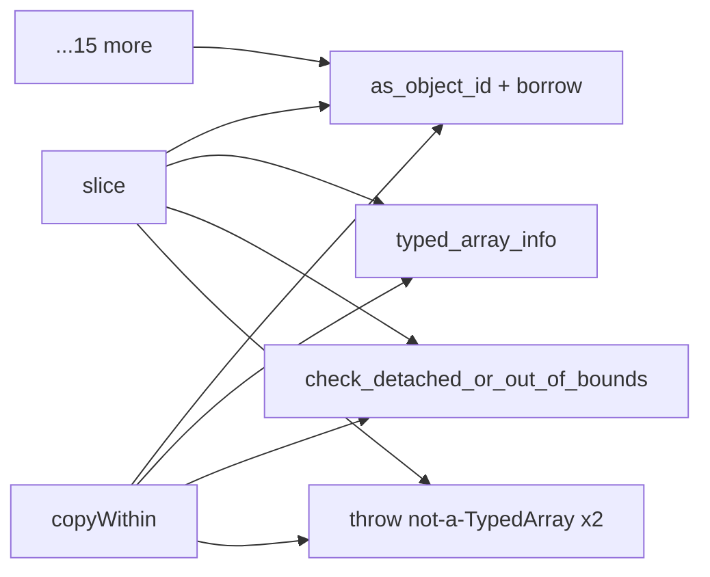
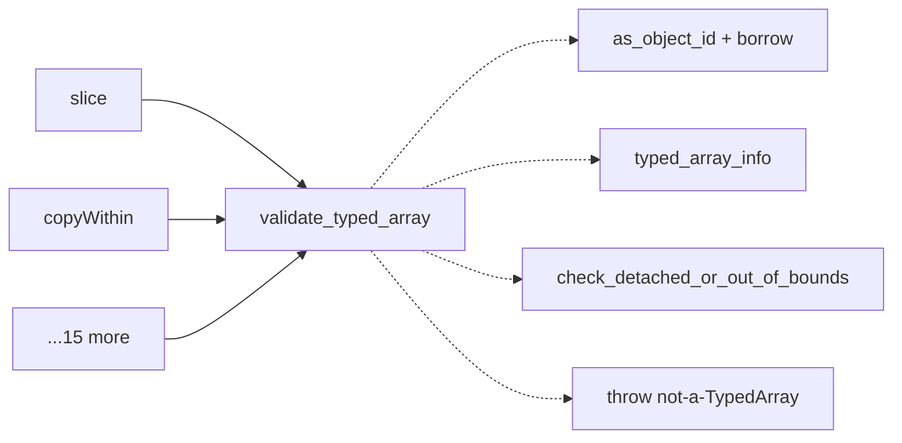
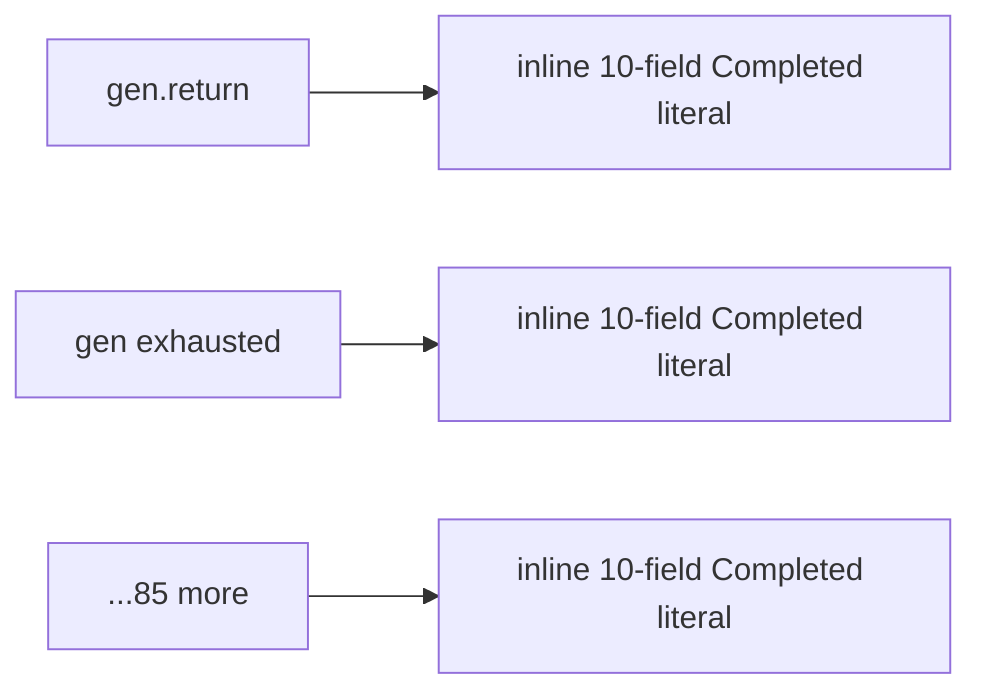
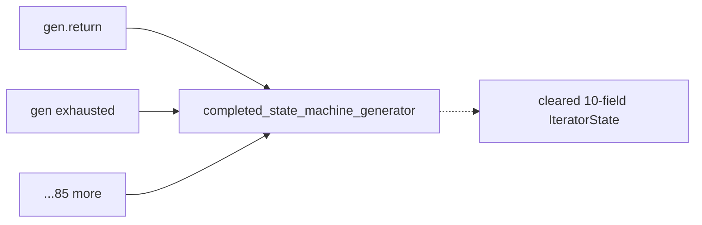
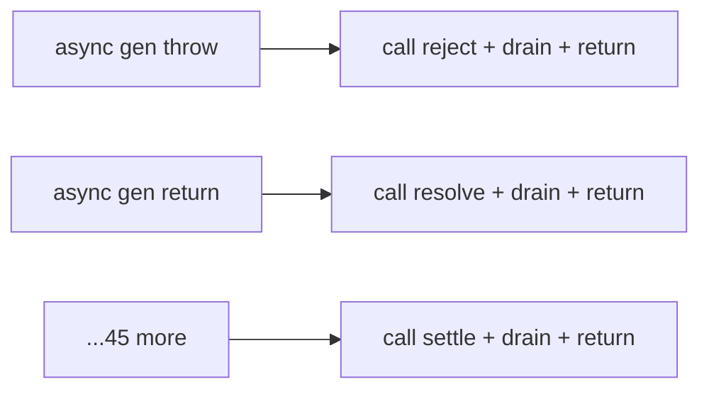
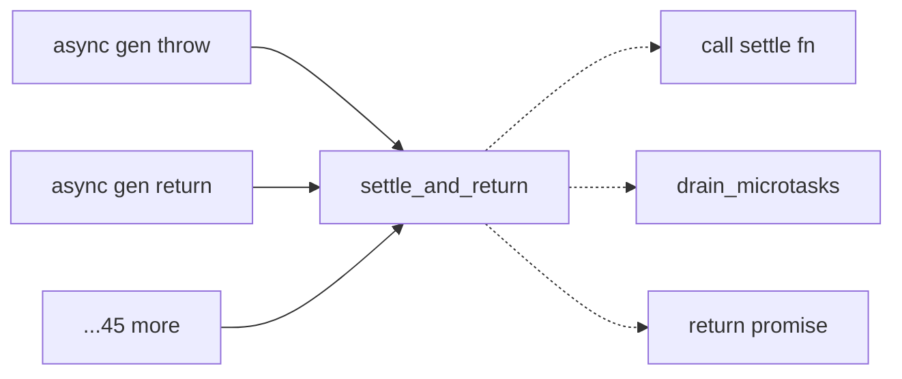
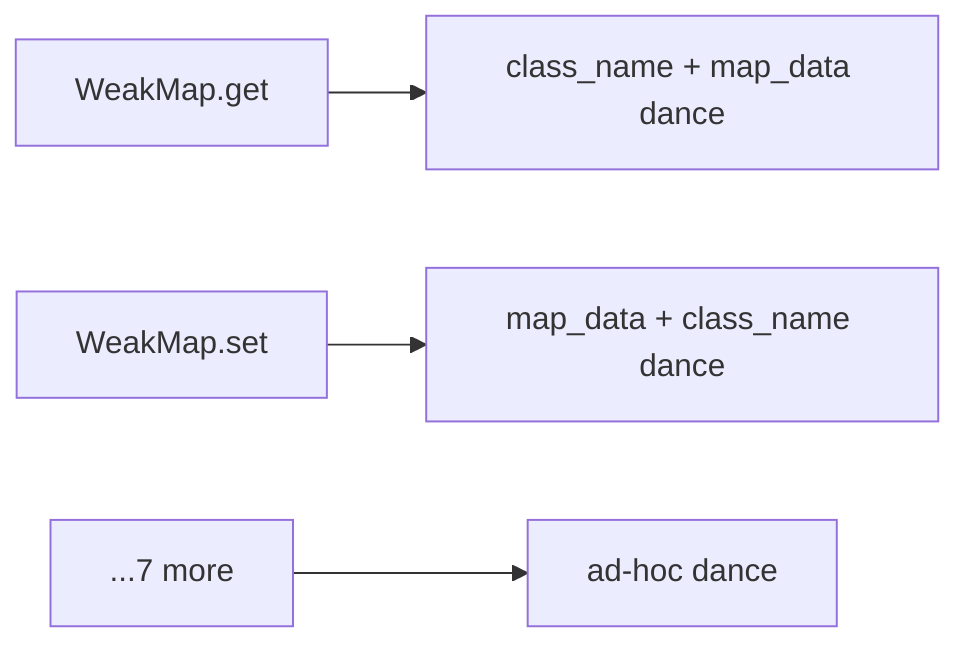
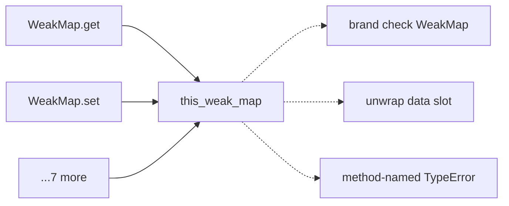

# Architecture review — jsse — 2026-09-01

**Scope**: `src/interpreter/` hot spots, weighted by change frequency over the last 200 commits (`eval.rs`, `types.rs`, `builtins/typedarray.rs`, `exec.rs`, generator/async machinery). Two parallel exploration passes: statement/expression + generator/async execution, and built-in prototypes + shared prologues. A 2026-08-26 audit's unpicked candidate backlog was re-verified against current code (typed-array *codec* candidate already landed as PR #541 — distinct from this run's pick).
**Picked**: `validate-typed-array` — see PR (to be opened) and `.architecture/backlog.md`
**Degradations**: none — `gh` authenticated, sub-agents available, `codebase-design` vocabulary applied.

In the Mermaid diagrams: **solid edges are the interface** (what a caller wires), **dashed edges are inside the implementation** (hidden behind a seam).

## Candidates

### validate-typed-array — collapse ~17 open-coded TypedArray receiver-validation prologues behind one seam  ·  Strong  ·  score 24/25

- **Files** — `src/interpreter/builtins/typedarray.rs`. Seam belongs beside the existing partial helpers `check_detached_or_out_of_bounds` (`typedarray.rs:5940`) and the kind-gated sibling `validate_uint8array` (`typedarray.rs:5879`). Collapsible "Shape A" prologues at `typedarray.rs:1544, 1801, 1922, 1993, 2058, 2114, 2171, 2228, 2269, 2390, 2454, 2532, 2601, 2853, 2992, 3024, 3051` (17 sites). File-count estimate: **1 file** (plus an in-crate `#[cfg(test)]` module).
- **Score** — **24/25**
  - *Leverage 5* — 17 call sites shed an ~11-line borrow-juggling prologue each, and the validation becomes independently unit-testable for the first time (today only test262 covers it).
  - *Locality 4* — changing what "a valid, non-detached TypedArray receiver" means becomes a one-function edit; today it is ~17 edits, and drift has already happened (several getters inline `is_detached.get() || is_typed_array_out_of_bounds(ta)` instead of the helper).
  - *Blast radius 1* (→ contributes 5) — one file, all sites are module-private native closures, no exported/public interface crossed.
  - *Heat 5* — `typedarray.rs` is among the hottest files in the tree (100+ touches in the 200-commit window, 40 in the last 40), last changed ~2 weeks ago.
- **Problem** — The receiver-validation is one conceptual step ("is `this` a TypedArray whose buffer is still attached and in bounds?") but every prototype method re-expresses it as ~11 lines: `as_object_id()` → `get_object` → `borrow()` → `typed_array_info()` → `check_detached_or_out_of_bounds` → `ta.clone()`, with the `"not a TypedArray"` TypeError written **twice** (once in the `else`, once as the fall-through tail after the whole method body). The interface is far simpler than the implementation the caller is forced to hand-roll — the definition of a shallow module — and the doubled throw separated by the entire body is a live footgun (easy to drop the tail throw; getters already diverged).
- **Deletion test** — **Concentrates.** A single `validate_typed_array(interp, this) -> Result<TypedArrayInfo, Completion>` absorbs the brand check, the detached/OOB check, the borrow scoping, the clone, and both throws. Deleting it re-scatters that invariant across 17 sites; the callers do not grow — each shrinks to one line.
- **Solution** — Add `validate_typed_array` mirroring `validate_uint8array` with the kind gate removed and `check_detached_or_out_of_bounds` folded in. Migrate the 17 Shape-A prologues to `let ta = match validate_typed_array(interp, this_val) { Ok(ta) => ta, Err(c) => return c };`. Leave the divergent sites alone: `subarray` (`:1737`) deliberately does **not** throw on OOB and captures the backing buffer inside the borrow; the base64/hex path (`:5689`) already threads through `?`.
- **Benefits** — *Leverage*: 17 methods lose their prologue; a future spec change to ValidateTypedArray (e.g. resizable-buffer semantics) is a one-line edit. *Locality*: the brand/detach/OOB decision lives in one place next to its siblings. *Test surface*: the validation is exercisable directly through a narrow `Result` interface — valid TA → `Ok(info)`, non-object / non-TA / detached → the exact `Err` — instead of only observably through 17 separate prototype methods.

### complete-state-machine-generator-ctor — collapse ~87 inlined "completed generator" struct literals  ·  Strong  ·  score 22/25

- **Files** — `src/interpreter/eval/generator_runtime.rs` (pairs at `:822`, `:846`, async at `:3645`, `:3670`, and dozens more). Enum at `src/interpreter/types.rs:1370`/`:1388`. Estimate: 1–2 files.
- **Score** — **22/25** — *Leverage 5* (87 byte-identical 10-field literals; a constructor adds compiler help for the "cleared" invariant), *Locality 4*, *Blast radius 1* (→5), *Heat 3* (`generator_runtime.rs` changed only ~4× in the window, though last touched 7 days ago — YAGNI docks it).
- **Problem** — The invariant "this generator is finished; clear every pending field" is copy-pasted 87 times (27 sync + 60 async). Adding a field to `StateMachineGenerator`/`StateMachineAsyncGenerator` is an 87-site edit with no compiler check for a missed field.
- **Deletion test** — **Concentrates.** `completed_state_machine_generator(sm, env, strict)` / `…_async_generator(…)` turn each 12-line block into one call.
- **Solution** — Two private constructors (or one with an `IsAsync` flag) returning the cleared `IteratorState`.
- **Benefits** — *Leverage* across 87 sites; *Locality* on the completed-generator shape; *Test surface*: the cleared state becomes directly assertable.

### settle-and-return-tail — ~47 copies of "call settle fn + drain microtasks + return promise"  ·  Worth exploring  ·  score 20/25

- **Files** — `src/interpreter/eval/generator_runtime.rs` (canonical at `:3660`, `:3685`; `reject_with_type_error` at `:2728` is one already-extracted special case). Estimate: 1 file.
- **Score** — **20/25** — *Leverage 4* (47 sites, but the tail is 3 lines and often fuses with a completed-writeback), *Locality 4*, *Blast radius 1* (→5), *Heat 3*.
- **Problem** — The promise-settlement protocol (invoke settle fn with `undefined` this + one arg, `drain_microtasks()` so reactions run synchronously, return the outer promise) is re-spelled at every async-generator exit; dropping the drain is a real ordering bug.
- **Deletion test** — **Concentrates** into `settle_and_return(settle_fn, arg, promise) -> Completion`.
- **Solution** — One settlement helper; `reject_with_type_error` layers on top. Naturally sequenced *after* the generator-constructor candidate, which shrinks the same driver.

### this-weak-map / this-weak-set — 9 hand-rolled WeakMap/WeakSet receiver-unwrap dances  ·  Worth exploring  ·  score 20/25

- **Files** — `src/interpreter/builtins/collections.rs` (WeakMap `:1703, 1728, 1758, 1782, 1811, 1846`; WeakSet `:2106, 2134, 2158`). Template `this_map`/`this_set` exist at `:12`/`:34`; weak variants do not. Estimate: 1 file.
- **Score** — **20/25** — *Leverage 4* (9 sites, exact template already proven), *Locality 4*, *Blast radius 1* (→5), *Heat 3* (`collections.rs` frequently changed historically but ~5 weeks stale).
- **Problem** — Each site re-open-codes the brand check *inconsistently* (`class_name` then `map_data().cloned()` in some, reversed in others), and retypes the per-method error string by hand — exactly the divergence `this_map`/`this_set` were introduced to kill.
- **Deletion test** — **Concentrates** into `this_weak_map`/`this_weak_set` returning `(id, handle)` + method name for the error, verbatim siblings of `this_map`/`this_set`.

### generator-entry-guard — ~11 duplicated "called on non-object" TypeError pairs  ·  Worth exploring  ·  score 19/25

- **Files** — `src/interpreter/eval/generator_runtime.rs` (`:14/:18`, `:180/:184`, `:323/:327`, `:482/:487`, `:2063/:2068`, `:2410/:2415`, async at `:3607/:3611`, `:6755/:6759`, `:7014/:7019`, `:7245/:7249`, `:7319/:7324`). Estimate: 1 file.
- **Score** — **19/25** — *Leverage 4*, *Locality 3*, *Blast radius 1* (→5), *Heat 3*.
- **Problem** — Every generator entry point emits the same null/undefined-check + object-id-check TypeError pair.
- **Deletion test** — **Concentrates** into `require_generator_object(this, method) -> Result<u64, …>`. Ties into the `object-id-of` simplification below.

### object-id-of — ~130 circular `.as_object_id().map(|id| JsObject { id })` round-trips  ·  Speculative  ·  score 13/25

- **Files** — `generator_runtime.rs` (~44), `eval.rs` (~76), `exec.rs` (~11). Estimate: 3+ files.
- **Score** — **13/25** — *Leverage 2* (mechanical: rebuilds a `JsObject` only to read `.id` back out; renames complexity rather than concentrating real behaviour behind a seam), *Locality 2*, *Blast radius 3* (→3), *Heat 4*.
- **Note** — This is a `/simplify`-class cleanup, not a deepening. Recorded so the next run does not re-derive it as a deep-module candidate. Best folded into whichever generator candidate touches those files.

## Dropped

No candidate tripped a hard filter (leverage 1, blast radius 5, ADR conflict, already-in-backlog, or un-pinnable). `object-id-of` scores low but is retained as a low-strength candidate rather than dropped, because it fails no hard filter.

| Candidate | Dropped because |
|---|---|
| _(none)_ | — |

## Too large to automate

| Candidate | Blast radius |
|---|---|
| `unify-generator-async-drivers` — `generator_next_state_machine_impl` (`generator_runtime.rs:470`, ~1580 lines) and `async_generator_next_state_machine_impl` (`:3592`, ~3050 lines) are largely parallel state-machine interpreters, plus `_with_promise` vs `_legacy` async splits. Unifying them is a deep structural refactor, not a narrow-interface change. Landing the generator-constructor and settle-tail candidates first shrinks both drivers and is the right sequencing. | 5 — human-scheduled |

## Pick

**`validate-typed-array` (24/25).** It outranks the runner-up **candidate** `complete-state-machine-generator-ctor` (22/25) on **heat**: both are single-file, `pub(crate)`, blast-radius-1 collapses of a duplicated invariant with leverage 5, but `typedarray.rs` is one of the hottest files in the tree while `generator_runtime.rs` is cold (~4 window touches), and YAGNI weights deepening toward code that keeps changing. The 2-point gap is **not** within 1 point — the pick is clear, not close. A proven deep sibling (`validate_uint8array`) already exists in the same file, so the interface shape is de-risked, and the drift already visible in the diverged getters is evidence the friction is active, not hypothetical.

## Design

_Written in step 4 (design-it-twice + adjudication). Filled after this report was first committed._
