# Architecture review — jsse — 2026-09-02

**Scope**: `src/interpreter/builtins/` hot spots weighted by change frequency over the last 200 commits, plus the standing `.architecture/backlog.md` from the 2026-09-01 firing. `typedarray.rs` and `iterators.rs` were both touched on 2026-09-01 (hottest in the tree). One fresh sub-agent exploration pass over the built-in prototypes and shared prologues surfaced new candidates; the prior run's backlog was reconciled against `gh` (PR #543 `validate-typed-array` **merged** → `landed`).
**Picked**: `arraybuffer-receiver-guard` — see the PR and `.architecture/backlog.md`
**Branch**: `sym/jsse/routine/refactor-audit/01M1FK9R05` — **adopted** (all four conditions held: non-default, 0 commits ahead of `origin/main`, no upstream, unpublished on origin). Never renamed; the slug is recorded here and in the backlog instead.
**Degradations**: none — `gh` authenticated, sub-agents available, `codebase-design` vocabulary applied.

In the Mermaid diagrams: **solid edges are the interface** (what a caller wires), **dashed edges are inside the implementation** (hidden behind a seam).

## Candidates

### arraybuffer-receiver-guard — snapshot receiver-validation guards for the ArrayBuffer-family getters · Strong · score 24/25

- **Files** — `src/interpreter/builtins/typedarray.rs`. Seam belongs beside the proven sibling `validate_typed_array` (`typedarray.rs:5721`, landed as PR #543). Collapsible ArrayBuffer getters, each with its own inline `enum Probe`, at `typedarray.rs:42, 80, 116, 150, 184` (`byteLength`, `detached`, `resizable`, `immutable`, `maxByteLength`); SharedArrayBuffer getters at `typedarray.rs:1092, 1107, 1125` (`byteLength`, `maxByteLength`, `growable`). File-count estimate: **1 file** (plus an in-crate `#[cfg(test)]` module).
- **Score** — **24/25**
  - *Leverage 5* — 8 getters each shed a hand-rolled `as_object_id → get_object_cell → borrow → arraybuffer_data → is_shared` prologue; the 5 ArrayBuffer getters additionally delete a per-getter local `enum Probe` declaration that exists **only** to escape the `borrow()` before calling `create_type_error`. The brand+snapshot decision becomes independently unit-testable for the first time (today only test262 covers it). *(Sensitivity: scored conservatively as a two-seam bundle, leverage is 4 → total 22/25, which ties `complete-state-machine-generator-ctor`; the tie breaks on heat — `typedarray.rs` touched 2026-09-01 vs `generator_runtime.rs` 2026-08-25 — so the pick is deterministic either way. Recorded per the ranking rubric.)*
  - *Locality 4* — changing what "a valid, non-shared ArrayBuffer receiver" means becomes a one-function edit; today it is 5 divergent inline copies (they already differ: `maxByteLength` folds the detached branch into its read, others don't).
  - *Blast radius 1* (→ contributes 5) — one file, all sites are module-private native getter closures, no exported/public interface crossed.
  - *Heat 5* — `typedarray.rs` is among the hottest files in the tree, last changed 2026-09-01 (the day before this run).
- **Problem** — "Is `this` an ArrayBuffer (not shared, not detached), and what are its bytes?" is one conceptual step, but each getter re-expresses it as a ~20-line borrow-juggling probe. The five ArrayBuffer getters each declare a *local* `enum Probe { NotAB, Shared, Detached, … }` whose sole purpose is to carry the brand verdict out of the `cell.borrow()` closure so `create_type_error(interp)` can run after the borrow drops — the interface (read one field) is far simpler than the implementation the caller is forced to hand-roll, the definition of a shallow module. The copies have already drifted.
- **Deletion test** — **Concentrates.** One `require_array_buffer(interp, this) -> Result<ArrayBufferSnapshot, Completion>` absorbs the brand check (ArrayBuffer data present **and** not shared), the borrow scoping, and the field reads into an owned snapshot. Deleting it re-scatters that invariant and the five `enum Probe` decls across the getters; the callers do not grow — each shrinks to a field read on the snapshot.
- **Solution** — Add a snapshot struct and a receiver guard per brand (`require_array_buffer` returning `{ byte_length, is_detached, max_byte_length, is_immutable }`; `require_shared_array_buffer` returning `{ byte_length, max_byte_length }`). The guard **never throws on detached** — it returns `is_detached` in the snapshot, because `byteLength`/`maxByteLength` return `0` (not a throw) on a detached buffer and `detached` returns the flag itself. Migrate the 5 ArrayBuffer + 3 SharedArrayBuffer getters. The brand checks stay bidirectional (`require_array_buffer` rejects a SharedArrayBuffer; `require_shared_array_buffer` rejects a plain ArrayBuffer).
- **Benefits** — *Leverage*: 8 getters lose their prologue; a future spec change to the ArrayBuffer brand/detach rules is a one-line edit. *Locality*: the brand/detach decision lives in one place next to `validate_typed_array`. *Test surface*: the validation is exercisable directly through a narrow `Result` interface — valid AB → `Ok(snapshot)`, non-object / non-AB / shared → the exact `Err` — instead of only observably through 8 separate getters.
- **Deferred (recorded as a follow-up, not lost)** — DataView getters (`buffer`, `byteOffset`, `byteLength` at `:4801, 4817, 4846`) *throw* on IsViewOutOfBounds (which subsumes detached), compute a per-getter OOB condition rather than reading a field, and reach through to the **underlying buffer's** length — a cross-object read, not a single borrow. The ArrayBuffer/SharedArrayBuffer *methods* (`slice`, `resize`, `transfer`, `grow`) hold their object borrow across the body and re-probe detached **after** the species constructor runs user code. Both are left for a follow-up firing, exactly as PR #543 left `slice`/`sort`/`toSorted`. Tracked as `dataview-receiver-guard` in the backlog.

**Before** — every getter wires the prologue itself:

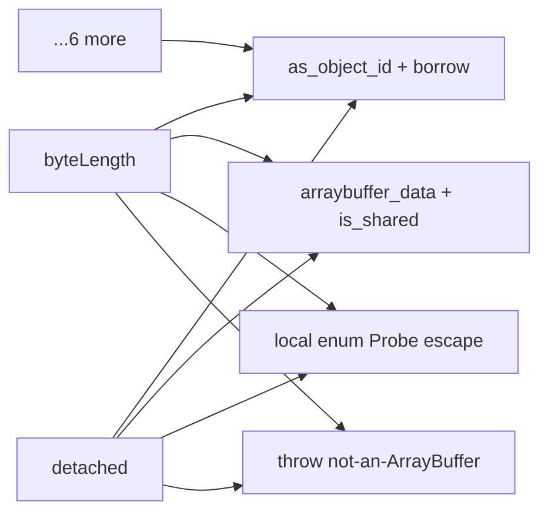

**After** — one guard per brand hides the prologue:

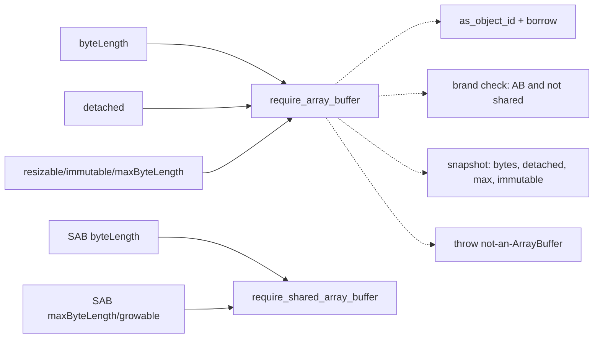

### complete-state-machine-generator-ctor — collapse ~87 inlined "completed generator" struct literals · Strong · score 22/25

- **Files** — `src/interpreter/eval/generator_runtime.rs`; enum at `src/interpreter/types.rs`. Estimate: 1–2 files.
- **Score** — **22/25** — *Leverage 5* (87 byte-identical 10-field literals; a constructor adds a compiler check for the "cleared" invariant), *Locality 4*, *Blast radius 1* (→5), *Heat 3* (`generator_runtime.rs` last touched 2026-08-25; YAGNI docks cold code). Carried forward from the 2026-09-01 backlog; friction re-verified present.
- **Problem** — "This generator is finished; clear every pending field" is copy-pasted 87 times (27 sync + 60 async). Adding a field is an 87-site edit with no compiler check for a missed field.
- **Deletion test** — **Concentrates** into `completed_state_machine_generator` / `…_async_generator`.
- **Solution** — Two private constructors returning the cleared `IteratorState`.
- **Benefits** — *Leverage* across 87 sites; *Locality* on the completed-generator shape; *Test surface*: the cleared state becomes directly assertable.
- **Recommendation strength** — Strong. This is the runner-up **candidate** and the natural next firing.

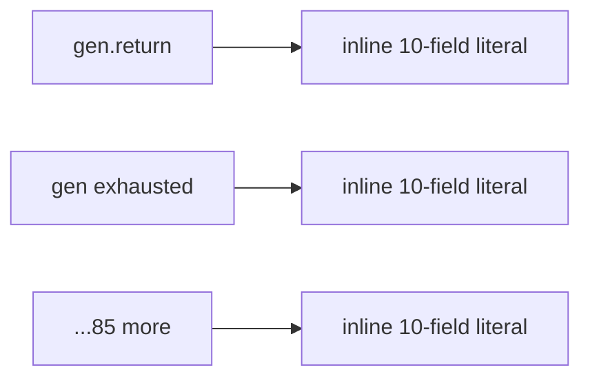

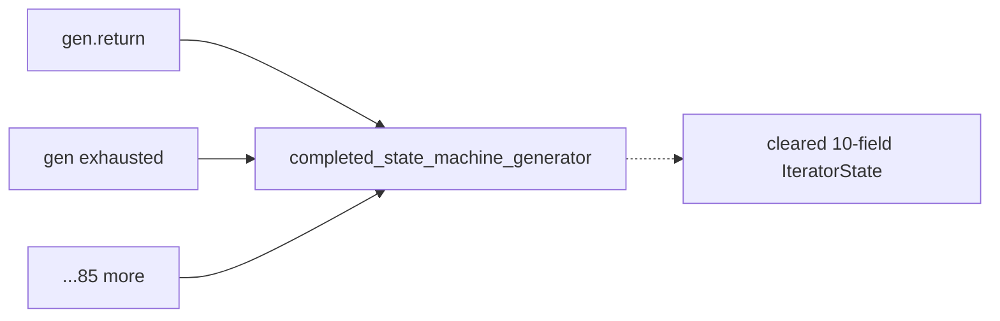

### completion-into-result — a `Completion::into_result()` adapter for the Result-returning iterator helpers · Worth exploring · score 21/25

- **Files** — `src/interpreter/builtins/iterators.rs` (37 `Completion::Normal(v) => v` adapter heads, 27 `Completion::Throw(e) => return Err(e)`), `src/interpreter/types.rs` (`impl Completion`). Estimate: 2 files.
- **Score** — **21/25** — *Leverage 4* (dozens of 4-line match wrappers collapse to `.into_result()?`, and the fabricated `_ =>` error arms become removable dead code), *Locality 3*, *Blast radius 1* (→5), *Heat 5* (`iterators.rs` touched 2026-09-01).
- **Problem** — The iterator abstract-operation helpers return `Result<_, JsValue>` but call MOP methods that return `Completion`, so every call is wrapped in a hand-rolled `match Completion { Normal(v)=>v, Throw(e)=>return Err(e), _=>… }`.
- **Deletion test** — **Concentrates** into one method on the existing `impl Completion`.
- **Solution** — `Completion::into_result(self) -> Result<JsValue, JsValue>`, mapping `Normal→Ok`, `Throw→Err`, other variants→`Ok(undefined)`.
- **Recommendation strength** — Worth exploring. Deferred: the two-seam ArrayBuffer guard scores higher on locality and is a cleaner single-family deepening.

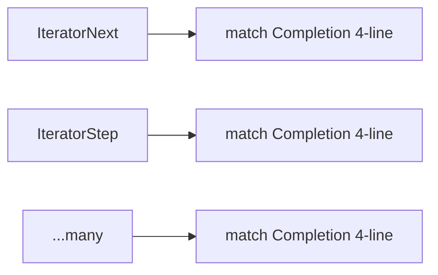

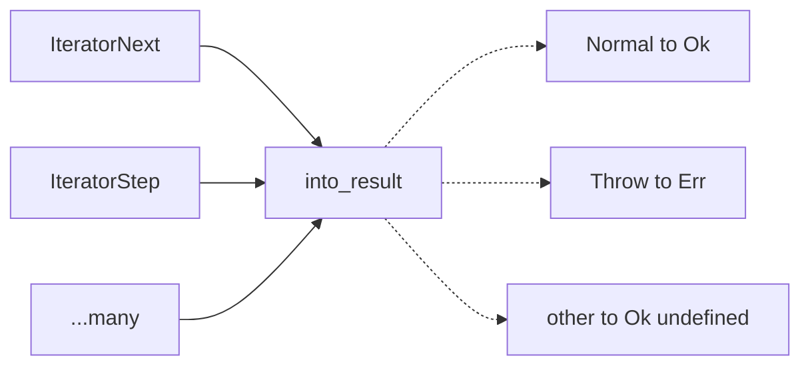

### completion-unwrap-macro — a `try_completion!` macro for the Completion-returning natives · Worth exploring · score 21/25

- **Files** — `src/interpreter/types.rs` (macro) + `src/interpreter/builtins/typedarray.rs` as first adopter (27 sites). Estimate: 2 files for the contained first step.
- **Score** — **21/25** — *Leverage 4*, *Locality 3*, *Blast radius 1* (→5), *Heat 5*.
- **Problem** — The `match Completion { Normal(v)=>v, Throw(e)=>return Completion::Throw(e), _=>… }` idiom recurs in Completion-returning functions (typedarray 27, builtins/mod 22, eval 11, string 11, …).
- **Deletion test** — **Concentrates** into one macro; distinct from `completion-into-result` (that serves `Result`-returning helpers, this serves `Completion`-returning ones).
- **Recommendation strength** — Worth exploring. A macro adopted across many files has a larger eventual blast radius; scoped to one adopter it is a clean start, but it lost to the ArrayBuffer guard on locality.

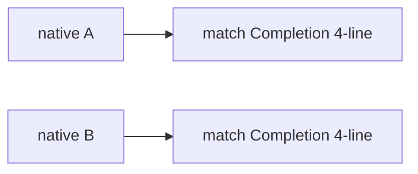

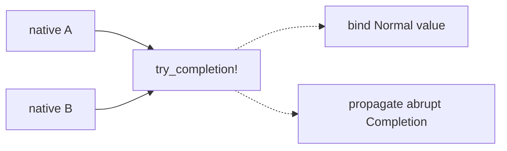

### object-this-coercion — a `require_this_object` ToObject prologue for Object.prototype · Worth exploring · score 20/25

- **Files** — `src/interpreter/builtins/mod.rs` (~10 `to_object(this_val)` prologues, ~4221–4770). Estimate: 1 file.
- **Score** — **20/25** — *Leverage 4*, *Locality 3*, *Blast radius 1* (→5), *Heat 4* (`builtins/mod.rs` last touched 2026-08-25).
- **Problem** — `hasOwnProperty`, `toString`, `isPrototypeOf`, `propertyIsEnumerable`, `toLocaleString`, `__proto__` each open-code `match to_object(this_val) { Normal(v)=>v, other=>return other }` then unwrap the object id. Distinct from the `object-id-of` round-trip: this is a *coercion* prologue (ToObject can run user code / throw).
- **Deletion test** — **Concentrates** into `require_this_object(this) -> Result<u64, Completion>`.
- **Recommendation strength** — Worth exploring.

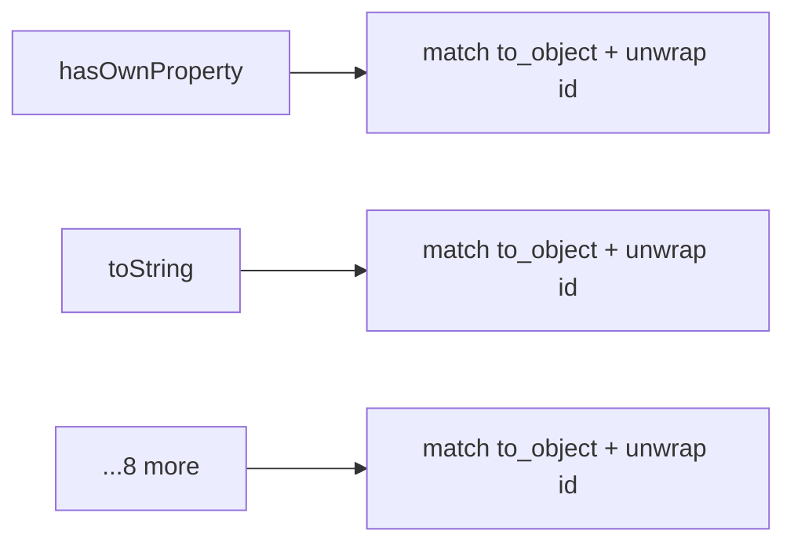

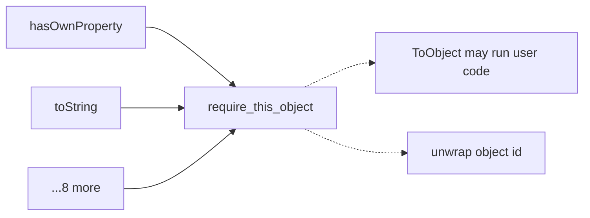

### regexp-last-index-accessor — `get_last_index` / `set_last_index` for the RegExp lastIndex dance · Speculative · score 18/25

- **Files** — `src/interpreter/builtins/regexp.rs` (5 read+ToLength sites, 3 `spec_set(...,"lastIndex",...)` sites). Estimate: 1 file.
- **Score** — **18/25** — *Leverage 3* (8 sites, small dance), *Locality 3*, *Blast radius 1* (→5), *Heat 4* (`regexp.rs` last touched 2026-08-26).
- **Problem** — `Get(R,"lastIndex")`→`ToLength` / `Set(R,"lastIndex",v,true)` is re-spelled inline at each site.
- **Deletion test** — **Concentrates** into two small accessors.
- **Recommendation strength** — Speculative — small dance, lower payback than the getter-family guard.

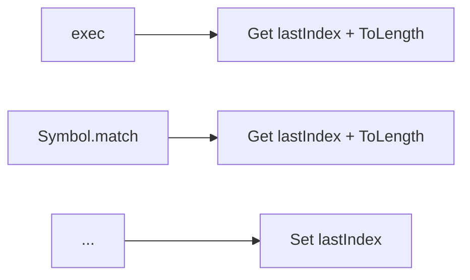

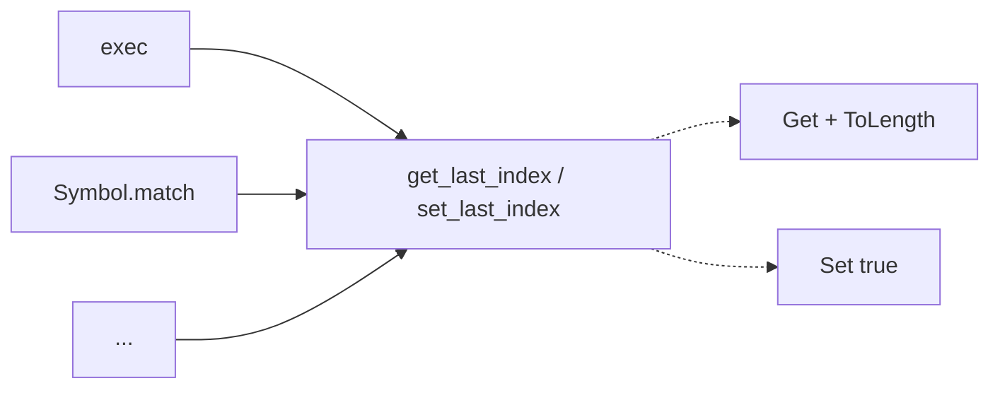

## Dropped

| Candidate | Dropped because |
|---|---|
| `typedarray-shared-equality` | Not a deepening — `/simplify`-class. `typedarray.rs` re-implements private `same_value_zero`/`strict_eq` that already exist in `helpers.rs`; deduping *moves* code rather than concentrating behaviour behind a new seam (leverage 2). Flagged caveat: the private `strict_eq` compares strings via `to_rust_string()` (allocating) — a semantic divergence must be confirmed before merging, and if real is a bug report, not a dedup. Recorded so a future run does not re-derive it as a deep-module candidate. |
| `object-id-of` | Leverage 2 — a `/simplify`-class round-trip cleanup, not a deepening (carried from the 2026-09-01 backlog). |

## Too large to automate

| Candidate | Blast radius |
|---|---|
| `unify-generator-async-drivers` — `generator_next_state_machine_impl` (~1580 lines) and `async_generator_next_state_machine_impl` (~3050 lines) are largely parallel state-machine interpreters. Unifying them is a deep structural refactor for a human to schedule; landing the generator-constructor and settle-tail candidates first shrinks both drivers. | 5 — human-scheduled |

## Pick

**`arraybuffer-receiver-guard` (24/25).** It outranks the runner-up **candidate** `complete-state-machine-generator-ctor` (22/25) on **heat**: both are single-file, module-private, blast-radius-1 collapses of a duplicated receiver-validation invariant, but `typedarray.rs` was touched the day before this run while `generator_runtime.rs` is over a week cold, and YAGNI weights deepening toward code that keeps changing. A proven deep sibling — `validate_typed_array`, landed the day before as PR #543 — already exists in the same file, so the interface shape is de-risked, and the drift already visible across the five `enum Probe` copies is evidence the friction is active, not hypothetical. The 2-point gap is **not** within 1 point on the leverage-5 read; on the conservative leverage-4 read the two tie at 22 and heat breaks it the same direction, so the pick is deterministic.

## Design

Three interfaces were designed in parallel (design-it-twice), then adjudicated by a fourth agent that authored none of them, against the fixed criteria depth ▸ locality ▸ seam placement ▸ test surface ▸ blast radius.

### Design A — minimal free function per brand (WINNER)

Two free functions mirroring the proven sibling `validate_typed_array`, each returning an owned *dumb* snapshot record with no methods; the getters apply the value rules inline.

```rust
struct BufferSnapshot { byte_length: usize, is_detached: bool, is_immutable: bool, max_byte_length: Option<usize> }

fn require_array_buffer(interp: &mut Interpreter, this_val: &JsValue) -> Result<BufferSnapshot, Completion>;
fn require_shared_array_buffer(interp: &mut Interpreter, this_val: &JsValue) -> Result<BufferSnapshot, Completion>;
```

Each getter becomes a 3–7 line adapter, e.g.:

```rust
self.define_getter(ab_proto_id, "byteLength", |interp, this_val, _args| {
    match require_array_buffer(interp, this_val) {
        Ok(s) => Completion::Normal(JsValue::number(if s.is_detached { 0.0 } else { s.byte_length as f64 })),
        Err(c) => c,
    }
});
```

**Hides**: the `as_object_id → get_object → cell.borrow()` escape dance, the bidirectional brand check (has ArrayBuffer data **and** not shared / is shared), the snapshot-then-drop-borrow-then-throw ordering, and the `Rc<Cell<bool>>` detached deref. Zero new vocabulary — the snapshot is a plain `Copy` record. The interface is **O(1)**: adding a sixth getter reads existing fields, it does not grow the interface. **Dependency strategy**: no ports/adapters needed — the seam is a same-module free function over the interpreter, exactly like `validate_typed_array`.

### Design B — one unified seam parameterised by brand (rejected)

`enum ArrayBufferKind { Plain, Shared }` + one struct + one `require_array_buffer(interp, this, kind)`. **Rejected on depth and seam placement**: the `is_shared` field is provably dead (needs `#[allow(dead_code)]` to survive the `-D warnings` gate — a real wart), two SAB-irrelevant fields (`is_detached`, `is_immutable`) leak into the Shared contract with the invariant upheld only by construction, and a single function behind a `kind` token is one adapter — a *hypothetical* seam by the "one adapter = hypothetical, two = real" rule — with ambient coupling (nothing type-checks that `Shared` is installed on the shared prototype).

### Design C — behaviour-carrying snapshot (RUNNER-UP DESIGN)

Two guards delegating to `probe_array_buffer(&Interpreter, this, want_shared) -> Option<AbSnapshot>`, plus an `AbSnapshot` whose *methods* encode the spec value rules (`byte_length_value() -> JsValue` returns 0 when detached, `max_byte_length_value()`, `has_max_capacity_value()`, `detached_value()`, `immutable_value()`), plus an optional `buffer_getter(guard, AbSnapshot::method)` combinator so each getter is one line. **Its genuine win — the strongest of the three on _test surface_**: the value-rule methods are pure `&self -> JsValue` with zero interpreter/arena dependency, so the spec-subtle rules (`detached → 0`, `unwrap_or(bytes)`) are unit-testable from struct literals as a truth table, with no setup.

### Adjudication

**Ranking A ≻ C ≻ B.** The first criterion, **depth**, separates them and therefore decides. Depth is behaviour hidden *per unit of interface*, a ratio — not total behaviour hidden. The deep, error-prone mass is the ~150-line borrow-escape `enum Probe` prologue; **A and C both hide it behind two functions and tie there**. To hide the *additional* ~6 lines of value rules, C adds ~7 interface items (5 methods + combinator + probe), three of the five methods being single-expression pass-throughs, and the method set scales **O(getters)** — one method per getter, 1:1. An interface that grows linearly with its own call sites has renamed them, not abstracted them, so C's marginal ratio dilutes it below A's fixed **O(1)** interface. The in-repo sibling corroborates: `validate_typed_array` returns a dumb `TypedArrayInfo` snapshot with no value methods, callers apply value rules inline — a receiver-validation seam in this codebase *is* shaped like A.

C's runner-up standing rests on **test surface** (criterion 4): its pure methods are cheaper to unit-test than A's inline rules. But (a) that is a *cheapness* edge, not a *possibility* edge — A's inline rules live inside the getter, whose interface **is** the property `[[Get]]`, so testing them through `[[Get]]` in-crate is testing *through* the interface, not past it; and (b) criterion 4 is subordinate to the depth separation and cannot overturn it. **Winner: Design A.** The adjudicator noted A must still close C's cheap-test edge from the inside by adding `[[Get]]`-level tests for the two subtle inline rules — folded into the plan below.

**Implementation risks carried into step 5** (from the adjudicator): (1) write `Err(c) => c`, not `return c` (clippy `needless_return`), and land the struct + both guards + enough getters that **every** `BufferSnapshot` field has a live reader in **one** edit, or the `dead_code -D warnings` hook blocks; (2) mirror `validate_typed_array_tests` for both guards including both exact brand-error strings, and pin the one place A *differs* from the sibling — a **detached** ArrayBuffer must still return a snapshot (`is_detached = true`), not throw; (3) add `[[Get]]`-level tests for `detached → 0` in **both** `byteLength` and `maxByteLength`, and `unwrap_or(bytes)` in both `maxByteLength` getters; (4) the SAB guard pins `is_detached = false`, `is_immutable = false`, and `growable` reads `max_byte_length.is_some()` off the same struct with no dead field.
