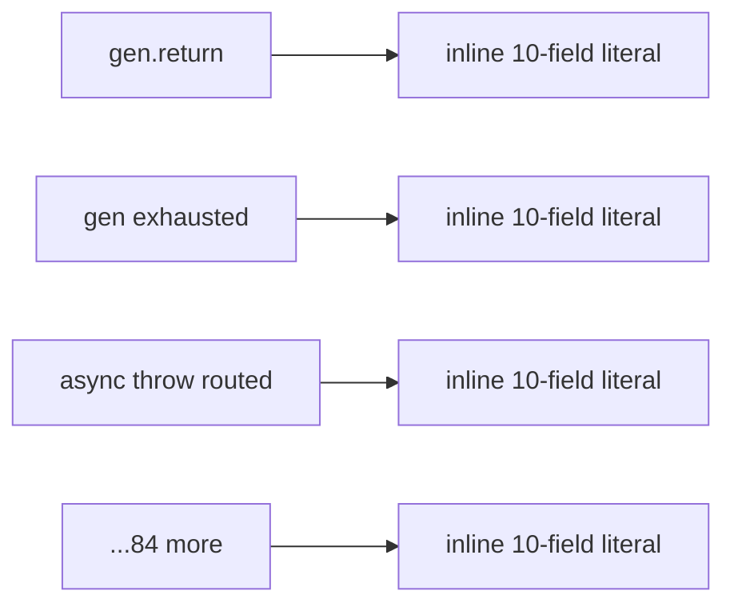
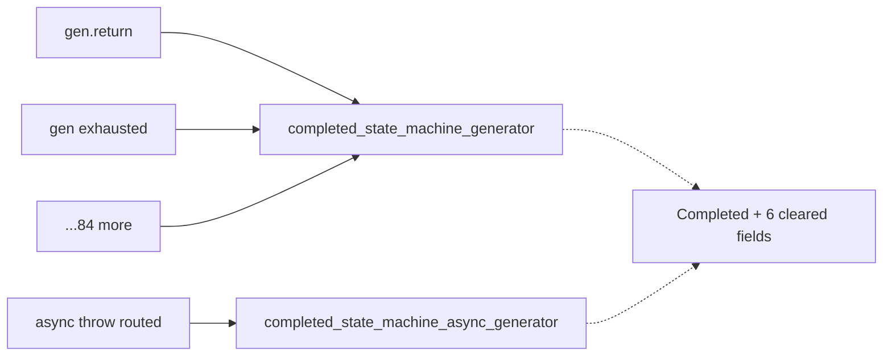
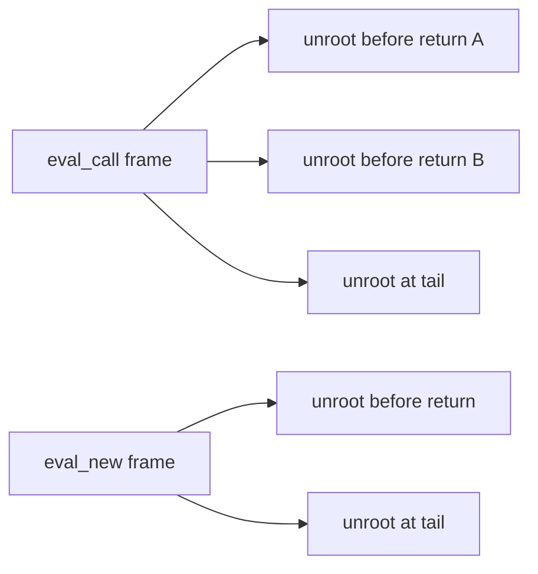
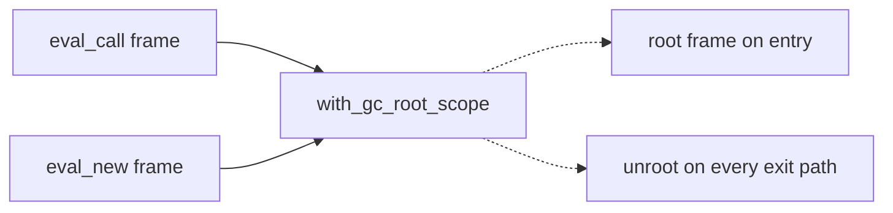
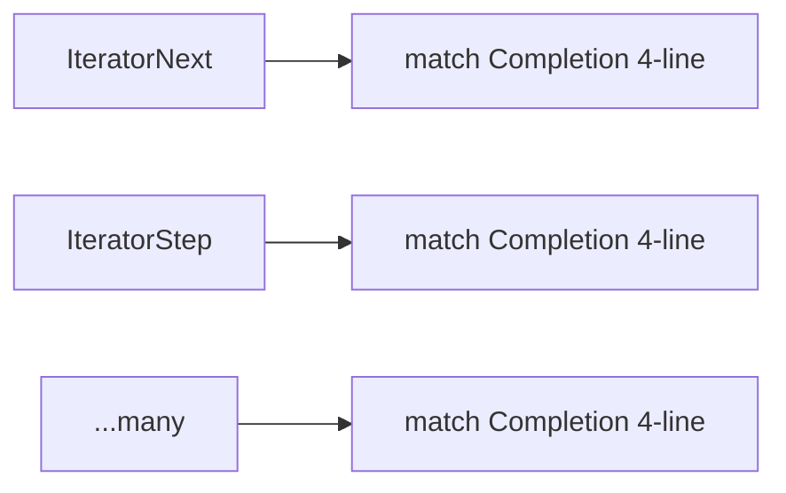
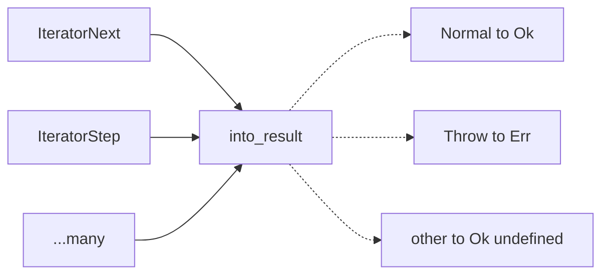
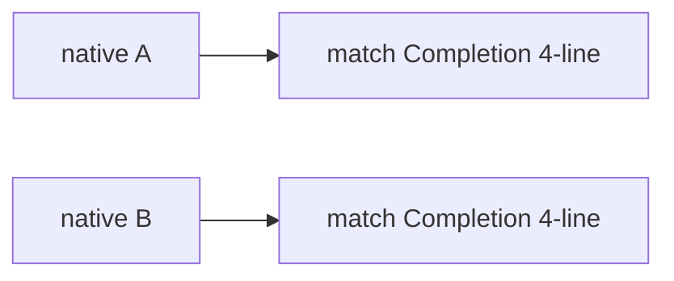
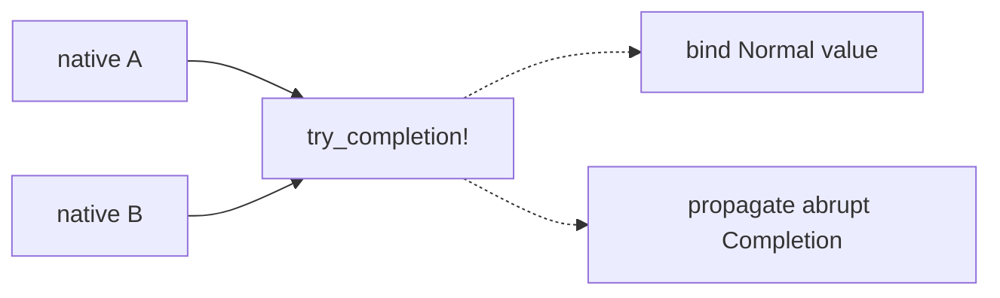

# Architecture review — jsse — 2026-09-03

**Scope**: The standing `.architecture/backlog.md` from the 2026-09-01/02 firings, reconciled against `gh` (PR #570 `arraybuffer-receiver-guard` **merged** 2026-09-02 → `landed`; PR #543 `validate-typed-array` already `landed`). Plus one fresh sub-agent exploration pass over the hottest interpreter files not already well-covered by the backlog — `eval.rs` (44 commits in the last 120 — the single hottest file), `types.rs`, `builtins/mod.rs`, `helpers.rs`, `property.rs`. The picked candidate carries forward from the backlog as the flagged runner-up of the 2026-09-02 firing.
**Picked**: `complete-state-machine-generator-ctor` — see PR (opened by this run) and `.architecture/backlog.md`
**Branch**: `sym/jsse/routine/refactor-audit/01M1J5Q8CJ` — **adopted** (all four conditions held: non-default, 0 commits ahead of `origin/main`, no upstream, unpublished on origin). Never renamed; the slug is recorded here and in the backlog instead.
**Degradations**: none — `gh` authenticated, sub-agents available, `codebase-design` vocabulary applied.

In the Mermaid diagrams: **solid edges are the interface** (what a caller wires), **dashed edges are inside the implementation** (hidden behind a seam).

## Candidates

### complete-state-machine-generator-ctor — collapse 87 inlined "completed generator" struct literals · Strong · score 22/25

- **Files** — `src/interpreter/eval/generator_runtime.rs` (all 87 completed literals; 2 more fixtures in `src/interpreter/tests.rs`); the `IteratorState` enum and the seam's home in `src/interpreter/types.rs`. File-count estimate: **2 files** (plus the enum's own file and `tests.rs`, both trivially touched → up to 3).
- **Score** — **22/25**
  - *Leverage 5* — 87 byte-identical 10-field literals (27 sync `StateMachineGenerator`, 60 async `StateMachineAsyncGenerator`) collapse to a named constructor that carries only the 3 fields that vary (`state_machine`, `func_env`, `is_strict`) and fixes the 7 "cleared" fields once. Adding or renaming a field in `StateMachineExecutionState`/`IteratorState` becomes a one-site edit with a compiler check, instead of an 87-site edit with none. The "what a completed generator looks like" invariant becomes independently unit-testable for the first time.
  - *Locality 4* — the completed-generator shape concentrates in one constructor; the 3 live fields still originate at each call site, so a third of the shape is not centralised, which is why this is 4 not 5.
  - *Blast radius 1* (→ contributes 5) — the sites are all module-private; the seam is a `pub(crate)` associated function on an in-crate enum; no exported/published interface is crossed. The change is a mechanical, behaviour-preserving substitution (no control flow altered).
  - *Heat 3* — `generator_runtime.rs` changed in 4 of the last 120 commits; warmer than dead code, cooler than the typed-array/iterator hot spots. YAGNI docks it accordingly.
- **Problem** — "This state-machine generator is finished; clear every pending field" is one conceptual step, but it is copy-pasted as a full 10-field `IteratorState::StateMachineGenerator { … }` / `…AsyncGenerator { … }` literal at 87 sites. Every site re-spells `execution_state: Completed, _sent_value: UNDEFINED, try_stack: vec![], pending_binding: None, delegated_iterator: None, pending_exception: None, pending_return: None`. The literal's interface (10 fields, 7 of them fixed) is far larger than the intent it expresses (finish this generator) — the definition of a shallow, hand-rolled construction. Verified byte-identical across all 87: a grep for any completed literal carrying a non-default field returns empty.
- **Deletion test** — **Concentrates.** A `completed_state_machine_generator(state_machine, func_env, is_strict)` / `…_async_generator(…)` constructor absorbs the 7 cleared fields and the `Completed` marker. Deleting it re-scatters that 7-field default across 87 sites; the callers do not grow — each shrinks from a 12-line literal to a 1-line call.
- **Solution** — Two `pub(crate)` associated functions on `IteratorState` returning the cleared state for the sync and async variants, each taking the 3 varying fields by value (the sites already move `state_machine`/`func_env` in by field shorthand, never clone). Migrate the 87 production sites and the 2 test fixtures.
- **Benefits** — *Leverage*: 87 sites collapse; a future field change is a one-line, compiler-checked edit. *Locality*: the completed-generator shape lives in one place. *Test surface*: the cleared state becomes directly assertable through a narrow `IteratorState`-returning interface, rather than only observably through generator exhaustion in test262.
- **Recommendation strength** — Strong. Carried forward from the 2026-09-01/02 backlog as the explicitly-flagged "natural next firing"; friction re-verified present (87 literals, all byte-identical).

**Before** — every completion site wires the full 10-field literal:



**After** — one constructor per variant hides the cleared shape:



### gc-root-scope-guard — collapse the manual GC-root frame teardown epilogue · Worth exploring · score 22/25 (runner-up candidate)

- **Files** — `src/interpreter/eval.rs` (22 `gc_root_frame()` setups, 50 `gc_unroot_frame(` teardowns — 28 of them per-early-return epilogue copies; `gc_temp_roots.push` seam bypass at `:1066` and `:4324`), primitives at `src/interpreter/builtins/mod.rs:1318`. Codebase-wide the same idiom spans ~9 files (~50 setups / ~149 teardowns; `array.rs` worst at 10/71). File-count estimate: **9 files** for the non-arbitrary full collapse.
- **Score** — **22/25**
  - *Leverage 5* — ~149 teardowns codebase-wide vanish; a whole class of "did every exit path unroot?" test setup disappears.
  - *Locality 4* — the guard concentrates *teardown* only. The rooting decisions (which values, when) and the missed-root bug class stay at every site, and `eval.rs:1066` already bypasses the value seam with a direct `gc_temp_roots.push`. Two-thirds centralised → 4, not 5.
  - *Blast radius 3* (→ contributes 3) — 9 modules, control-flow-altering rewrite of the hottest interpreter file; band 3 by both description and file range.
  - *Heat 5* — `eval.rs` is the single hottest file in the tree (44 of the last 120 commits).
- **Problem** — Every temporary-rooting site opens `let f = self.gc_root_frame();` and must hand-write `self.gc_unroot_frame(f);` before *each* early return plus the tail — a repeated teardown epilogue (friction pattern #6). The codebase has already discovered this is error-prone and grown a *second* idiom for the same obligation: ~5 frames (`eval.rs:2633, 2766, 3038, 3443, 3539`) wrap their body in an IIFE `let result = (|| { … })();` so a single tail unroot suffices — a parallel discipline (pattern #7) at the cost of a closure allocation on hot paths. A missed `gc_unroot_frame` on an early-return path is invisible to unit tests (pattern #5): the temp root merely outlives its scope until an enclosing frame truncates.
- **Deletion test** — **Concentrates.** A `with_gc_root_scope(|s| { … })` combinator (closure form — in-file precedent `with_tail_position_suppressed` at `eval.rs:410`) or a `GcRootScope` RAII guard (precedent `EvalDepthGuard` at `eval.rs:10`, though its own doc warns a raw `self` pointer would be unsound, so the RAII form must change `gc_temp_roots`' storage and touch `gc.rs`) holds the teardown discipline once. Deleting it re-scatters ~149 teardowns.
- **Solution** — Introduce one scope combinator/guard that tears down the frame on every exit path, and migrate the setup/teardown sites. The closure form is the lower-blast-radius path (`eval.rs` + `mod.rs`, no storage change) and has direct in-file precedent.
- **Benefits** — *Leverage*: ~149 teardowns removed; the untestable exit-path-unroot class is eliminated. *Locality*: the rooting-teardown discipline becomes a one-place edit. *Test surface*: the combinator's "unroots on all paths" contract becomes directly assertable.
- **Recommendation strength** — Worth exploring. **This is the runner-up candidate, tied at 22/25**, and the natural next firing. It lost the tie on **lower blast radius** (rule 1 of the deterministic tie-break): the picked candidate is blast-radius 1, this is 3. The rubric's inverted blast-radius term exists precisely to "keep an unattended run from picking a repo-wide migration it cannot finish or review in one PR": a ~200-site control-flow rewrite of GC rooting in the hottest interpreter file, with a closure-vs-RAII design fork carrying `#[inline(always)]` perf implications and an acknowledged exit-path-pinnability problem, has `bail: diff outgrew estimate` as its modal unattended outcome. Recorded faithfully; scheduled deliberately, not attempted one-shot.

**Before** — every rooting site wires its own teardown before each exit:



**After** — one scope guard tears down on every path:



### completion-into-result — a `Completion::into_result()` adapter for the Result-returning iterator helpers · Worth exploring · score 21/25

- **Files** — `src/interpreter/builtins/iterators.rs` (~196 `Completion::Normal` heads, dozens of the `match Completion { Normal(v)=>v, Throw(e)=>return Err(e), _=>… }` adapter shape), `src/interpreter/types.rs` (`impl Completion`). Estimate: 2 files.
- **Score** — **21/25** — *Leverage 4* (many 4-line match wrappers collapse to `.into_result()?`; the fabricated `_ =>` arms become removable dead code), *Locality 3*, *Blast radius 1* (→5), *Heat 5* (`iterators.rs` remains hot). Carried forward; friction re-verified (196 `Completion::Normal` sites present).
- **Problem** — Iterator abstract-operation helpers return `Result<_, JsValue>` but call MOP methods returning `Completion`, so every call is a hand-rolled 4-line match.
- **Deletion test** — **Concentrates** into one method on the existing `impl Completion`.
- **Solution** — `Completion::into_result(self) -> Result<JsValue, JsValue>` (`Normal→Ok`, `Throw→Err`, other→`Ok(undefined)`).
- **Recommendation strength** — Worth exploring. Lost to the generator-ctor on leverage (87 vs dozens) and on being a zero-behaviour-change mechanical substitution.





### completion-unwrap-macro — a `try_completion!` macro for the Completion-returning natives · Worth exploring · score 21/25

- **Files** — `src/interpreter/types.rs` (macro) + one first adopter (e.g. `typedarray.rs`, ~27 sites). Estimate: 2 files for the contained first step. *(Note: a same-named `try_completion!` already exists privately in `temporal/duration.rs:9` — the shared macro should be reconciled with, or supersede, that local copy.)*
- **Score** — **21/25** — *Leverage 4*, *Locality 3*, *Blast radius 1* (→5), *Heat 5*.
- **Problem** — `match Completion { Normal(v)=>v, Throw(e)=>return Completion::Throw(e), _=>… }` recurs across Completion-returning natives (typedarray 27, builtins/mod 22, eval 11, string 11, …).
- **Deletion test** — **Concentrates** into one macro; distinct from `completion-into-result` (that serves `Result`-returning helpers, this serves `Completion`-returning ones).
- **Recommendation strength** — Worth exploring. A macro adopted across many files has a larger eventual blast radius; scoped to one adopter it is a clean start.





### Carried-forward candidates (friction re-verified, scored in the backlog)

Lower-ranked `proposed` candidates from prior firings, re-checked this run and still present. Full cards live in prior reviews; scores in `.architecture/backlog.md`.

| Candidate | Score | Friction re-check (2026-09-03) |
|---|---|---|
| `object-this-coercion` | 20/25 | `builtins/mod.rs` — 27 `to_object(` sites present |
| `settle-and-return-tail` | 20/25 | `generator_runtime.rs` async exit tails present (shrinks after the generator-ctor lands) |
| `this-weak-map-set` | 20/25 | `collections.rs` — `this_map`/`this_set` siblings present (28 refs); brand strings differ, confirm per site |
| `generator-entry-guard` | 19/25 | `generator_runtime.rs` entry TypeError pairs present |
| `pattern-bound-names-walker` | 19/25 | `exec.rs` — 5 `collect_pattern_bound_names` refs present |
| `dataview-receiver-guard` | 18/25 | `typedarray.rs` DataView getters present (follow-up to the now-landed `arraybuffer-receiver-guard`) |
| `regexp-last-index-accessor` | 18/25 | `regexp.rs` — 27 `"lastIndex"` sites present |

## Dropped

| Candidate | Dropped because |
|---|---|
| `typedarray-shared-equality` | Not a deepening — `/simplify`-class. `typedarray.rs` re-implements private `same_value_zero`/`strict_eq` that already exist in `helpers.rs`; deduping *moves* code rather than concentrating behaviour (leverage 2). Caveat carried forward: the private `strict_eq` compares strings via `to_rust_string()` — a genuine semantic divergence must be confirmed first, and if real is a bug report, not a dedup. |
| `object-id-of` | Leverage 2 — a `/simplify`-class `.as_object_id().map(\|id\| JsObject { id })` round-trip cleanup, not a deepening. |

## Too large to automate

| Candidate | Blast radius |
|---|---|
| `unify-generator-async-drivers` — `generator_next_state_machine_impl` (~1580 lines) and `async_generator_next_state_machine_impl` (~3050 lines) are largely parallel state-machine interpreters. Unifying them is a deep structural refactor for a human to schedule; landing the generator-constructor and settle-tail candidates first shrinks both drivers. | 5 — human-scheduled |

## Pick

**`complete-state-machine-generator-ctor` (22/25).** The top of the reconciled backlog after PR #570 landed, and the explicitly-flagged runner-up of the 2026-09-02 firing ("natural next firing"). Its friction is verified active — 87 byte-identical 10-field completion literals, a grep for any non-default completed literal returning empty — so the collapse is a purely mechanical, behaviour-preserving substitution with a compiler-checked payoff.

The fresh scan surfaced one new candidate, `gc-root-scope-guard`, that **ties at 22/25**. Per the report rule, this is flagged as within 1 point (it is a dead tie). The tie breaks deterministically on **rule 1, lower blast radius**: the picked candidate is blast-radius 1 (one mechanical substitution in module-private code) versus gc-root's blast-radius 3 (a ~200-site, control-flow-altering rewrite spanning ~9 files, headed by the hottest file in the tree). The tie-break is exactly what the rubric intends — the safe, contained, trivially-test-pinnable change is taken now; the high-value but large and correctness-sensitive one is recorded as the natural next firing rather than attempted one-shot by an unattended run.

## Design

Three interfaces were designed in parallel (design-it-twice), then adjudicated by a fourth agent that authored none of them, against the fixed criteria depth ▸ locality ▸ seam placement ▸ test surface ▸ blast radius.

> **Count correction.** Designing against the real sites revealed the true completed-literal count is **97** (31 sync + 66 async), not the 87 the backlog carried. The `87` was a single-line grep undercount — 10 completed literals wrap `execution_state:` onto its own line, so the single-line pattern missed them. A brace-matching parser and the whitespace-tolerant regex agree at 97. All 97 are verified to carry exactly the canonical 10-field completed shape. The higher count only strengthens the leverage; the score is unchanged.

### Design A — minimal surface (two dumb constructors returning `IteratorState`) · WINNER

Two `pub(crate)` associated functions on `IteratorState`, each fixing the 7 completed-default fields and taking the 3 varying fields by value, returning `IteratorState`. Callers keep their own `ObjectKind::Iterator(...)` wrapper and `borrow_mut().kind = …` assignment — exactly the shape of the in-repo sibling seam `validate_typed_array` (a dumb snapshot returned, caller applies the rest).

```rust
impl IteratorState {
    pub(crate) fn completed_state_machine_generator(
        state_machine: Rc<GeneratorStateMachine>, func_env: EnvRef, is_strict: bool,
    ) -> IteratorState { /* StateMachineGenerator { …3 varying…, Completed, 6 cleared } */ }

    pub(crate) fn completed_state_machine_async_generator(
        state_machine: Rc<GeneratorStateMachine>, func_env: EnvRef, is_strict: bool,
    ) -> IteratorState { /* StateMachineAsyncGenerator { … } */ }
}
```

A call site collapses from a 14-line literal to `IteratorState::completed_state_machine_generator(state_machine, func_env, is_strict)`. **Hides**: the 7 fixed fields, the "completed = these 7 values" invariant, and the variant-tag choice (encoded in the fn name). **Interface is O(1)** — a new completed site reads existing fns, the interface does not grow. **Dependency strategy**: none crosses a seam; the fns are pure (`3 scalars in, 1 value out`), no `&Interpreter`/arena, so they are unit-testable directly in `types.rs`. **Blast radius**: 2 files (`types.rs` + `generator_runtime.rs`), 97 mechanical 1-for-1 edits, no published interface.

### Design B — common-caller optimised (two-layer: `ObjectKind` constructors + mutation wrappers) · RUNNER-UP DESIGN

Layer 1: two pure fns returning the fully-wrapped `ObjectKind` (hiding the `ObjectKind::Iterator(...)` wrapper too). Layer 2: two free fns in `generator_runtime.rs` (`set_completed_state_machine_generator(&obj, sm, env, strict)`) that also perform the `obj.borrow_mut().kind = …` write, collapsing each site to a single line. Its genuine edge: the GC write-barrier choice (`borrow_mut` vs `borrow_mut_untracked`) is decided once instead of trusted at 97 sites — a locality win.

### Design C — maximum flexibility (one general 11-arg constructor for all 174 literals) · rejected

A general `state_machine_generator(is_async, sm, env, strict, execution_state, sent_value, try_stack, …)` covering all 174 state-machine-generator literals (needs `#[allow(clippy::too_many_arguments)]`), with `completed_sync`/`completed_async` wrappers. **Rejected**: its depth ratio only materialises if all ~174 literals migrate — which reaches match arms, busts the scored 2-file/blast-radius-1 estimate, and trips the mis-score bail. Migrate only the completed sites and the 11-arg ctor has a single caller — textbook shallow — and the shipped artifact collapses to Design A. The `is_async` discriminant is a hypothetical seam (the sync/async drivers share no dispatch point; the refactor that would make it real, `unify-generator-async-drivers`, is dropped at blast-radius 5).

### Adjudication

**Ranking A ≻ B ≻ C. Winner: Design A.** The first criterion, **depth** (behaviour hidden *per unit of interface* — a ratio penalising interface growth), separates A from B and therefore decides. A hides the 7 fixed fields + invariant + variant choice behind **2** items; B doubles the interface to **4** items (the shape is written at both layers, Layer 2 near-pass-throughs over Layer 1) to buy sub-proportional added depth (a one-variant wrapper + a single-token barrier choice). A is the deeper module, and it mirrors the in-repo sibling precedent exactly. Because depth separates them on criterion 1, B's real merit — consolidating the write-barrier — is a criterion-2 (locality) argument that is never reached; and it is moreover a *hypothetical* seam here: `generator_runtime.rs` has 205 tracked `borrow_mut(` and **0** `borrow_mut_untracked`, so the barrier B consolidates does not actually vary at these sites. C is last: shallow unless a 174-site migration that busts the estimate and bails.

**Implementation risks carried into step 5** (from the adjudicator and the minimal-surface designer): (1) the two fns are `pub(crate)` with no non-test caller until the sites migrate — a `#[cfg(test)]` caller does **not** satisfy the bin-target `dead_code -D warnings` gate, so land the constructors + all 97 call-site edits together and accept the intermediate hook exit-2s, final state clean; (2) the `GeneratorStateMachine` test fixture needs a `#[cfg(feature = "perf-counters")] perf_key: None` arm; (3) the 2 `tests.rs` hits at `:3755`/`:3811` are `matches!` **patterns**, not constructions — do not migrate them; (4) `_sent_value` is a real field (leading underscore) — a completed generator fixes it to `UNDEFINED`.

## As landed

Design A implemented as two `pub(crate)` associated functions on `IteratorState` in `src/interpreter/types.rs` — `completed_state_machine_generator(state_machine, func_env, is_strict)` and `completed_state_machine_async_generator(...)` — each fixing the 7 completed-default fields (`execution_state = Completed`, `_sent_value = UNDEFINED`, empty `try_stack`, four `pending_*`/`delegated_iterator = None`) and taking the 3 varying fields by value. **All 97 completed literals migrated** in `src/interpreter/eval/generator_runtime.rs` (31 sync + 66 async), each collapsing from a ~14-line literal to a 1-line call inside the caller's own `ObjectKind::Iterator(...)` wrapper. The 2 `tests.rs` `matches!` patterns were correctly left untouched.

**Test-first (stub-wrong-seam under the per-edit `clippy -D warnings` hook):** the constructors landed with `pending_return: Some(JsValue::UNDEFINED)` (a completed generator has no pending return) alongside all 97 call sites, so every field/fn had a live non-test reader and the final state was warning-free. Two unit tests (`completed_state_machine_generator_tests`) asserting the fully-cleared shape were seen to **fail** — `assertion failed: pending_return.is_none()` — then the stub was fixed to `None` and both went **green**. This pins the completed invariant directly through the constructor interface, which prior to this change was only observable end-to-end through generator exhaustion.

**Gate** (each step a separate command): `./scripts/lint.sh` clean (rustfmt + `clippy -D warnings` on default **and** `perf-counters`, the latter validating the `#[cfg(feature = "perf-counters")] perf_key` test-fixture arm); `cargo test --release --bin jsse` **621 passed, 0 failed**; test262 `language/{statements,expressions}/{generators,async-generator}/` + `built-ins/{Generator,AsyncGenerator}{Prototype,Function}/` **3168/3168 scenarios, 0 regressions**; custom tests **13/13**. **Blast radius held at 2 files** (`types.rs` +137, `generator_runtime.rs` −901/+325 → net **−576 lines**), as scored — a mechanical, behaviour-preserving collapse.

**`CONTEXT.md`:** no term added. The glossary is tightly scoped to the inline-cache system (Body, IC Site/State, Seam, Module Key) and carries no iterator/generator vocabulary; introducing a lone "completed state-machine generator" entry would sit at a different altitude than the existing terms. The concept is named in-code by the constructor and documented here instead. A future firing that deepens more of the generator runtime could seed a generator-vocabulary section deliberately.
