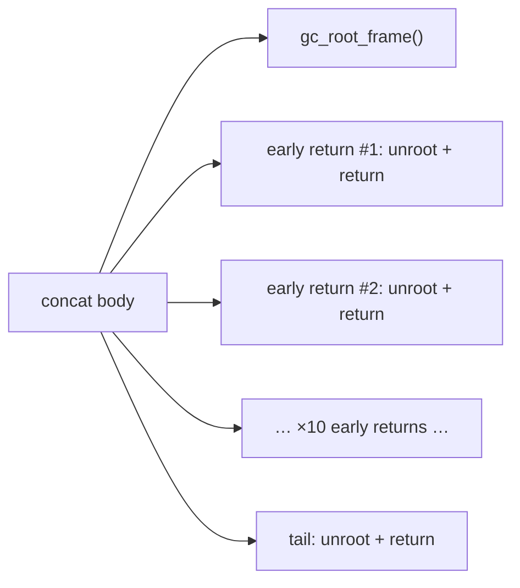
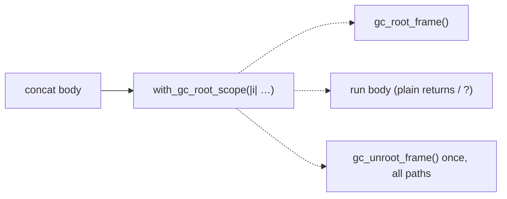

# Architecture review — jsse — 2026-09-04

**Scope**: Hot spots in `src/interpreter/` inferred from `git log` (generator runtime, typedarray/arraybuffer receivers, eval/exec, iterators — the areas of the last dozen merged refactors), plus a fresh sub-agent sweep for net-new candidates and a reconcile of the persisted backlog against GitHub. No path argument was given, so the scan followed the codebase's own heat.
**Picked**: `gc-root-scope-guard` — see PR (link in `.architecture/backlog.md` once opened) and the backlog entry.
**Degradations**: none. `gh` authenticated; `Explore`/`Agent` sub-agents available; `codebase-design` vocabulary applied.

**Diagram convention** (replaces the upstream HTML legend): solid edges are the module's interface; dashed edges are inside its implementation.

Reconciliation this run:
- `complete-state-machine-generator-ctor` → **landed** (PR #592 merged 2026-09-03). This is what promoted `gc-root-scope-guard` from recorded runner-up to this firing's pick — exactly the deterministic hand-off the backlog exists to carry.
- No open `pm-deepen`/architecture PR is `in-flight`, so this run may implement.
- All `proposed` entries re-checked: friction still present (196 `Completion::Normal` in `iterators.rs`; 10 `to_object(this` in `builtins/mod.rs`; `this_map`/`this_set` still present). No `dropped` entry's filter has lapsed.

## Candidates

### gc-root-scope-guard — a scope guard for GC temp-root frames  ·  Strong  ·  score 22/25

- **Files**: seam home `src/interpreter/mod.rs:1327` (`gc_root_frame`) / `:1333` (`gc_unroot_frame`); this firing migrates `src/interpreter/builtins/array.rs` (10 functions at `:1444, :1574, :1759, :1820, :2292, :2733, :2808, :3111, :3146, :3183`). Full-candidate blast-radius band derived from ~12 files / ~156 teardowns; **this firing's file-count estimate: 2** (`mod.rs` + `array.rs`).
- **Score 22/25**:
  - **Leverage 5** — ~156 `gc_unroot_frame` teardowns against ~55 `gc_root_frame` setups; the ~100-teardown gap is per-early-return epilogue copies. In `array.rs` alone, 10 setups carry 71 teardowns. Collapsing removes a whole *class* of hand-written teardown, and with it the standing risk of a forgotten `gc_unroot_frame` on some early-return path (a leak or, worse, a premature collection).
  - **Locality 4** — after the seam exists, changing root-frame teardown semantics (e.g. adding a poison check, or logging) is a one-function edit instead of a 156-site sweep.
  - **Blast radius 3** (full candidate) — several modules, no published interface. This firing's slice is blast radius 1 (2 files); the eval-and-rest remainder is split to `gc-root-scope-guard-eval`.
  - **Heat 5** — `eval.rs`, `array.rs`, `iterators.rs` are the hottest files in the interpreter and change most often; GC-root discipline is exactly the invariant a busy file erodes.
- **Problem**: The GC temp-root *frame* is a shallow seam used through a two-call idiom — `let f = gc_root_frame(); … gc_unroot_frame(f);` — whose teardown call the *caller* must thread onto every exit path by hand. `Array.prototype.concat` (`array.rs:1444`) repeats `interp.gc_unroot_frame(gc_frame); return …;` **ten times**, once per early return, plus the tail. The interface (two calls the caller must pair and place) is as complex as the implementation (a `Vec::len` and a `Vec::truncate`), and the caller reaches past it: the correctness of teardown lives in the caller, not the seam. Five sites in `eval.rs` (`:2633, :3038, :3443, :3539`, and `iterators.rs:5185` `iterate_to_vec`) already work around this with an IIFE — the same guard, hand-rolled — which is the tell that a real seam is missing.
- **Deletion test**: Delete the manual epilogue and the behaviour must still hold, so the teardown has to go *somewhere*. Behind `with_gc_root_scope` it concentrates in one place (passes); left to callers it stays scattered across ~156 sites (fails). Complexity concentrates, not moves — a genuine deepening.
- **Solution**: Add `Interpreter::with_gc_root_scope<T>(&mut self, body: impl FnOnce(&mut Self) -> T) -> T` that captures the frame, runs `body`, truncates back to the frame, and returns the body's value — structurally identical to the in-file `with_tail_position_suppressed` (`eval.rs:410`) and to the `iterate_to_vec` IIFE. Migrate `array.rs`'s 10 functions so their bodies run inside the guard with plain `return`s; the per-exit `gc_unroot_frame` copies delete. `eval.rs` and the remaining ~9 files follow in `gc-root-scope-guard-eval` because they carry the `#[inline(always)]` `eval_expr` hot path, two `gc_temp_roots.push` seam bypasses (`eval.rs:1066`, `:4324`), and require care the `array.rs` closures do not.
- **Benefits**: **Leverage** — one seam absorbs ~61 redundant epilogue copies in `array.rs` and makes the remaining ~90 across the codebase mechanical to migrate later. **Locality** — teardown correctness moves from every caller into one guard. **Test surface** — the guard is directly unit-testable through its interface (enter → roots grow → early-`return`/`?`-`Err` → roots truncate back to the saved frame), which the two-call idiom never was; you cannot unit-test "every caller remembered to unroot".

**Before** — each function body wires teardown onto every exit itself (shallow: interface = implementation, caller reaches past the seam):

**After** — one seam owns setup and teardown; the body just returns (deep: teardown hidden inside the implementation):

### completion-into-result — Completion→Result adapter head  ·  Worth exploring  ·  score 21/25

- **Files**: `src/interpreter/builtins/iterators.rs`, `src/interpreter/types.rs` (~2).
- **Score 21/25**: leverage 4 (~37 adapter heads collapse), locality 3, blast radius 1, heat 5.
- **Problem**: ~37 Result-returning iterator helpers open-code `match Completion { Normal(v)=>v, Throw(e)=>return Err(e), _=>… }`, each fabricating an unreachable `_ =>` arm.
- **Deletion test**: concentrates — `Completion::into_result(self) -> Result<JsValue, JsValue>` + `?` replaces every head and deletes the dead arms.
- **Solution / Benefits**: add the method on `Completion`; callers become `.into_result()?`. Leverage across 37 sites, one place to change the Completion→Result mapping.
- Runner-up **candidate** to the pick (within 1 point). Before/after omitted — not implemented this firing.

### completion-unwrap-macro — try_completion! for Completion-returning natives  ·  Worth exploring  ·  score 21/25

- **Files**: `src/interpreter/types.rs`, one adopter (~2). Score 21/25 (leverage 4, locality 3, blast radius 1, heat 5). A `try_completion!(expr)` that binds `Normal` and propagates abrupt Completions, for the Completion-return context (distinct from `completion-into-result`'s Result context).

### iterator-close-return-dance — one IteratorClose core  ·  Worth exploring  ·  score 20/25 (net-new)

- **Files**: `src/interpreter/builtins/iterators.rs` (~2). Score 20/25 (leverage 3, locality 4, blast radius 1, heat 5).
- **Problem**: four parallel reimplementations of spec IteratorClose that have **drifted** — `iterator_close_getter` (`:319`) and `iterator_close_with_completion` (`:541`) omit the `is_callable` pre-check that `iterator_close` (`:5103`) and `iterator_close_result` (`:5134`) perform, and only the latter two thread `Completion::Exit`.
- **Deletion test**: concentrates — one core `iterator_close(iterator, completion) -> Completion`, the four variants as thin adapters over return-type / completion-priority / Exit handling. Leverage 3 by backlog calibration: 4 implementation sites (the 121 downstream callers do not change), matching how `pattern-bound-names-walker` (1 site) and `regexp-last-index-accessor` (5+3) scored 3 while `this-weak-map-set` (9) scored 4.

### ordinary-create-from-constructor — shared [[Construct]] prologue  ·  Worth exploring  ·  score 19/25 (net-new)

- **Files**: 15–20 across `collections.rs`, `disposable.rs`, `proxy.rs`, all `intl/*`, all `temporal/*`. Score 19/25 (leverage 5, locality 4, blast radius 4, heat 3). Highest raw leverage of the fresh set (29 new-target guards + 38 prototype-resolution dances), but blast radius 4 crosses many builtin families and drags the total below the pick. Two composable helpers (`require_new_target` + `ordinary_create_from_constructor`), best in human-scheduled waves.

### this-primitive-value — one wrapper-unwrap for the primitive prototypes  ·  Speculative  ·  score 18/25 (net-new)

- **Files**: `number.rs`, `bigint.rs`, `string.rs` (~5). Score 18/25 (leverage 3, locality 4, blast radius 1, heat 3). Five near-identical `this_X_value` helpers (`number.rs:397/667/258`, `bigint.rs:40`, `string.rs:6`) differing only by class-name literal and extractor; a generic `this_primitive_value(this, class_name)` collapses them. Wrapper-object analogue of `object-this-coercion`.

*(Lower-scored proposed entries — `settle-and-return-tail`, `this-weak-map-set`, `object-this-coercion`, `generator-entry-guard`, `pattern-bound-names-walker`, `dataview-receiver-guard`, `regexp-last-index-accessor` — are carried in `.architecture/backlog.md` with scores and justifications; not re-expanded here.)*

## Dropped

| Candidate | Dropped because |
|---|---|
| `proxy-blind-callable-check` | Behaviour change, not a deepening — routing the 37 bare `callable.is_some()` checks through `is_callable` fixes a real Proxy-of-callable bug (spec IsCallable is true, jsse throws). An unattended deepening must pin *existing* behaviour first, and here existing behaviour is wrong. File as a jsse bug report; deepen once semantics are agreed. |
| `define-accessor-adoption` | Leverage 2 — the `define_getter` seam already exists (`mod.rs:1812`, 22 adopters); migrating the 42 raw-`PropertyDescriptor` getters is `/simplify`-class finishing work. The net-new `define_accessor` (getter+setter) piece is only 4 sites. |
| `object-id-of` | Leverage 2 — `.as_object_id().map(\|id\| JsObject { id })` round-trips renamed, not concentrated (re-check 2026-09-04: filter still applies). |
| `typedarray-shared-equality` | Leverage 2 — missed-reuse dedup of `same_value_zero`/`strict_eq` already in `helpers.rs`; moves code rather than concentrating behaviour. |

## Too large to automate

| Candidate | Why |
|---|---|
| `unify-generator-async-drivers` | Blast radius 5 — `generator_next_state_machine_impl` (~1580 L) and `async_generator_next_state_machine_impl` (~3050 L) are parallel state-machine interpreters; unifying them is a human-scheduled structural refactor. Land the generator-constructor and settle-tail candidates first to shrink both. |

## Pick

**`gc-root-scope-guard`, 22/25** — the highest-scoring eligible candidate. It was recorded on 2026-09-03 as the runner-up to `complete-state-machine-generator-ctor` (both 22/25, lost the blast-radius tie-break 1 vs 3); #592 merging on 2026-09-03 cleared the `in-flight` block and made it the natural next pick, precisely the deterministic hand-off the backlog memory is for.

The runner-up **candidate** is **`completion-into-result` (21/25)** — **within 1 point of the pick**, so the pick was close and `completion-into-result` is the natural next firing. It lost on leverage (4 vs 5) and locality (3 vs 4): its ~37 adapter heads are a wide but shallow win, whereas `gc-root-scope-guard` removes a whole class of hand-written teardown *and* the standing correctness hazard of a missed unroot, and is directly unit-testable through the new seam.

This firing scopes the pick to introducing the seam in `mod.rs` and migrating `array.rs` (the single worst concentration, 71 teardowns). `eval.rs` and the remaining ~9 files are split to `gc-root-scope-guard-eval` (proposed, 22/25) — `eval.rs` carries the `#[inline(always)]` hot path and two `gc_temp_roots.push` seam bypasses that need care an unattended firing should not rush. This mirrors the landed `arraybuffer-receiver-guard` → `dataview-receiver-guard` split.

## Design

_Written in step 4, after this report was first committed._
