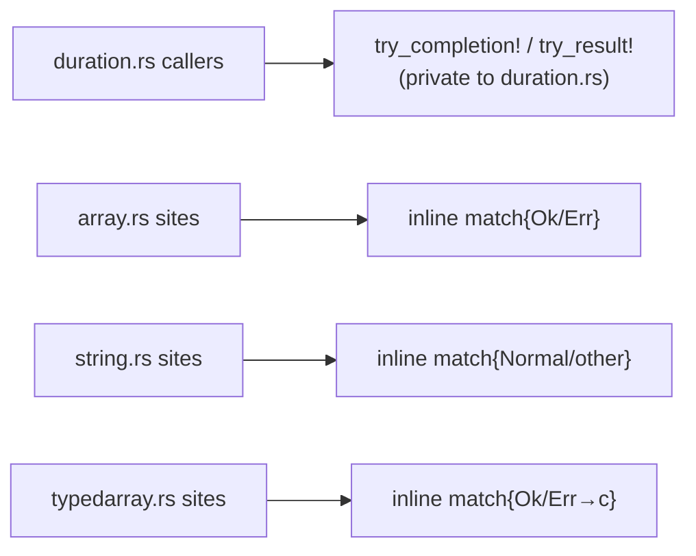
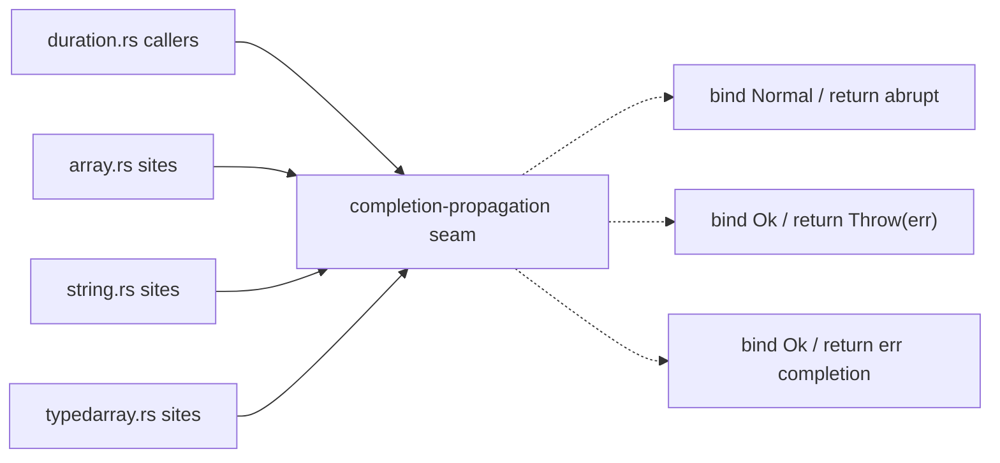
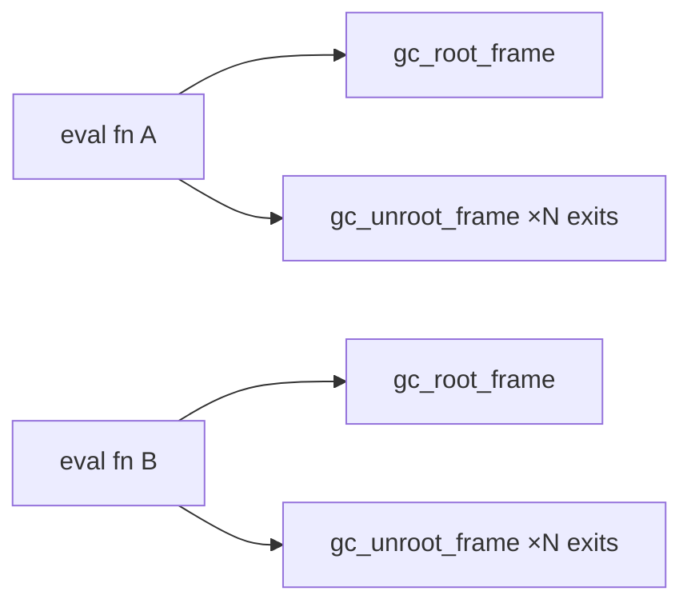
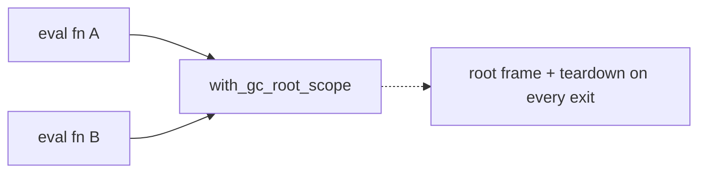

# Architecture review — jsse — 2026-09-10

**Scope**: `src/interpreter/` and `src/interpreter/builtins/` — the interpreter hot spots that dominate recent history and that every prior deepening firing has drawn from. A fresh sub-agent scan was run against these files, and the persistent `.architecture/backlog.md` was reconciled against `gh` first.
**Picked**: `completion-unwrap-macro` — see [PR to be opened] and `.architecture/backlog.md`. Branch was **adopted** (the firing's `sym/jsse/routine/refactor-audit/01M25W97CF`, which met all four adoption conditions: non-default, 0 commits ahead of `origin/main`, no upstream, unpublished on origin), so it is **not** renamed to `pm-deepen/<slug>`; the slug lives here and in the backlog.
**Degradations**: none. `gh` authenticated; sub-agent available; advisor available.

**Diagram convention**: solid edges are the interface (what a caller wires up); dashed edges are inside the implementation (hidden behind the seam).

## Reconciliation summary

- `gc-root-scope-guard` → **landed** (PR #595 merged 2026-09-04). Was the last `in-flight` entry; no open architecture PR now blocks implementation.
- All `dropped` filters re-checked (ranking step 2.4) and still apply — none reopened.
- Fresh scan surfaced one seam (`try_completion!` / `try_result!`) that **already exists** but is trapped private in `temporal/duration.rs`, which materially enriches the backlog's `completion-unwrap-macro` candidate and is the reason it re-scores above `gc-root-scope-guard-eval` this firing.

## Candidates

### completion-unwrap-macro — promote the private error-propagation macros to a crate-visible seam  ·  Strong  ·  score 23/25

- **Files**: seam home `src/interpreter/builtins/temporal/duration.rs:9-25` (the two macros to hoist), destination near `Completion` in `src/interpreter/types.rs`, plus one representative adopter file (chosen at step 5 from the shape-3 concentrations: `array.rs` 124 sites / `string.rs` 67 / `typedarray.rs` 46). **File-count estimate: 3** — seam definition + re-point `duration.rs` + one adopter.
- **Score 23/25**:
  - **Leverage 5** — the seam pays back across ~1725 hand-rolled propagation adapters tree-wide (911 `Result<_,JsValue>`→`Completion::Throw`, 598 `Result<_,Completion>`→`return c`, 216 `Completion`→bind-`Normal`) and removes a whole class of two-line match heads. Parity with the leverage-5 the just-landed `gc-root-scope-guard` earned for collapsing ~50–70 teardown epilogues; this collapses far more of the same shape of boilerplate, and the seam is already proven in-repo.
  - **Locality 3** — the propagation direction (which error type, which return conversion) concentrates in the macro definition; adoption itself is mechanical DRY, so change concentrates but bugs do not dramatically.
  - **Blast radius 1** — this firing touches ~3 files, no published interface (macros are `pub(crate)`), net-negative lines. Broad adoption is deliberately deferred, exactly as `gc-root-scope-guard` scoped to `array.rs` before `gc-root-scope-guard-eval`.
  - **Heat 5** — `builtins/*` and `types.rs` are the hottest files in the tree.
- **Problem** — the same three error-unwrap dances are re-spelled 1725 times because the two macros that already solve two of them are `macro_rules!` defined at the top of one Temporal file and invisible everywhere else. This is a *shallow* situation twice over: the propagation logic has no shared interface (every call site re-derives the direction), and where a seam *does* exist it cannot be reached. A reader must re-read a two-line match to learn "this just propagates the error".
- **Deletion test** — deleting the private macros today would re-scatter ~50 duration.rs match blocks back inline: complexity moves, does not concentrate. Deleting the *hoisted* seam would re-scatter propagation across all adopters: it concentrates. The hoisted seam passes; the trapped one fails — which is precisely the deepening.
- **Solution** — move `try_completion!` and `try_result!` out of `duration.rs` into a crate-visible home beside `Completion` (via `macro_rules!` + `pub(crate) use`, the `kind_accessor` convention already in `types.rs`); drop `try_result!`'s vestigial unused `$interp` parameter; add the missing third arm for `Result<T, Completion>` → bind `Ok`, `return` the `Err` completion. Re-point `duration.rs` to the shared macros and adopt them in one representative file to prove the seam and pin behaviour.
- **Benefits** — **leverage**: one seam now reachable from every builtins/core file, ready for follow-up adoption firings across 1725 sites. **locality**: the propagation contract lives in one definition instead of being re-derived per call. **test surface**: the macro's behaviour (bind normal / propagate abrupt / wrap-or-return) is exercised through a real adopter and pinned by test262-family delta = 0 plus a unit test invoking the macros from outside `duration.rs` — impossible today, since they are file-private.

### gc-root-scope-guard-eval — extend `with_gc_root_scope` to eval.rs + remaining files  ·  Strong  ·  score 22/25

- **Files**: `src/interpreter/eval.rs` (primary; 23 setups / 51 teardowns / 2 `gc_temp_roots.push` bypasses confirmed this firing) + ~9 more (`iterators.rs`, `promise.rs`, `exec.rs`, `atomics.rs`, `typedarray.rs`, `property.rs`, `eval/literals.rs`, `mod.rs`, `bytecode/vm.rs`). **Estimate ~10.**
- **Score 22/25**: leverage 5 (collapses ~50 teardown epilogues in the hottest file), locality 4 (GC-root correctness concentrates behind the seam), blast radius 3 (~10 files), heat 5. The `with_gc_root_scope` seam it needs is confirmed present at `mod.rs:1358`.
- **Problem / deletion test / solution** — as recorded in the backlog: follow-up to landed #595; the `eval_expr` `#[inline(always)]` hot path must not gain a call frame, the two `gc_temp_roots.push` bypasses must be routed or documented, and 5 existing IIFE workarounds adopt the combinator trivially. Deletion test: concentrates.
- **Why not picked** — within 1 point of the pick; it loses only on blast radius (3 vs 1). It is a correctness-sensitive control-flow rewrite of the hottest file, exactly the kind of change the inverted blast-radius term exists to defer behind a lower-footprint, higher-confidence pick. Natural next firing.

### completion-into-result — `Completion::into_result()` for the Result-returning iterator helpers  ·  Strong  ·  score 21/25

- **Files**: `src/interpreter/builtins/iterators.rs`, `src/interpreter/types.rs`. **Estimate ~2.**
- **Score 21/25**: leverage 4 (~37 adapter heads in one file), locality 3, blast radius 1, heat 5 (195 `Completion::Normal` in iterators.rs this firing).
- **Problem** — hand-rolled `match Completion { Normal(v)=>v, Throw(e)=>return Err(e), _=>… }` heads in the Result-returning abstract-operation helpers, with fabricated dead `_ =>` arms.
- **Why not picked** — distinct context (Result-return vs Completion-return; a method not a macro). Complementary to the pick, not superseded by it. Runner-up-adjacent; a natural firing after the macro seam lands.

### throw-error-completion — `throw_type_error` / `throw_range_error` helpers  ·  Worth exploring  ·  score 18/25

- **Files**: all builtins; representative `typedarray.rs:1426`. **Estimate ~1 (one adopter file first).**
- **Score 18/25**: leverage 3 (535 sites: 287 `Completion::Throw(create_type_error(...))`, 248 range), locality 2, blast radius 1, heat 5. Thinner than the pick — hides one wrapper token + the constructor lookup — but real and large.
- **Deletion test** — mild concentration (the `Completion::Throw` wrapper) rather than a class of control flow. Fresh this firing.

### array-typedarray-immutable-methods — unify parallel `toReversed`/`toSorted`/`with`  ·  Worth exploring  ·  score 17/25

- **Files**: `src/interpreter/builtins/array.rs:1652/2535/2908`, `src/interpreter/builtins/typedarray.rs:2258/2315`. **Estimate ~2.**
- **Score 17/25**: leverage 3 (only ~3 method pairs, but two drifting parallel implementations), locality 3, blast radius 2, heat 4. The "two parallel implementations drift apart" pattern the scan is told to watch for — small here, but genuine drift risk.

## Dropped

| Candidate | Dropped because |
|---|---|
| `arg-or-undefined` | Leverage 2 — 943 sites but a shallow helper whose interface equals its implementation; pure DRY + naming, not a deep module. `/simplify`-class, like `object-id-of`. |
| `define-method-adoption` | Leverage 2 — the `define_method` seam already exists (`mod.rs:1819`, 258 adopters); finishing the ~200 stragglers is `/simplify`-class, same reasoning as the existing `define-accessor-adoption` drop. |
| `proxy-trap-skeleton` | Leverage 2 — the deep part (`invoke_proxy_trap`) is already factored; only a thin ~13-site `if proxy {…} else {ordinary}` skeleton repeats and the per-trap validation genuinely differs. |

Older drops (`object-id-of`, `proxy-blind-callable-check`, `define-accessor-adoption`, `typedarray-shared-equality`) are retained in `.architecture/backlog.md`; all filters re-checked and still apply.

## Too large to automate

| Candidate | Blast radius |
|---|---|
| `unify-generator-async-drivers` | 5 — two ~1580/~3050-line parallel state-machine interpreters; a human-scheduled structural refactor. Shrink both drivers first via the generator-tail candidates. |

(`ordinary-create-from-constructor`, blast radius 4 / ~15–20 files, stays `proposed` in the backlog for a human-scheduled wave — implementable but too broad to outrank a blast-radius-1 pick.)

## Pick

**`completion-unwrap-macro`**, 23/25. It outranks the runner-up **candidate** `gc-root-scope-guard-eval` (22/25) by exactly one point, on the inverted blast-radius term alone (1 vs 3) — **the pick is close**, and `gc-root-scope-guard-eval` is the natural next firing. Both score leverage 5; the macro seam wins because it delivers that leverage while touching ~3 files with no published-interface change and a net-negative diff, where the eval.rs work is a ~10-file correctness-sensitive rewrite of the hottest file. New evidence this firing (the macros already exist and are proven; the true site count is ~1725, not the ~200 the backlog last estimated) is what lifted the macro candidate's leverage to parity and made the blast-radius term decisive — a legitimate re-score on fresh evidence, not a re-prioritization on other criteria.

## Design

Written at step 4 (design-it-twice + advisor adjudication); this file is amended and re-committed after the design pass.
