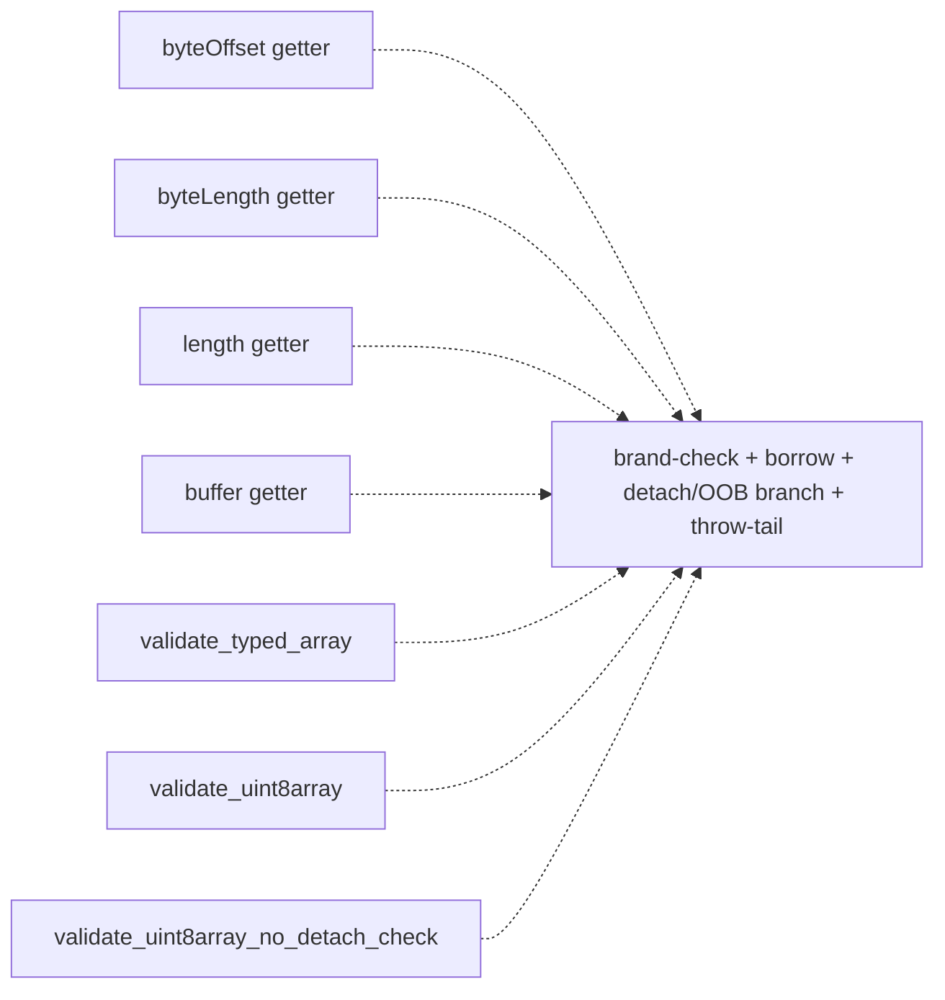
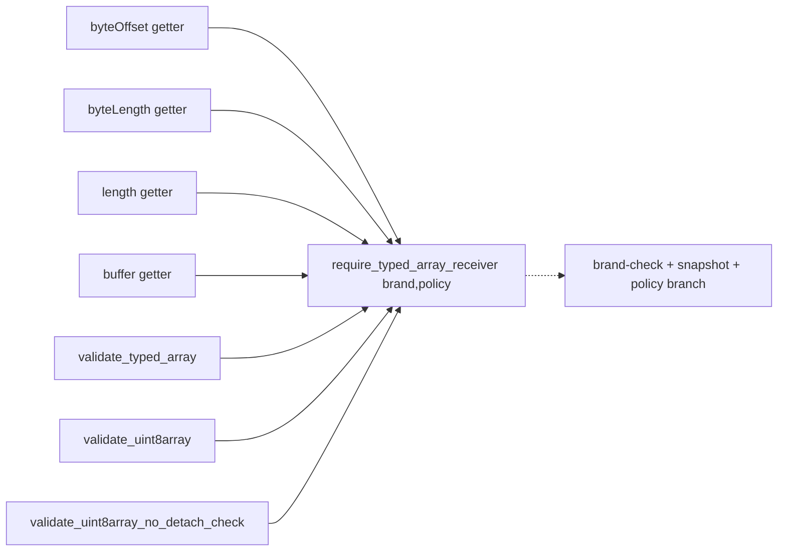
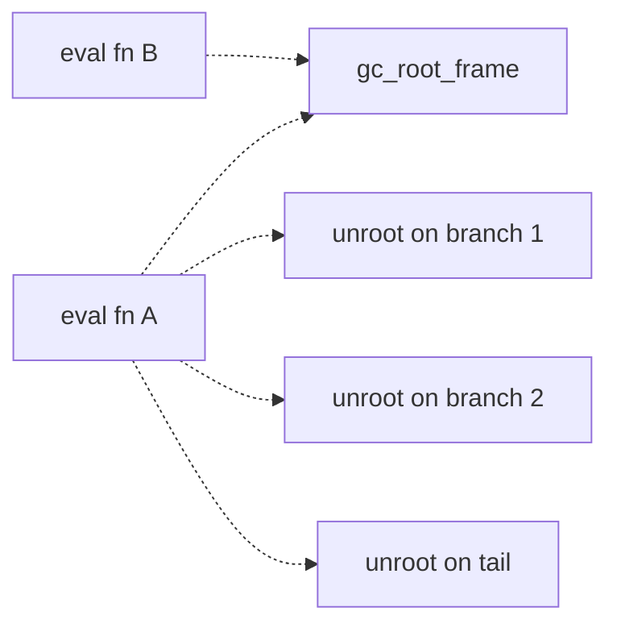
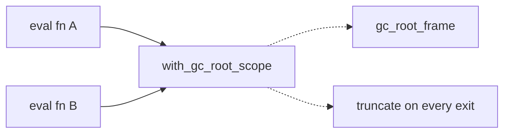

# Architecture review — jsse — 2026-09-11

**Scope**: `src/interpreter/` and `src/interpreter/builtins/` — the tree-walking interpreter and its
native builtins, which dominate the recent hot spots (`git log -60`: `typedarray.rs`, `iterators.rs`,
`string.rs`, `eval.rs`, `generator_runtime.rs`). Two PRs merged since the last firing reshaped the
Completion landscape — #622 (`with_array_elements/_mut`) and #623 (`propagate!` + `IntoAbrupt`) — so
their candidates were re-verified against current code, not the backlog's stale counts.

**Picked**: `typedarray-getter-receiver-guard` — see PR (below) and `.architecture/backlog.md`.

**Degradations**: none. `gh` authenticated; `codebase-design` vocabulary applied; sub-agent scan ran.

**Diagram convention**: in every Before/After pair, solid edges are the module's public interface;
dashed edges are calls that happen *inside* the implementation, hidden from callers.

## Candidates

### typedarray-getter-receiver-guard — one seam for TypedArray receiver-brand + detach policy · Strong · score 22/25

- **Files**: `src/interpreter/builtins/typedarray.rs` — the 4 `%TypedArray%.prototype` getters
  (`byteOffset` :1313, `byteLength` :1328, `length` :1343, `buffer` :1359) and the 3-member validator
  sibling family (`validate_typed_array` :5655, `validate_uint8array` :5673,
  `validate_uint8array_no_detach_check` :5700). File-count estimate: **~1**.
- **Score**: **22/25**
  - **Leverage 4** — 7 sites collapse (4 getters + 3 validators) and a whole class of receiver-validation
    test setup disappears; consistent with the landed `arraybuffer-receiver-guard` (8 getters → leverage 5)
    and `validate-typed-array` (leverage 5), one notch lower for the smaller site count.
  - **Locality 4** — a change to TypedArray receiver semantics (resizable-buffer OOB, a new detach rule,
    the brand error wording) today forces parallel edits in up to 7 places; afterwards it is one seam edit.
  - **Blast radius 1** — contained to `typedarray.rs`, no published interface touched, ~1 file.
  - **Heat 5** — `typedarray.rs` is among the hottest builtins (recent #543 `validate-typed-array`,
    #570 `arraybuffer-receiver-guard`, and present in the last-60-commit window).
- **Problem** — the module is **shallow at the receiver-validation seam**: a caller (getter) that wants a
  validated TypedArray must itself spell out `as_object_id → get_object[_cell] → borrow →
  typed_array_info → (detach/OOB branch) → else create_type_error("not a TypedArray")`. The seam
  `validate_typed_array` exists and hides exactly this — but only under a **throw-on-detached** policy, so
  the getters, which must **return 0** on a detached/out-of-bounds receiver (per spec `TypedArrayLength`
  returning 0), reach *past* it and re-open-code the whole dance. The result is three parallel validators
  that differ only in brand string and detach policy, plus four getters that duplicate the validator body
  a fourth way. The interface (`this_val`) is trivial; the implementation (brand + borrow + policy branch +
  two spellings of the throw) is repeated verbatim — the definition of a shallow module.
- **Deletion test** — delete the getters' inline prologues and the two Uint8 validators: the brand-check
  and policy logic **concentrates** in the one `require_typed_array_receiver` seam. It does not move to
  callers — callers shrink to a payload expression over a returned snapshot. Concentrates → a real
  deepening.
- **Solution** — add one receiver guard, `require_typed_array_receiver(this, brand, detach_policy) ->
  Result<TypedArrayInfo, Completion>`, returning an owned `TypedArrayInfo` snapshot (as
  `validate_typed_array` already does, so no borrow is held across the payload computation). `brand`
  selects any-TypedArray vs a specific `TypedArrayKind` (with the matching error string); `detach_policy`
  selects Throw / NoCheck / **ReturnZero**. Re-express the 4 getters as `match guard(..ReturnZero/NoCheck..)
  { Ok(ta) => payload, Err(_) => 0-or-throw }`, and redefine the 3 validators as thin one-line calls into
  the guard. Extends the existing seam by one policy dimension rather than adding a new parallel one.
- **Benefits** — **leverage**: the "what counts as a valid TypedArray receiver, and what happens when it is
  detached" decision lives once. **locality**: the next resizable-ArrayBuffer OOB fix, or a corrected brand
  message, is a one-line change behind the seam instead of a 7-site sweep that drift has already started on
  (the getters say `"not a TypedArray"`, the Uint8 validators say `"not a Uint8Array"` / `"typed array is
  detached"` — the guard makes the divergence a parameter, not an accident). **test surface**: the guard is
  directly unit-testable for each (brand × policy) combination through one interface, where today each
  policy is only reachable through a specific getter's observable output.

### gc-root-scope-guard-eval — extend with_gc_root_scope into eval.rs · Strong · score 22/25 (tied runner-up candidate)

- **Files**: `src/interpreter/eval.rs` (primary; 23 `gc_root_frame` setups / 51 `gc_unroot_frame`
  teardowns = ~28 redundant per-early-return copies across ~14 fns, 10 IIFE-workaround sites e.g. :4071,
  2 `gc_temp_roots.push` bypasses :1066/:4327, 1 manual `remove` :4589), plus the remaining ~9 files
  (`iterators.rs`, `promise.rs`, `exec.rs`, `atomics.rs`, `typedarray.rs`, `property.rs`, `eval/literals.rs`,
  `mod.rs`, `bytecode/vm.rs`). File-count estimate: **~10** (full candidate). A first firing would scope to
  `eval.rs` only, mirroring how #595 scoped to `array.rs`.
- **Score**: **22/25** (leverage 5, locality 4, blast radius 3, heat 5) — unchanged from the backlog, held at
  the full-candidate blast radius per the ranking rule that a one-file firing scopes the *implementation*,
  not the *score*.
- **Problem** — the `with_gc_root_scope` combinator already exists (`mod.rs:1358`, landed #595) and hides
  the Temp-Root Frame teardown, but `eval.rs` — the hottest file — still hand-pairs `gc_root_frame` /
  `gc_unroot_frame` with a teardown copy on *every* early-return branch, exactly the forgettable-epilogue
  bug class the seam was built to remove (#595 found 3 latent over-rooting exits doing this in `array.rs`).
- **Deletion test** — concentrates: the teardown-on-every-branch obligation collapses onto the combinator.
- **Solution** — adopt `with_gc_root_scope` for the whole-body single-frame functions and the 10 IIFE sites;
  leave the 2 direct `gc_temp_roots.push` bypasses and the manual `remove` as documented exceptions (as #595
  kept `Array.from`'s nested frames raw).
- **Benefits** — leverage across ~14 functions on the hottest path; locality of the whole GC-root-teardown
  contract; test surface unchanged (behaviour-preserving) but the bug class is structurally excluded.
- **Newly more implementable**: the documented blocker — `eval_expr` being `#[inline(always)]` — is **gone**
  (no `#[inline(always)]` remains in `eval.rs`). This lowers *risk*, not the score.

### completion-into-result — Completion::into_result for Result-returning iterator helpers · Worth exploring · score 21/25

- **Files**: `src/interpreter/builtins/iterators.rs` (25 open-coded `match Completion { Normal(v)=>v,
  Throw(e)=>return Err(e), _=>… }` heads with 26 fabricated `_ => UNDEFINED` arms), `types.rs`. Estimate ~2.
- **Score**: **21/25** (leverage 4, locality 3, blast radius 1, heat 5). Verified present and **unresolved**
  by #622/#623: `propagate!` early-returns a `Completion` and fits `eval.rs`'s `-> Completion` heads, but
  these 25 heads live in `-> Result<_, JsValue>` helpers with `_ => continue`-style arms, so they need a
  *Result-flavoured* sibling (`Completion::into_result(self) -> Result<JsValue, JsValue>`), not the existing
  macro. Distinct from #623.
- **Problem / deletion test / solution** — as recorded in the backlog; the fabricated `_ =>` arms become
  removable dead code once the adapter head is a single `.into_result()?`.

### this-primitive-value — collapse 4 brand-and-unwrap wrapper helpers · Worth exploring · score 18/25

- **Files**: `number.rs` (`this_number_value` :397, `this_boolean_value` :667, `this_symbol_value` :258),
  `bigint.rs` (`this_bigint_value` :40). Estimate ~5. **Correction from the backlog**: `this_string_value`
  (`string.rs:6`) is **not** a parallel sibling — it returns `Result<String, Completion>`, takes `&mut`, and
  does RequireObjectCoercible + ToString fallback. So the parallel family is **4, not 5**.
- **Score**: **18/25** (leverage 3, locality 4, blast radius 1, heat 3).

### iterator-close-return-dance — one IteratorClose core, four (now five) adapters · Worth exploring · score 20/25

- **Files**: `src/interpreter/builtins/iterators.rs`. A **5th** parallel reimplementation surfaced
  (`iterator_close_all` :637) beyond the four recorded. Drift confirmed live: `iterator_close_getter` :319
  and `iterator_close_with_completion` :587 lack both the `is_callable` pre-check and `Completion::Exit`
  handling that `iterator_close` :4999 and `iterator_close_result` :5030 perform.
- **Score**: **20/25** (leverage 3, locality 4, blast radius 1, heat 5).

### settle-and-return-tail — one async-generator exit tail · Worth exploring · score 20/25

- **Files**: `src/interpreter/eval/generator_runtime.rs` — 47 open-coded "call settle fn + `drain_microtasks()`
  + return `Normal(promise)`" tails; a partial seam `reject_with_type_error` (:2503) already exists for the
  TypeError variant (15 uses). Estimate ~1.
- **Score**: **20/25** (leverage 4, locality 4, blast radius 1, heat 3).

### Other verified-present proposed candidates (unchanged, see backlog)

`object-this-coercion` 20/25 (10 `to_object(this` sites, `builtins/mod.rs`), `this-weak-map-set` 20/25
(6 WeakMap + 3 WeakSet dances, `collections.rs`), `generator-entry-guard` 19/25 (11 pairs,
`generator_runtime.rs`), `regexp-last-index-accessor` 18/25 (read side has no seam; set side 13 uses of
`set_last_index_strict` with ~7 bypasses), `throw-error-completion` 18/25, `pattern-bound-names-walker`
19/25, `dataview-receiver-guard` 18/25, `array-typedarray-immutable-methods` 17/25.

## Dropped

Carried forward from the backlog; hard filters re-checked this run and still apply.

| Candidate | Dropped because |
|---|---|
| `object-id-of` | Leverage 2 — `/simplify`-class round-trip cleanup, complexity renamed not concentrated |
| `proxy-blind-callable-check` | Behaviour change (latent bug), not a behaviour-preserving deepening — file as a bug |
| `define-accessor-adoption` | Leverage 2 — deep `define_getter` seam already exists; migrating 42 raw getters is finishing work |
| `typedarray-shared-equality` | Leverage 2 — missed-reuse dedup, not a new seam |
| `arg-or-undefined` | Leverage 2 — DRY helper whose interface equals its implementation (shallow by definition) |
| `define-method-adoption` | Leverage 2 — `define_method` seam already exists; straggler adoption is `/simplify`-class |
| `proxy-trap-skeleton` | Leverage 2 — deep `invoke_proxy_trap` already factored; only a thin skeleton would collapse |

## Too large to automate

| Candidate | Filter | Note |
|---|---|---|
| `unify-generator-async-drivers` | Blast radius 5 | ~1580/~3050-line parallel state machines; land the ctor/settle-tail candidates first |
| `ordinary-create-from-constructor` | Blast radius 4 | 15–20 files across builtin families; best in human-scheduled waves |

## Pick

**`typedarray-getter-receiver-guard`** (22/25), scoped to `typedarray.rs`.

The top two are **tied at 22/25**, so the deterministic tie-break — **lower blast radius** — decides it:
`typedarray-getter-receiver-guard` is blast radius **1** (one file), the runner-up candidate
`gc-root-scope-guard-eval` is blast radius **3** (full ~10-file candidate). Per the ranking rule, the
runner-up's score is *not* re-lowered by scoping its first firing to `eval.rs`; the full-candidate blast
radius is what ranks it, and at equal totals the tighter-scoped candidate wins. `gc-root-scope-guard-eval`
is therefore the natural next firing.

Why the pick is a genuine deepening and not straggler-adoption of the existing `validate_typed_array` seam
(the test that dropped `define-method-adoption`): the getters do not merely fail to *use* the seam — they
*cannot*, because they need a **return-0-on-detached** policy the seam does not offer. Adding a detach-policy
parameter **extends what the seam hides**, exactly the distinction that keeps `dataview-receiver-guard`
proposed. It is the direct follow-up to the landed `validate-typed-array` (#543) — whose summary explicitly
left the `validate_uint8array` sibling and the throw-on-detached getters out of scope — in the same family
relation that `arraybuffer-receiver-guard` (#570) bears to it.

## Design

_Written in step 4 (design-it-twice + adjudication); this section is amended and re-committed then._
