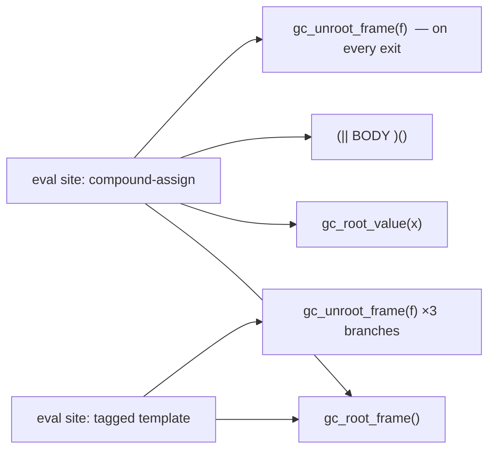
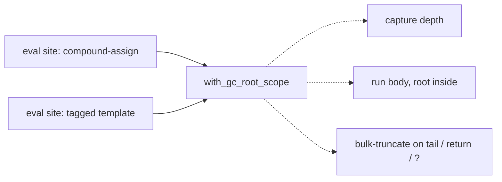
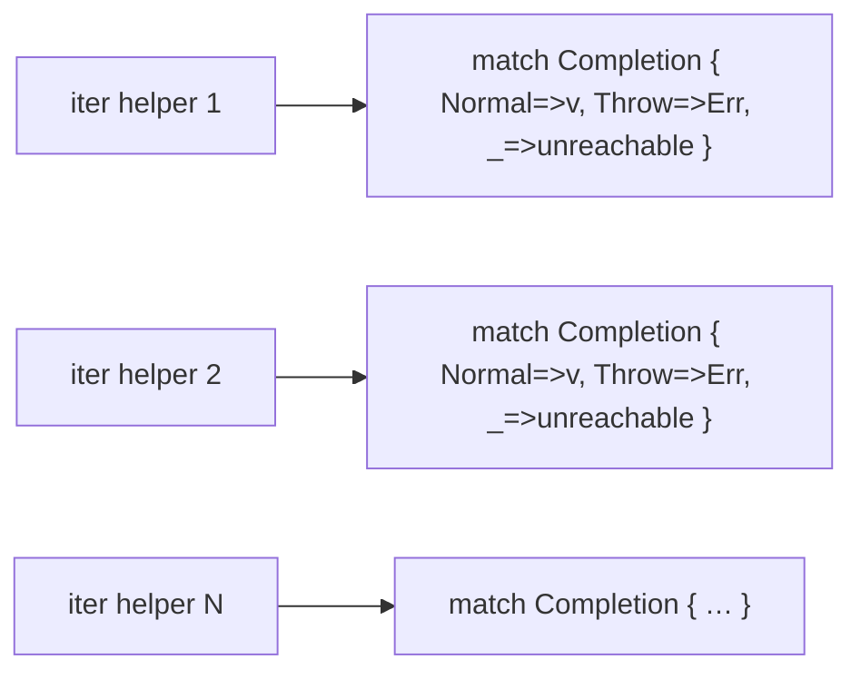
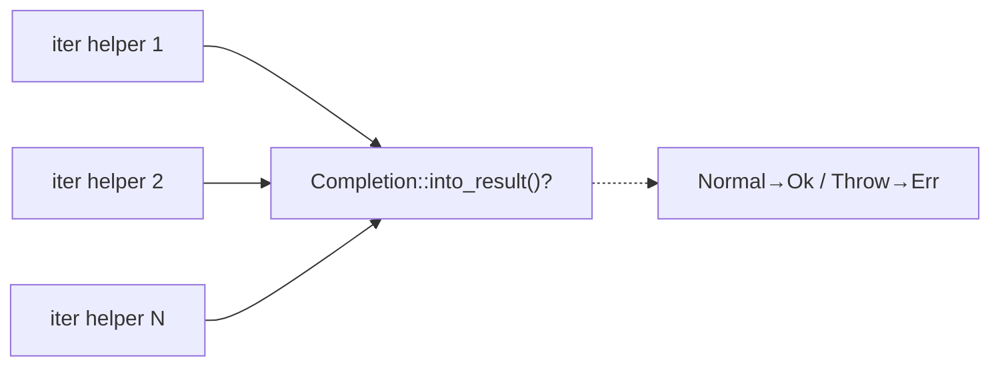
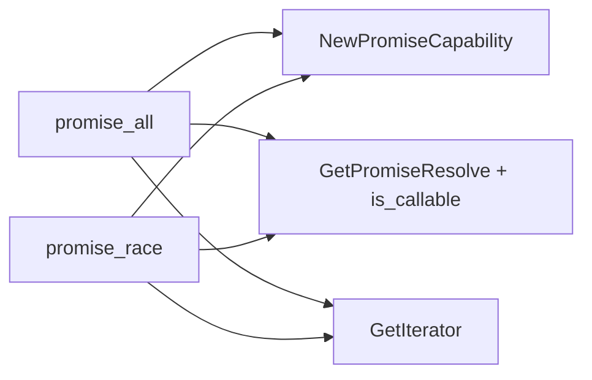
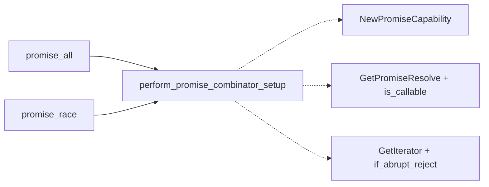
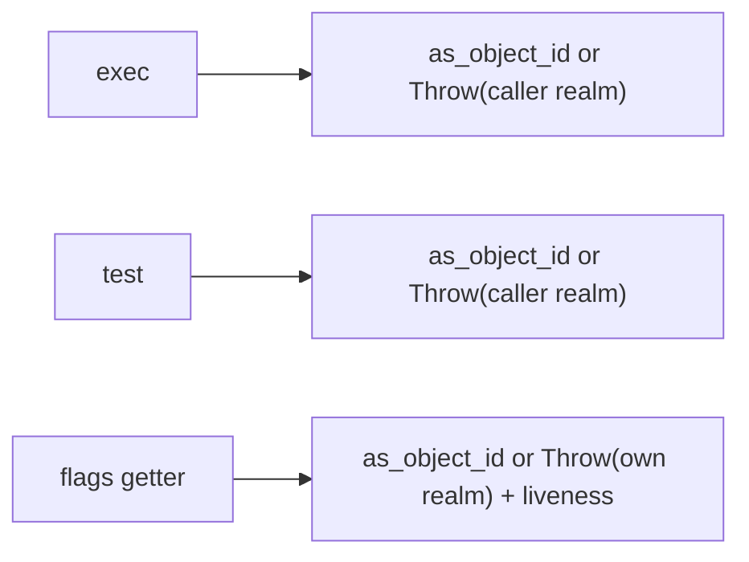
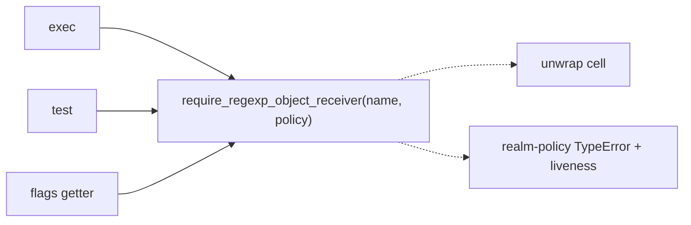

# Architecture review — jsse — 2026-09-14

**Scope**: `src/interpreter/` interpreter core, weighted to recent hot spots
(`eval.rs`, `builtins/{iterators,typedarray,promise,regexp}.rs`,
`eval/generator_runtime.rs`, `types.rs`). Reconciled against the persistent
`.architecture/backlog.md` and open/merged PRs via `gh`. A fresh sub-agent scan
re-verified the top proposed candidates, re-checked the dropped filters, and
hunted for net-new candidates.

**Picked**: `gc-root-scope-guard-eval` — see the PR and `.architecture/backlog.md`.

**Degradations**: none. `gh` authenticated, sub-agent scan ran, advisor
available for step-4 adjudication.

**Diagram convention** (replaces the upstream HTML legend): solid edges are the
public interface a caller wires by hand; dashed edges are steps hidden *inside*
the deepened module's implementation.

---

## Candidates

### `gc-root-scope-guard-eval` — adopt `with_gc_root_scope` in `eval.rs` · Strong · score 22/25

- **Files**: full candidate ~10 files — `src/interpreter/eval.rs` (primary) +
  `iterators.rs`, `promise.rs`, `exec.rs`, `atomics.rs`, `typedarray.rs`,
  `property.rs`, `eval/literals.rs`, `mod.rs`, `bytecode/vm.rs`.
  **This firing's scope: ~1 file (`eval.rs`), 7 sites** — the member-access /
  compound-assignment / property-write IIFE sites at `eval.rs:2611, 2744, 3016,
  3421, 3517, 4046` plus the tagged-template call manual-epilogue at
  `eval.rs:1385`. The remaining `eval.rs` sites and the 9 other files are
  deferred to `gc-root-scope-guard-remainder`.
- **Score** (full candidate): **22/25**
  - **Leverage 5** — the `with_gc_root_scope` seam (landed #595, adopted in
    `array.rs` and the `yield*` path #624) removes an entire class of
    hand-threaded teardown epilogue across ~22 `eval.rs` sites; `eval.rs` today
    carries 22 `gc_root_frame` setups against 41 `gc_unroot_frame` teardowns —
    the ~19-copy gap is per-early-return epilogue duplication the seam deletes.
  - **Locality 4** — a rooting-lifetime change (e.g. a new early-return path)
    becomes a single edit inside the closure instead of a new `gc_unroot_frame`
    threaded onto every branch by hand; the "did every exit path unroot?" audit
    concentrates at the seam.
  - **Blast radius 3** — full candidate touches ~10 files (this firing scopes to
    1). *This firing's blast radius is 1.*
  - **Heat 5** — `eval.rs` is the single hottest interpreter file.
- **Problem**: `eval.rs`'s temp-root frames are *shallow at each call site* — the
  interface (`gc_root_frame` / `gc_unroot_frame`) is a two-call primitive whose
  correct use (unroot on **every** exit path — tail, each early `return`, each
  `?`) is re-derived and hand-placed per site. Callers reach past the seam:
  some isolate the body in an IIFE purely to funnel every `return` through one
  post-IIFE `gc_unroot_frame`; others thread an explicit `gc_unroot_frame`
  before each early `return` (`eval.rs:1385` repeats it 3×). The correctness
  invariant lives in the caller, not the module — exactly the shallowness #595
  and #624 already collapsed elsewhere.
- **Deletion test**: deleting `with_gc_root_scope` **concentrates** — every
  adopter would have to re-grow its own teardown epilogue on every branch, the
  precise duplication this removes. Not a rename: the seam owns the
  "truncate-on-every-exit" behaviour, which is where root-leak/over-root bugs
  live (#595 fixed 3 latent over-rooting exits in `concat` by adopting it).
- **Solution**: replace each site's `let f = gc_root_frame(); … (|| { BODY })();
  gc_unroot_frame(f); result` (IIFE sites) or `let f = gc_root_frame(); …
  gc_unroot_frame(f); return X;`-per-branch (manual-epilogue sites) with
  `with_gc_root_scope(|i| { i.gc_root_value(&x); BODY })`, moving the
  `gc_root_value` calls inside the closure and letting the seam bulk-truncate on
  every exit. Behaviour-identical (ADR-2026-09-10-2014: the returned value is
  not rooted after the scope closes, matching the manual tail).
- **Benefits**: **leverage** — the teardown-on-every-branch discipline is
  written once, in an audited seam, instead of re-verified per site;
  **locality** — a rooting bug or a new exit path is a one-place change;
  **test surface** — the invariant "temp-root depth is restored on every exit
  path" becomes assertable against the seam and against each adopter's throw
  path, rather than being an implicit property of hand-placed teardown pairs.

### `completion-into-result` — `Completion::into_result()` adapter · Worth exploring · score 21/25 · runner-up candidate

- **Files**: ~2 — `src/interpreter/builtins/iterators.rs`, `src/interpreter/types.rs`.
- **Score 21/25**: leverage 4 (18 canonical 3-arm adapter heads collapse, each
  shedding a fabricated `_ =>` dead-code arm), locality 3, blast radius 1, heat 5.
- **Problem**: 37 `Completion::Normal(v) => v` unwrap heads and 25
  `Completion::Throw(e) => return Err(e)` arms in the Result-returning iterator
  abstract-operation helpers each re-spell the Completion→Result adapter inline;
  18 are the byte-identical 3-arm shape (`iterators.rs:308, 322, 418, 427, 439,
  483, 506, 527, 545, 4513, 4530, 4547, 4553, 4593, 4903, 5038, 5114, 5128`).
- **Deletion test**: concentrates — the adapter is one method; the fabricated
  unreachable `_ =>` arms become removable.
- **Solution**: add `Completion::into_result(self) -> Result<JsValue, JsValue>`;
  rewrite the heads to `.into_result()?`.
- **Benefits**: leverage across ~18 helpers; the Completion→Result boundary gets
  one tested definition. Distinct from the landed `propagate!`/`IntoAbrupt`
  (#623), which covers the *other* direction (Result→Completion abrupt-propagate).

### `promise-combinator-setup-prologue` — `perform_promise_combinator_setup` · Worth exploring · score 20/25 · NEW

- **Files**: ~1 — `src/interpreter/builtins/promise.rs`. 4 full sites
  (`promise_all` :1238, `promise_all_settled` :1386, `promise_race` :1964,
  `promise_any` :2039) + 2 partial keyed fast-path hooks (`promise_all_keyed`
  :1577, `promise_all_settled_keyed` :1740).
- **Score 20/25**: leverage 4, locality 4, blast radius 1, heat 3.
- **Problem**: each combinator re-spells the identical prologue —
  `NewPromiseCapability(C)` → root the capability on a GC frame →
  `GetPromiseResolve(C)` + `is_callable` check → `GetIterator(iterable)` — with
  every abrupt routed through `if_abrupt_reject_promise` (`promise.rs:13`). The
  subtle piece re-derived per site is *when* an abrupt completion must become a
  **rejected promise** rather than a thrown completion (it flips once the
  capability exists).
- **Deletion test**: concentrates — the abrupt-becomes-rejected-promise decision
  is the behaviour being hidden, not just the call sequence.
- **Solution**: `perform_promise_combinator_setup(constructor, iterable) ->
  Result<(PromiseCapability, JsValue /*promiseResolve*/, JsValue /*iterator*/),
  Completion>`.
- **Benefits**: leverage across 4–6 combinators; the reject-vs-throw boundary
  gets one home. **Composition note**: these sites also each carry a
  `gc_root_frame` + IIFE that the full `gc-root-scope-guard` candidate lists
  under `promise.rs`; the two seams compose (prologue inside the scope closure),
  and whichever lands second adapts to the first.

### `regexp-object-receiver-guard` — `require_regexp_object_receiver` · Worth exploring · score 18/25 · NEW

- **Files**: ~1 — `src/interpreter/builtins/regexp.rs`. ~13 sites: exec :8325,
  test :8363, toString :8392, compile :8435, `@@match` :8592, `@@search` :8801,
  `@@replace` :8882, `@@split` :9456, `@@matchAll` :9692,
  RegExpStringIterator.next :9857, `flags` getter :10137, boolean-flag getters
  :10195, `source` getter :10249.
- **Score 18/25**: leverage 3 (borderline — thinner than the TypedArray guards;
  edges toward `object-this-coercion`'s territory unless it also returns the
  object *cell* and carries the realm policy), locality 3, blast radius 1, heat 4.
- **Problem**: ~13 sites open-code `match this.as_object_id() { Some(id)=>id,
  None=>return Throw(TypeError "…requires that 'this' be an Object") }`. Two
  *deliberate* realm policies (not drift): methods use caller-realm
  `create_type_error`; the `flags`/`source`/flag **accessors** use
  `create_error_in_realm(my_realm_id, …)` captured at getter-creation
  (`regexp.rs:10181`) — cross-realm accessor semantics. The `flags` getter also
  does a second liveness check (`get_object_cell(id).is_none()` at :10144) the
  other 12 skip.
- **Deletion test**: borderline-concentrates — genuine deepening only if the
  guard returns the cell and carries the realm policy (mirroring what keeps
  `typedarray-getter-receiver-guard` a deepening rather than straggler-adoption);
  a bare id-unwrap + message would be `object-this-coercion`-class.
- **Solution**: `require_regexp_object_receiver(this, name, realm_policy) ->
  Result<u64 /*or cell*/, Completion>`, the RegExp sibling of the backlogged
  `object-this-coercion` (Object.prototype) and the receiver-guard family, in a
  module that currently has none.

### Carried in backlog (proposed, re-verified present, not re-carded this run)

Full cards live in prior reviews; scores below drive the ranking. All friction
re-confirmed by this run's scan (line drifts folded into the backlog).

| Candidate | Score | Note from this run's scan |
|---|---|---|
| `settle-and-return-tail` | 20/25 | 48 exit tails present (`generator_runtime.rs`) |
| `this-weak-map-set` | 20/25 | 9 dances confirmed; needs `method_name` param (per-method messages) |
| `object-this-coercion` | 20/25 | 10 `to_object(this` sites present |
| `iterator-close-return-dance` | 20/25 | 4 impls confirmed drifted (`:319, :587, :4999, :5030`) |
| `generator-entry-guard` | 19/25 | present |
| `pattern-bound-names-walker` | 19/25 | present |
| `this-primitive-value` | 18/25 | family is 4 not 5 (string sibling differs) |
| `regexp-last-index-accessor` | 18/25 | present |
| `dataview-receiver-guard` | 18/25 | present |
| `throw-error-completion` | 18/25 | present |
| `array-typedarray-immutable-methods` | 17/25 | present |
| `gc-root-scope-guard-remainder` | 22/25 (deferred remainder) | NEW — the ~15 `eval.rs` sites + 9 files this firing did not take |

## Dropped

| Candidate | Dropped because |
|---|---|
| `object-id-of` | Leverage 2 — `.map(\|id\| JsObject { id })` round-trip (now 158 sites), `/simplify`-class, complexity renamed not concentrated |
| `define-method-adoption` | Leverage 2 — `define_method` seam already exists (~130 adopters); migrating raw sites is finishing work |
| `define-accessor-adoption` | Leverage 2 — `define_getter` exists; 54 raw getters are finishing work; the net-new getter+setter piece is only 4 sites |
| `proxy-blind-callable-check` | Behaviour change (latent bug), not a behaviour-preserving deepening — file as a bug report |
| `typedarray-shared-equality` | Leverage 2 — missed-reuse dedup, not a new seam |
| `arg-or-undefined` | Leverage 2 — shallow DRY helper (interface == implementation) |
| `proxy-trap-skeleton` | Leverage 2 — deep part (`invoke_proxy_trap`) already factored; only a thin skeleton would collapse |
| `array/typedarray iteration-method parallelism` (scan secondary) | Blast radius risk — ~24 method pairs, JS-value vs typed-numeric access; a shared core likely *moves* complexity into per-kind adapters (same profile as `unify-generator-async-drivers`) |

## Too large to automate

| Candidate | Why |
|---|---|
| `ordinary-create-from-constructor` | Blast radius 4 — 15–20 files across many builtin families; best in human-scheduled waves |
| `unify-generator-async-drivers` | Blast radius 5 — ~1580/~3050-line parallel state machines; land the generator-ctor/settle-tail shrinkers first |

## Pick

**`gc-root-scope-guard-eval`, 22/25.** It is the highest-scoring eligible
candidate and its headline risk has cleared: the sub-agent scan confirmed
`eval_expr` is **no longer `#[inline(always)]`** (definition at `eval.rs:418`,
no attribute; the `EvalDepthGuard` doc no longer warns about it), so adopting
the `#[inline]` `with_gc_root_scope` combinator adds no hot-path frame concern.
The seam exists and is tested (#595, #624) and ADR-2026-09-10-2014 explicitly
names `gc-root-scope-guard-eval`'s remaining scope as the sanctioned follow-up,
evaluated "individually against the same criterion … single frame, no
cross-branch identity removal, no continuation spanning multiple ticks."

The **runner-up candidate is `completion-into-result` (21/25)** — within 1
point, so the pick was close and `completion-into-result` is the natural next
firing. It loses only on leverage (4 vs 5): it collapses 18 adapter heads in one
file, where the pick removes a whole teardown-epilogue class from the hottest
file behind an already-audited seam.

**This firing scopes to `eval.rs` only (7 sites)**, mirroring how the parent
`gc-root-scope-guard` (#595) scored the full ~10-file candidate at 22/25 but
implemented a 2-file `array.rs` slice and deferred the rest to this candidate.
The scope excludes, and defers to `gc-root-scope-guard-remainder`:
the array/object-destructuring sites (`eval.rs:4340, 4453, 4621, 4702` — the
ADR-flagged sensitive region that roots `DestructLRef` and nests frames), the
hot call/spread sites (`:4839, 4931, 5109, 5124, 6716, 6749` — highest teardown
redundancy but the hottest paths, a deliberately-scheduled slice), the
promise/multi-tick sites (`:8193, 9735`), the two cosmetic single-exit sites
(`:4268, 5366`, no redundant teardown to collapse), the ADR-excluded
`gc_temp_roots.push`/`remove` bypasses (`:4302, :4566`) and `gc_unroot_value`
identity-removal sites, and the 9 non-`eval.rs` files. The 7 in-scope sites were
each confirmed to meet the ADR criterion: single frame, bulk-truncate on all
exits, zero `gc_unroot_value`/`gc_temp_roots` between setup and teardown.

## Design

Three interfaces were produced in parallel by sub-agents (not inline), each for
*how `eval.rs` consumes the existing `with_gc_root_scope` seam* — the seam itself
is fixed by ADR-2026-09-10-2014 (RAII rejected), so the design axis is the
consumption pattern, not the combinator. Adjudicated by the advisor against
depth → locality → seam placement → test surface → blast radius.

### Design A — minimal surface (bare adoption) · WINNER

No new API. Each site becomes
`self.with_gc_root_scope(|i| { i.gc_root_value(&x); …body, self→i… })`, with
static-prefix roots and dynamic mid-body roots (1385's substitution loop,
3517's `boxed` wrapper at `:3550`) going through the same `i.gc_root_value(...)`
call. The 6 IIFE sites are near-1:1 rewrites (`(|| {` → `with_gc_root_scope(|i| {`,
drop the trailing `gc_unroot_frame`); the manual-epilogue site 1385 collapses 3
hand-threaded `gc_unroot_frame` calls to plain returns. This is exactly the shape
the landed `yield*` adopter (#624) uses.

### Design B — value-rooting slice wrapper (`with_gc_rooted(&[&JsValue], body)`) · runner-up design, REJECTED

Add a wrapper that roots a static prefix then delegates:
`self.with_gc_rooted(&[&a, &b], |i| …)`. This is the exact variant #595's
design-it-twice review rejected as its runner-up ("its slice seals a ≥2-root
variation that had zero real adapters in `array.rs`").

**Why it lost — the stronger reason `eval.rs` surfaces.** #595's stated premise
is factually overturned: `eval.rs` has **3** ≥2-root sites (1385, 2744, 4046),
not zero. But the rejection survives for a more fundamental reason: `JsValue` is
not `Copy` (custom `Drop`, `types.rs:734`), so the `&[&JsValue]` slice holds
shared borrows across the whole call while the closure **moves** those same
values into `set_object_with_key` (2744 `:2771`, 4046 `:4064`) or
`Completion::TailCall` (1385 `:1407`) — **E0505** at all 3 adapter sites,
forcing `.clone()` workarounds. And 1385 also roots dynamically (its loop),
which a fixed prefix slice cannot express, so it degrades to a *mixed* idiom
(slice + inline `gc_root_value`) at the very site that most needs help. Only 2
of 7 sites (2744, 4046) are clean pure-static-prefix adapters, and both still
need the clone. The slice does not cleanly serve even its own target sites.

### Design C — maximum-flexibility rooting handle (`with_gc_root_scope(|i, roots| …)`) · REJECTED

A handle passed to the closure so static and dynamic roots share one `.push()`
idiom. **Borrow-checker-infeasible in its flagship form**: the handle must reach
`gc_temp_roots`, which every body method (`eval_expr`, `call_function`, …)
mutates through `&mut self`; a disjoint `&mut self.gc_temp_roots` conflicts with
those calls, a token handle needs `self` passed back in anyway, and interior
mutability (`Rc<RefCell>`/`*mut`) is the precise GC-hot-path tax
ADR-2026-09-10-2014 rejected. Its only compilable fallback is the Design B
prefix slice — already rejected. Decisive observation: `gc_root_value(&mut self)`
**already is** the dynamic-root API and the closure already receives `&mut Self`,
so Design C's stated goal (one idiom for static + dynamic) is already met by
Design A with zero new types.

### Verdict

**Design A wins on every criterion.** Depth: reuses the audited seam, adds no
surface. Locality: one rooting idiom, uniform across static and dynamic roots.
Seam placement: the seam already sits where variation is (three prior adopters);
B/C seal a variation with no clean adapter. Test surface: identical for all
three (behaviour-preserving), pinned via the existing `$262.gc()` hook and the
seam test at `tests.rs:4536`. Blast radius: A is the smallest diff — near-mechanical,
no clones. B and C both self-defeat on the borrow checker; A is what #595 and
#624 already established.

**Honest yield**: 1385 is the substantive collapse (3 hand-threaded unroots →
returns). The 6 IIFE sites retire the IIFE-funnel idiom for consistency but are
near-cosmetic — the trailing `gc_unroot_frame` after an IIFE already could not be
skipped by an early return inside it. Net line count is roughly neutral apart
from rustfmt reindent of the ~270-line body at 3016. The value is uniformity and
one audited teardown path, not deletion volume.

### Proposed ADR amendment (see PR body)

Not a new ADR — an amendment note to ADR-2026-09-10-2014 recording that the
value-taking `with_gc_rooted(&[&JsValue], …)` variant, when re-evaluated against
`eval.rs`, is rejected for a **stronger** reason than #595 gave: the shared-borrow
vs. move conflict (E0505), not merely absent adapters. Recorded so a future
firing over `gc-root-scope-guard-remainder` does not re-derive the slice.
