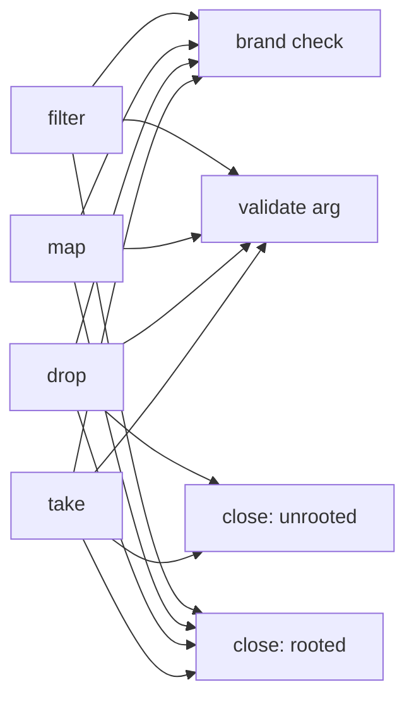
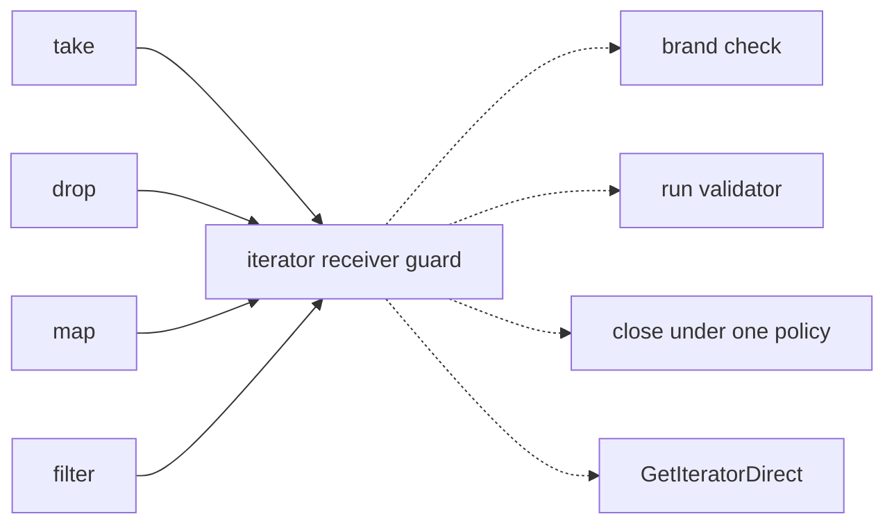
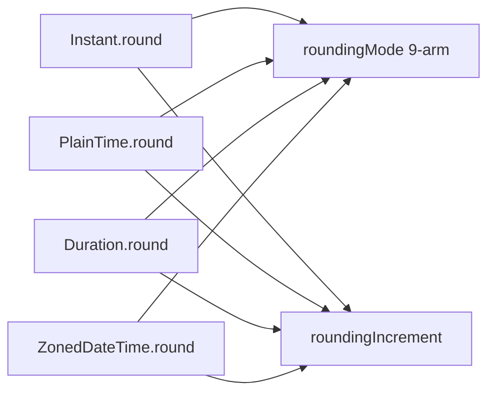
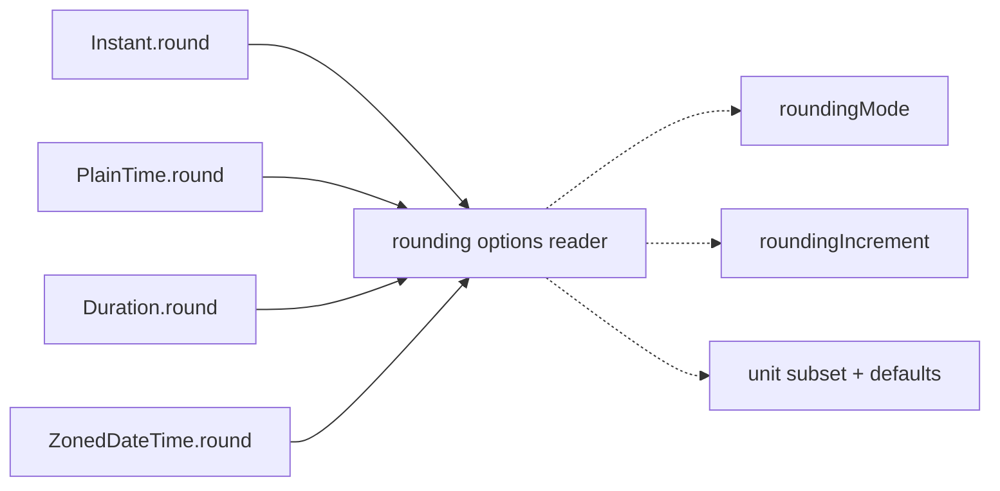

# Architecture review — jsse — 2026-09-18

**Scope**: Whole-tree scan weighted to the hot spots in `git log` since 2026-09-01 —
`src/interpreter/builtins/temporal/`, `builtins/string.rs`, `builtins/iterators.rs`,
`builtins/typedarray.rs`, `property.rs`, `scheduler.rs`, `types.rs` — plus a
re-verification pass over every `proposed` and `dropped` entry in
`.architecture/backlog.md`. Three sub-agents ran in parallel: one re-deriving the
`gc-root-scope-guard-remainder` site inventory post-#628, one re-verifying the top
six `proposed` entries against current code, one hunting genuinely new candidates.

**Picked**: `iterator-helper-argument-prologue` — see `.architecture/backlog.md`

**Degradations**: none. `gh` authenticated, sub-agents available, advisor available,
quality gate discoverable.

**Branch**: `sym/jsse/routine/refactor-audit/01M2RSMHC2` — **adopted** (all four
conditions held: non-default; `origin/main..HEAD` = 0; no upstream; absent from
`origin`). Not renamed, per the adopted-branch rule.

**Diagram legend**: solid edges are the interface; dashed edges are inside the
implementation.

---

## Reconciliation

| Entry | Was | Now | Evidence |
|---|---|---|---|
| `gc-root-scope-guard-eval` | in-flight (#628) | **landed** | `gh pr view 628` → `MERGED` 2026-09-14T07:19:16Z |

No open PRs on the repo, so the one-architecture-PR-at-a-time gate is clear and this
run may implement.

Every `proposed` entry was re-checked against current code. **None** was resolved or
partly fixed by #622/#623/#624/#626/#628. Corrections folded into the backlog:

- `gc-root-scope-guard-remainder` — line numbers re-derived post-#628. Tree-wide now
  **48 setups / 83 teardowns = 35 redundant epilogue copies** (was ~55/~156 pre-#595).
  Two structural corrections: `property.rs` has **zero** frame call sites (its only
  match is a doc comment at `:575` explaining why `array_set_length` deliberately uses
  `gc_root_value`/`gc_unroot_value` identity removal instead) — struck from the file
  list; and `src/interpreter/builtins/mod.rs:6463` (`Object.fromEntries`, 1 setup /
  7 teardowns) was **missing from the entry entirely** — added.
- `settle-and-return-tail` — grew from ~47 to **54** canonical tails (48 `reject_fn`,
  6 `resolve_fn`). Its "sequence after `complete-state-machine-generator-ctor`" note is
  **stale**: #592 landed and the count went *up*. Dependency struck; heat raised.
- `this-weak-map-set` — the 2026-09-02 blocker is **resolved**. All 9 error messages are
  uniformly `"{Brand}.prototype.{method} requires a {Brand}"`, the same template
  `this_map`/`this_set` already format, so a parametrized helper is a drop-in.
- `object-this-coercion` — **leverage downgraded 4 → 3**. #623's `propagate!` is now a
  ready-made behaviour-preserving rewrite for 8 of its 10 heads, leaving only the
  id-returning guard as residual deepening. Two sites (`:4332`, `:4737`) are
  non-conforming and must stay hand-written.
- `completion-into-result` — friction 100% intact (18/18 heads, 37 + 25 arms at the exact
  claimed lines). Confirmed **complementary** to `propagate!`, not redundant: `propagate!`
  expands to `return c` where `c: Completion` and therefore cannot compile inside the nine
  `-> Result<T, JsValue>` helpers that host all 18 heads. One wording correction: the entry
  claims "18 byte-identical 3-arm heads"; arms 1–2 are identical but **arm 3 splits 10 / 2 / 6**
  across three dispositions, which is the candidate's central design constraint.

`dropped` entries were re-checked against their filters (ranking.md step 4). All five
filters still apply; none moves back to `proposed`. `proxy-blind-callable-check` in
particular remains dropped, and directly constrains the pick — see the card below.

---

## Candidates

### `iterator-helper-argument-prologue` — one receiver+argument guard for the 14 `%IteratorPrototype%` helpers · **Strong** · score 24/25

- **Files**: ~1 — `src/interpreter/builtins/iterators.rs`. Seam home alongside the existing
  `close_iterator_for_error` (`iterators.rs:390`). File-count estimate the blast band was
  derived from: **1**.
- **Score**: **24/25**
  - *Leverage 5* — 14 sibling methods shed a ~16-line verbatim prologue, and the
    close-on-validation-failure rule stops being re-derived at 25 sites in 3 spellings.
  - *Locality 4* — change and verification concentrate into one function; not 5 because
    the friction is already confined to a single file.
  - *Blast radius 1* — one file, no published interface touched.
  - *Heat 5* — `iterators.rs` is a top-3 hot spot; #622 rewrote 90 lines of it on 2026-09-10.
- **Problem**: The 14 `%IteratorPrototype%` helpers — `forEach:1553`, `some:1602`,
  `every:1662`, `find:1721`, `includes:1775`, `reduce:1875`, `join:1950`, `map:2025`,
  `filter:2156`, `take:2295`, `drop:2456`, `chunks:2626`, `windows:2739`, `flatMap:2875` —
  each open-code the same prologue: brand-check `this` is an Object, read and validate
  argument 0, **close the underlying iterator before propagating a validation failure**,
  then `GetIteratorDirect`. The interface each caller must learn is as complex as the thing
  it is doing, which is the definition of a shallow cluster.

  The close step is spelled **three incompatible ways across 25 sites**:
  `close_iterator_for_error` (roots the error across the close) at 14 sites; raw
  `iterator_close_getter` *with* hand-written `gc_root_value`/`gc_unroot_value` at
  `:1794, :1807, :1817` and *without* it at `:2307, :2467`; and
  `iterator_close_with_completion(…, Err(err.clone()))` at 6 sites. `take:2295-2340` and
  `drop:2456-2500` are ~45-line near-verbatim clones that differ only in a method-name
  string and a state tuple — and each contains **both** policies: the `ToNumber` failure
  path closes with a bare unrooted `iterator_close_getter`, while the three RangeError
  paths in the same function close through the rooting `close_iterator_for_error`. Same
  spec step, same function, two answers.

  Only one of the 14 siblings — `includes:1786-1789` — carries a comment explaining *why*
  the error must stay rooted across a close that runs user `return()`. The other 13 simply
  re-derive it, which is how the three spellings arose.
- **Deletion test**: **Concentrates.** The seam hides the ordering contract between
  *creating* the error, *keeping it alive* across user code, and *running* `return()`.
  Delete it and that rule is re-derived 25 times — as it already has been, three different
  ways. The per-method argument validation, which genuinely differs, stays at the call site
  as a closure; only the invariant part moves.
- **Solution**: One guard the 14 siblings route through, which brand-checks the receiver,
  runs a caller-supplied validation closure, closes-and-rethrows on failure under a single
  explicit rooting policy, and returns the `(validated, iterator, next)` record on success.
- **Benefits**: *Leverage* — 14 call sites shed their prologue and the close policy becomes
  one decision instead of 25. *Locality* — a change to the rooting rule becomes a one-function
  edit. *Test surface* — the behaviour becomes exercisable through one interface;
  today "does argument validation close the underlying iterator?" needs 14 separate paths.
  test262 already pins it exactly: `argument-validation-failure-closes-underlying.js`,
  `argument-effect-order.js`, `limit-rangeerror.js`, `limit-tonumber-throws.js`,
  `this-non-object.js`, `callable.js`, mirrored under `take/`, `drop/`, `map/`, `filter/`,
  `flatMap/`.

> **Constrained by the `proxy-blind-callable-check` drop.** Eleven of these sites open-code
> the callability test as `obj.borrow().callable.is_some()` rather than calling the canonical
> `is_callable` (`promise.rs:2195`), which is a known latent spec bug — a `Proxy` wrapping a
> function is rejected. That entry is `dropped` precisely because fixing it is a *behaviour
> change*, not a behaviour-preserving deepening. **This refactor therefore preserves the
> open-coded check byte-for-byte and fixes nothing.** Doing so is not a compromise: moving
> the check behind the seam concentrates the bug from 11 sites to 1, so the filed fix becomes
> a one-line change once its semantics are agreed. The deepening is the prerequisite that
> makes the dropped bug fix cheap.

**Before** — each caller wires the steps itself:

**After** — one seam owns the invariant part:

---

### `temporal-rounding-options-reader` — one reader for the Temporal rounding-option bag · **Strong** · score 24/25

- **Files**: ~6 — `temporal/mod.rs` (seam home), `instant.rs`, `duration.rs`, `plain_time.rs`,
  `plain_date_time.rs`, `zoned_date_time.rs`.
- **Score**: **24/25** — *leverage 5* (12 option-reader sites, 8 carrying a verbatim 9-arm
  `roundingMode` match); *locality 5* (a change to the read order currently forces edits in
  6 files, would become a one-file edit); *blast radius 2* (6 files, no published interface);
  *heat 5* (4 Temporal files in the recent-commit hot spots).
- **Problem**: 7 named `parse_*_options` functions (`mod.rs:4116`, `instant.rs:1166`,
  `duration.rs:3037`, `duration.rs:3212`, `plain_time.rs:1136`, `plain_time.rs:1285`,
  `zoned_date_time.rs:4189`) plus 5 copies inlined inside `round`/`toString` native closures
  each re-spell: read `largestUnit`/`roundingIncrement`/`roundingMode`/`smallestUnit` in
  alphabetical order, *then* validate. Already diverged: `instant.rs:376` throws
  `"Invalid roundingMode: {rs}"` while `mod.rs:4218` throws
  `"{rs} is not a valid value for roundingMode"` — same spec step, two messages.
- **Deletion test**: **Concentrates.** Hides which rounding policy a call site is on (unit
  subset, default mode, increment rule) *and* the spec-mandated read-all-before-validating
  observation order. The defaults legitimately differ per type (`halfExpand` vs `trunc`),
  which is what makes this a deepening rather than a dedup.
- **Benefits**: *Leverage* across 12 sites; *locality* 6 files → 1. Test surface: the
  `order-of-operations.js`, `options-read-before-algorithmic-validation.js`, and
  `roundingincrement-*.js` families pin the observation order directly.
- **Why not picked**: tied at 24/25 and lost the deterministic tie-break on blast radius
  (2 vs 1). Natural next firing.

**Before:**

**After:**

---

### `gc-root-scope-guard-remainder` — finish the `with_gc_root_scope` migration · **Worth exploring** · score 22/25

- **Files**: ~10 — `eval.rs` (primary) + `builtins/mod.rs` (**newly added**), `iterators.rs`,
  `promise.rs`, `exec.rs`, `atomics.rs`, `typedarray.rs`, `eval/literals.rs`, `mod.rs`,
  `interpreter/bytecode/vm.rs`. (`property.rs` **struck** — zero call sites.)
- **Score**: **22/25** — *leverage 5*, *locality 4*, *blast radius 3*, *heat 5*. Unchanged.
- **Problem**: 35 redundant epilogue copies remain tree-wide (48 setups / 83 teardowns).
  Best single site is now `builtins/mod.rs:6463` (`Object.fromEntries`, 1 setup / 7 teardowns,
  ~69-line closure, passes every ADR criterion) — which the entry had never recorded.
- **Deletion test**: Concentrates — the frame-teardown-on-every-exit rule is the thing hidden.
- **Why not picked**: outranked. Its highest-count `eval.rs` site
  (`construct_from_evaluated:6736`, 7 teardowns) is **higher-risk than the count suggests**:
  five of the seven are deliberate early unroots *before delegating* to `invoke_proxy_trap` /
  `construct_with_new_target` / `call_constructor_body`, so a trailing bulk truncate would run
  after those callees and discard any persistent root they register. That needs per-exit
  analysis, not a mechanical wrap — recorded in the backlog so the next firing does not
  rediscover it.

---

### `completion-into-result` — the mirror of `propagate!` for `Result`-returning helpers · **Worth exploring** · score 21/25

- **Files**: ~1–2 — `src/interpreter/types.rs` (seam home), `builtins/iterators.rs`.
- **Score**: **21/25** — *leverage 4*, *locality 3*, *blast radius 1*, *heat 5*.
- **Problem**: 18 canonical 3-arm adapter heads in `iterators.rs` across nine
  `-> Result<T, JsValue>` helpers; 96 instances of the same `Throw(e) => return Err(e)` shape
  across 21 files repo-wide. `propagate!` (#623) cannot serve them — it expands to
  `return c` where `c: Completion`.
- **Deletion test**: Concentrates, but the seam must pick **one** disposition for
  `Empty`/`Break`/`Continue`/`Exit` and the sites currently pick three (10× `UNDEFINED`,
  2× `return Ok(())`, 6× `return Err(TypeError)` with 4 distinct messages).
- **Why not picked**: outranked. Worth landing as an `IntoThrow` + `propagate_err!` sibling in
  #623's `types.rs` home rather than a bare `Completion::into_result`, so it composes with the
  existing seam and generalises to the 71 non-`iterators.rs` sites.

---

### `temporal-property-bag-reader` — one `PrepareTemporalFields` · **Worth exploring** · score 22/25

- **Files**: ~7 — `temporal/mod.rs` (seam home) + `plain_date.rs`, `plain_year_month.rs`,
  `plain_month_day.rs`, `plain_date_time.rs`, `zoned_date_time.rs`, `duration.rs`.
- **Score**: **22/25** — *leverage 5* (6 whole-bag readers, each 60–140 lines); *locality 5*;
  *blast radius 3* (7 files, two of them the mutation-testing-excluded Temporal helpers);
  *heat 4*.
- **Problem**: 6 independent re-implementations of spec `PrepareTemporalFields`
  (`plain_date.rs:1605`, `plain_year_month.rs:66`, `plain_month_day.rs:60`,
  `plain_date_time.rs:282`, `zoned_date_time.rs:844`, `duration.rs:237`), plus second-pass
  `with()`-style copies. `mod.rs` already carries two *partial* extractions
  (`read_month_code_field:1482`, `read_month_fields:3937`) that none of the six route
  through — the seam is wanted but under-built.
- **Deletion test**: Concentrates — hides field observation order and per-field coercion.
  The required-*combination* check genuinely differs per type and stays at the call site.
- **Why not picked**: largest blast radius of the new candidates, and it touches
  `duration.rs`/`plain_date_time.rs`, which `.cargo/mutants.toml` excludes as
  combinatorially explosive — a poor fit for a first unattended pass.

---

### `string-symbol-protocol-dispatch` — a real `GetMethod` seam · **Worth exploring** · score 20/25

- **Files**: ~2 — `builtins/string.rs` + a seam home.
- **Score**: **20/25** — *leverage 4*, *locality 4*, *blast radius 1*, *heat 3*.
- **Problem**: there is **no `GetMethod` abstract-operation seam anywhere in the tree**
  (`fn get_method` → 0 hits; 17 comments across 7 files say "GetMethod" and then open-code it).
  9 sites in `string.rs` alone. Real script-observable drift: `search:1115` and `match:1168`
  use `get_property_on_id`, which *swallows* a throwing `@@search`/`@@match` getter, while
  `matchAll:1272` uses `get_object_property`, which propagates it.
- **Why not picked**: the drift is a **behaviour** difference, and test262 coverage is
  asymmetric — `matchAll/` pins the throwing-getter case but `match/` and `search/` do not.
  Pinning current behaviour first would require writing `test262-extra` tests for a path that
  is probably a bug, which is the same shape that got `proxy-blind-callable-check` dropped.
  Recorded as `proposed` with that caveat.

---

### `typed-array-kind-table` — one table for the 12 `TypedArrayKind`s · **Speculative** · score 19/25

- **Files**: ~3 — `types.rs`, `builtins/typedarray.rs`, `builtins/atomics.rs`.
- **Score**: **19/25** — *leverage 4*, *locality 4*, *blast radius 2*, *heat 3*.
- **Problem**: "what a `TypedArrayKind` is" is re-derived across ~13 parallel 12-arm tables in
  3 files, including 12 separate `*_prototype: Option<u64>` realm fields plus their init and
  GC-root lists. Adding `Float16Array` meant editing every one. `types.rs:3650/3726` uses
  `from_ne_bytes`/`to_ne_bytes` while `atomics.rs:1238/1319/1337` uses `*_le_bytes` for the
  same element layout — unobservable on x86-64/aarch64, so a symptom rather than a bug.
  DataView already got this right via a macro threading an explicit `le: bool`.
- **Why not picked**: `Speculative` because the existing suites pin *behaviour* but nothing
  pins the 12-kind table as a unit — it needs new Rust unit tests written first, which is a
  weaker test-first footing than the picked candidate's ready-made test262 pins.

---

## Dropped

Re-checked this run against the filter that removed each ([ranking.md](../../../../.claude/skills/pm-deepen/references/ranking.md) step 4). **All five filters still apply; none moves back to `proposed`.**

| Candidate | Dropped because | Still applies? |
|---|---|---|
| `proxy-blind-callable-check` | Behaviour change (latent spec bug), not a behaviour-preserving deepening | **Yes** — and it constrains the pick; see the callout on the picked card |
| `object-id-of` | Leverage 1 — complexity moves to callers, does not concentrate | Yes |
| `define-accessor-adoption` | Straggler adoption, not deepening — the seam already exists and hides nothing new | Yes |
| `typedarray-shared-equality` | Leverage 1 — the two paths differ for a real reason | Yes |
| `unify-generator-async-drivers` | Blast radius 5 — see *Too large* | Yes |
| `arg-or-undefined` | Leverage 2 — cosmetic; callers do the same work | Yes |
| `define-method-adoption` | Straggler adoption; the seam hides nothing the callers did not already state | Yes |
| `proxy-trap-skeleton` | The deep part is already factored; remaining variation is genuine | Yes |

## Too large to automate

| Candidate | Why |
|---|---|
| `unify-generator-async-drivers` | Blast radius 5 — unifying the generator and async execution drivers is a repo-wide migration across `generator_runtime.rs` (6,843 lines), `scheduler.rs`, and `eval.rs`. Real, but not one-PR work. A human schedules it. |

## Pick

**`iterator-helper-argument-prologue`, 24/25.**

The top two were **tied at 24/25** — `temporal-rounding-options-reader` scored identically
(leverage 5, locality 5, blast 2, heat 5 vs. leverage 5, locality 4, blast 1, heat 5). The
deterministic tie-break in ranking.md is *lower blast radius first*, and the iterator
candidate touches **1 file** against the Temporal candidate's **6**. It wins on that, and the
tie-break happens to align with what an unattended run should prefer: a single file, no
published interface, and test262 pins that already exercise the exact behaviour being moved.

A reviewer who disagrees should know the pick was close. `temporal-rounding-options-reader` is
the natural next firing and is recorded `proposed` at 24/25.

The runner-up **candidate** is therefore `temporal-rounding-options-reader`. The runner-up
**design** is recorded in the *Design* section below.

Both new top candidates outscored the incumbent backlog leader
`gc-root-scope-guard-remainder` (22/25), which the previous firing had flagged as the next
pick. That is the scan working as intended: the remainder entry's best remaining sites turned
out to be riskier on inspection than their teardown counts implied, while two previously
unseen single-concern candidates scored higher on the same rubric.

## Design

*(written at step 4 — see below)*
