# Architecture review — jsse — 2026-09-21

**Scope**: Hot-spot inferred from `git log --oneline -60 --name-only`. The generator/async
state machine dominates recent history — `generator_transform.rs` (7 commits),
`eval.rs` (7), `eval/generator_runtime.rs` (5), `generator_analysis.rs` (2) — and the
last five commits on `main` are *all* generator or `await using` fixes (#688, #690,
#691, #692). YAGNI says deepening pays off through future change, so that is where the
scan went. The existing `.architecture/backlog.md` candidates were re-verified against
the current tree in the same pass.

**Picked**: `state-machine-terminator-dispatch` — see `.architecture/backlog.md`

**Degradations**: the **advisor was rate-limited**, so the step-4 adjudication was made
against the written designs in the `## Design` section rather than by an external
reviewer, per the skill's no-advisor fallback. Everything else ran normally: sub-agents
were available and used for both the hot-spot scan and the backlog re-verification.

**Diagram legend**: solid edges are the interface a caller must learn; dashed edges are
inside the implementation, hidden behind the seam.

---

## Candidates

### `state-machine-terminator-dispatch` — one seam for evaluating a state-terminator operand · Strong · score 25/25

- **Files**: ~4 estimated — `src/interpreter/eval/generator_runtime.rs` (sync driver
  :482–2471, async-generator driver :3267–5917), `src/interpreter/eval.rs`
  (`async_function_resume` :8178–~9336), a seam home, and `src/interpreter/tests.rs`.
  Blast-radius band derived from 2 source files touched, no published interface changed.
- **Score**: **25/25** (leverage 5, locality 5, blast radius 1, heat 5)
  - *Leverage 5* — one interface replaces 15 open-coded completion-disposition heads
    across three drivers, and removes a whole class of test setup: the "did this driver
    remember `Completion::Exit`?" question stops being per-site.
  - *Locality 5* — today a change to terminator-operand semantics forces edits in three
    places across two files, and has twice been applied to only two of them. Afterwards
    it is a one-function edit.
  - *Blast radius 1* — contained; 2 source files, no published interface, no ADR touched.
  - *Heat 5* — the three hottest files in the last 60 commits; 5 of the last 5 commits
    on `main` are in this subsystem.

**Problem.** `StateTerminator` (`generator_transform.rs:76-143`) has 14 variants, and
**three** drivers interpret them independently:

| Driver | Location | Size |
|---|---|---|
| sync generator | `generator_runtime.rs:482` `generator_next_state_machine_impl` | 1,989 lines |
| async generator | `generator_runtime.rs:3267` `async_generator_next_state_machine_impl` | 2,650 lines |
| async function | `eval.rs:8178` `async_function_resume` | ~1,158 lines |

Several terminators carry an **operand** — an expression the driver must evaluate and
consume as a value: a `ConditionalGoto` condition, a `SwitchDispatch` discriminant and
each case test, a `ForOfInit` iterable, and the `Await`/`Return` operands. Evaluating
one means answering *"which `Completion` kinds carry a value here, and which must abort
the driver?"* — and the three drivers answer it three different ways:

| Driver | Spelling of the disposition |
|---|---|
| sync generator | `other => return other` — a catch-all that propagates everything abrupt |
| async generator | an explicit `Completion::Exit` arm, then `Completion::Yield(yv) => yv`, then `_ => JsValue::UNDEFINED` |
| async function | `_ => JsValue::UNDEFINED` — **no `Exit` arm at all** |

The interface is as complex as the implementation: there is no interface. Each of the 15
call sites re-derives the taxonomy inline, and a `_ =>` arm silently absorbs whatever the
author did not think of. That is precisely how the drift happened.

**The "fix applied in N places" signal — the strongest evidence here.** Two recent
commits each rewrote the *same concept* in two drivers and missed the third:

- `a86201e9` (#664, switch throw routing) rewrote `SwitchDispatch` **twice** in one commit
  (`generator_runtime.rs:1442` + `:5309`), ~76 lines each. `eval.rs` untouched.
- `5e8ee75b` (#682, condition throw routing) rewrote `ConditionalGoto` **twice**
  (`:1334` + `:5193`) and added the `Completion::Exit` propagation. `eval.rs` untouched.

**This is not hypothetical — 8 defects are reproducible today.** Run against the release
binary with `--node`; every "expected" column is the value the *sibling driver* already
produces for the identical program, so this is drift, not an open spec question:

| # | Driver | Site | Program | Observed | Expected |
|---|---|---|---|---|---|
| 1 | async fn | `eval.rs:8945` ConditionalGoto cond | `async function f(){ if (__host_exit(3)) { await 1; } } f()` | exit 0 | exit 3 |
| 2 | async fn | `eval.rs:8945` ConditionalGoto cond | `async function f(){ while (__host_exit(4)) { await 1; } } f()` | exit 0 | exit 4 |
| 3 | async fn | `eval.rs:9033` SwitchDispatch discriminant | `async function f(){ switch (__host_exit(5)) { case 1: await 1; } } f()` | exit 0 | exit 5 |
| 4 | async fn | `eval.rs:9043` SwitchDispatch case test | `async function f(){ switch (0) { case __host_exit(5): await 1; } } f()` | exit 0 | exit 5 |
| 5 | async fn | `eval.rs:9081` ForOfInit iterable | `async function f(){ for (const x of __host_exit(6)) { await 1; } } f()` | exit 0 | exit 6 |
| 6 | async fn | `eval.rs:8845` Await operand | `async function f(){ await 0; await __host_exit(8); } f()` | exit 0 | exit 8 |
| 7 | async fn | `eval.rs:8896` Return operand | `async function f(){ await 0; return __host_exit(7); } f()` | exit 0 | exit 7 |
| 8 | async gen | `generator_runtime.rs:5395` ForOfInit iterable | `async function* g(){ for (const x of __host_exit(6)) { yield 1; } } g().next()` | exit 0 | exit 6 |

A ninth, `generator_runtime.rs:5820` (async-generator `Await` operand), reproduces the
same way: `async function* g(){ yield 1; await __host_exit(8); }` exits 0 where the
`Return` twin on the identical shape exits 7.

Worse than a lost exit code: in cases 1–5 the async function **keeps running** past the
`__host_exit` — `globalThis.reached` reads `"after"` — because `Exit` is coerced to
`UNDEFINED` and then read as a falsy condition. `__host_exit` is documented at
`builtins/node_host.rs:84-93` as *"structurally uncatchable — no user `catch`/`finally`,
disposer, iterator `return()`, or Promise reaction ever consumes it"*. A `_ =>` arm in a
state-machine driver consumes it anyway.

**Deletion test — CONCENTRATES.** Delete the proposed seam and every driver must again
answer, independently, four questions that have *each already produced a bug*:

1. *What does an operand returning `Throw` mean?* — fixed in #664 and #682, in 2 of 3 drivers.
2. *What does one returning `Exit` mean?* — answered correctly in 1 of 3 drivers; 8 reproducible defects above.
3. *What does one returning `Yield` mean?* — sync says "propagate", async-generator says "take the value", async function folds it into `_ => UNDEFINED`. Three answers.
4. *What does `Empty`/`Break`/`Continue` mean here?* — currently answered only by whichever `_ =>` arm happens to catch it.

That knowledge is spec text (completion propagation, §13.4.x / §27.5.3.3), not an
enumeration of call sites. Contrast with the excluded alternative of extracting the
`match` *skeleton*: that would move the arms without concentrating the rule. The seam has
to carry the completion taxonomy, and the win is that the `Err` arm becomes
**unmissable** — there is no `_ =>` to fall into, so the compiler enforces what three
code reviews did not.

**Solution.** One operation that evaluates an expression in terminator position and hands
back either a value or an abrupt completion the driver must route, with the abrupt case
split into exactly the two dispositions a driver can legitimately choose between —
*route into my try stack* (`Throw`) versus *propagate verbatim, uncatchably* (everything
else). Each driver keeps its own routing and settling, which genuinely differ; only the
taxonomy is shared. Final signature is adjudicated in `## Design`.

**Benefits.** *Leverage*: 15 disposition heads collapse to 15 one-line calls, and the
next `Completion` variant is a one-function change instead of a 15-site audit.
*Locality*: terminator-operand semantics stop being smeared across two files and three
functions totalling 5,797 lines. *Test surface*: the seam is a pure function of a
`Completion`, so the taxonomy becomes unit-testable directly for the first time — today
it can only be reached through a full generator resumption.

**Before**

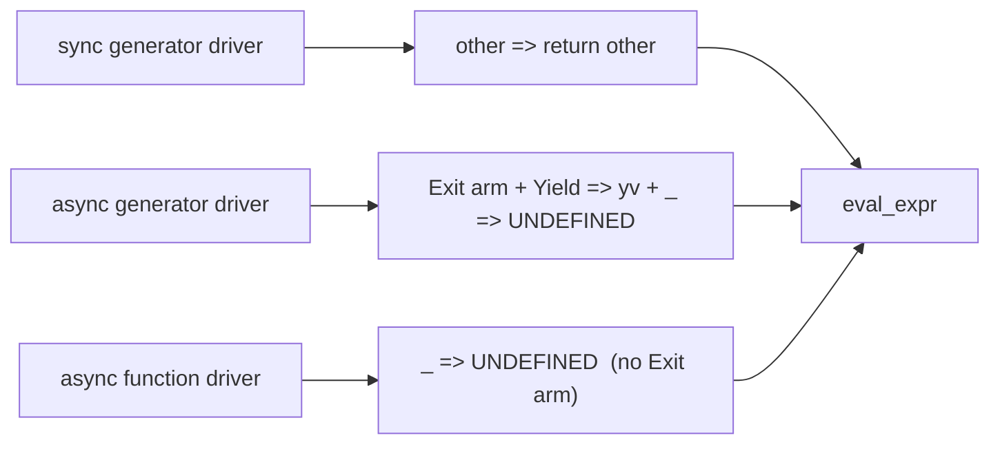

**After**

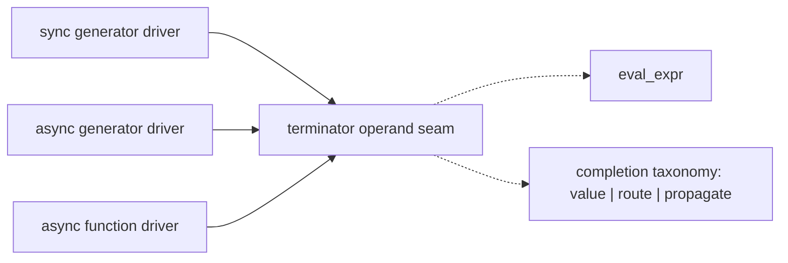

---

### `generator-completion-teardown` — one seam for the generator completion transition · Strong · score 24/25

- **Files**: ~2 estimated — `src/interpreter/eval/generator_runtime.rs`, `src/interpreter/types.rs`
- **Score**: **24/25** (leverage 5, locality 4, blast radius 1, heat 5)
  - *Leverage 5* — 98 hand-written completion transitions collapse behind one call.
  - *Locality 4*, not 5 — the async driver still needs a thin promise-settling wrapper on
    top, and that wrapper is the separately-tracked `settle-and-return-tail`. Verification
    therefore concentrates into two places, not one.
  - *Blast radius 1* — 2 files, no published interface.
  - *Heat 5* — same hot files.

**Problem.** "This generator is finished, tear it down" is hand-written at 98 sites:
30 `IteratorState::completed_state_machine_generator(...)` assignments, 68
`..._async_generator(...)`, alongside 66 `generator_inline_iters.remove(&o.id)`, 11
`generator_for_of_stacks.remove(&o.id)`, 22 `dispose_resources(...)` and 50
`call_function(&reject_fn, …)` calls. The sequence has measurably drifted:
`drain_microtasks()` follows the reject at **43 of 50** sites and is absent at 7
(`:4659, :4714, :4802, :4916, :5095, :5151, :5799`). Commit `5e8ee75b` added *two* new
reject epilogues in one diff and gave them different answers — `:4802` omits the drain,
`:5218` includes it. Separately, `dispose_resources` (§27.5.3.3) runs on the
`ConditionalGoto` and `SwitchDispatch` throw paths (`:1344`, `:1471`) but **not** on the
`ForOfInit` iterable-throw path (`:1504`, `:1524`), inside the same driver.

**Deletion test — CONCENTRATES.** What the seam hides is an *ordering invariant*, not a
call sequence: dispose before latching `Completed` so a throwing disposer can still be
routed; clear both side tables before the object becomes unreachable or `gc.rs:380`/`:385`
leak roots; convert an `Exit` out of dispose into a propagated exit rather than
`unreachable!()`. Deleting it re-scatters that ordering across 98 sites — which is the
present state, and it has produced 43-vs-7 drift.

**Solution.** `complete_generator(&mut self, gen: &GeneratorHandle, outcome: Completion)
-> Completion`, with a thin `settle_completed_async(…)` wrapper owning `drain_microtasks`
exactly once. `IteratorState::completed_state_machine_generator` (`types.rs:1501`) is
already an extracted seam for the 10-field literal; this is the next ring outward.

**Benefits.** *Leverage*: 98 sites to one. *Locality*: the §27.5.3.3 ordering lives in one
function. *Test surface*: `tests.rs:4141-4143` and `:4197-4199` already assert exactly the
post-conditions the seam would enforce, so they generalise from 2 paths to all of them.

**Before**

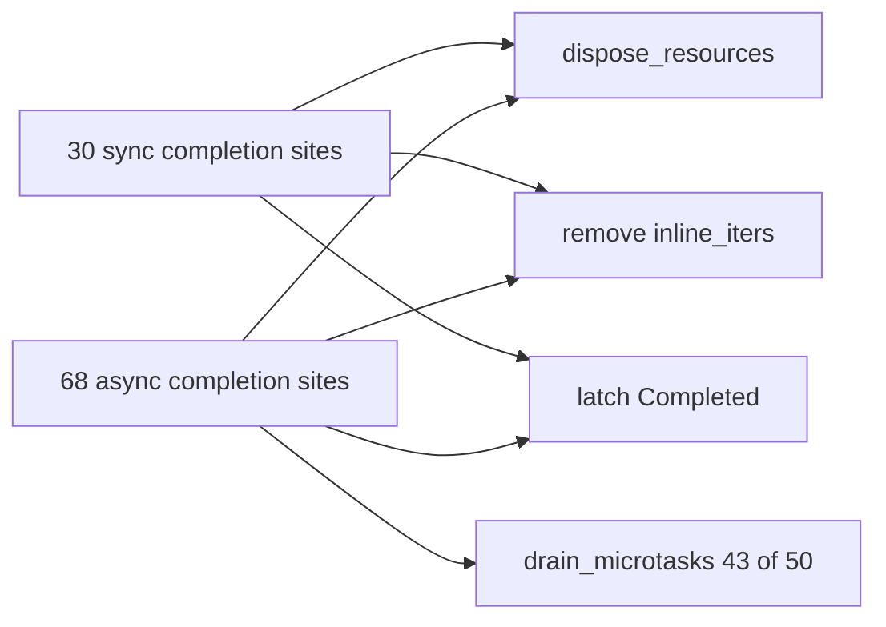

**After**

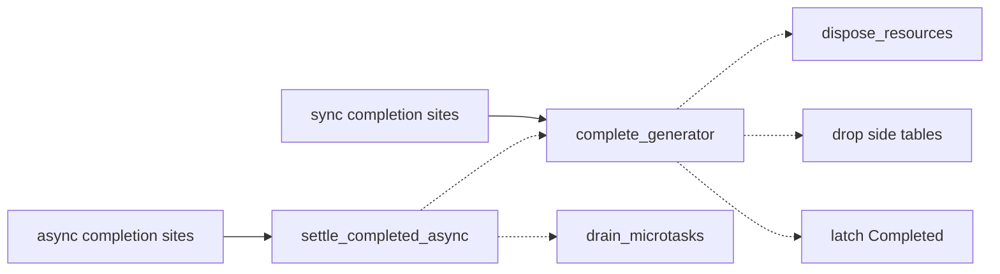

---

### `suspension-scope-expression-walker` — one scope-aware walker behind 14 predicates · Strong · score 24/25

- **Files**: ~2 estimated — `src/interpreter/generator_analysis.rs`, `src/interpreter/generator_transform.rs`
- **Score**: **24/25** (leverage 5, locality 5, blast radius 1, heat 4)
  - *Leverage 5* — 14 recursive walkers, two of them verbatim twins, collapse to one
    predicate-parameterised walk.
  - *Locality 5* — the four suspension-scope boundary rules become a one-function edit.
  - *Blast radius 1* — 2 files.
  - *Heat 4* — `generator_transform.rs` is the single hottest file (7 commits), but
    `generator_analysis.rs` moved only twice.

**Problem.** Eight walkers over the same statement grammar in `generator_analysis.rs`
(`:115 analyze_statement`, `:431 analyze_expression`, `:666 contains_yield`,
`:729 expr_contains_yield`, `:982 contains_suspension`, `:784 expr_contains_suspension`,
`:845 has_block_with_await_using`, `:918 scan_await_using`) plus six in
`generator_transform.rs` (`:548 stmt_contains_for_await`, `:581 stmt_contains_return`,
`:630 stmt_has_break_or_continue`, `:672 collect_escaping_jumps`,
`:2644 rewrite_stmt_await_to_yield`, `:2750 rewrite_expr`) — **14**. After renaming the
recursive callee, `contains_yield` vs `contains_suspension` differs by 11 lines, all
whitespace; `expr_contains_yield` vs `expr_contains_suspension` differs by 2 semantic
lines out of 30. Drift: `stmt_contains_for_await` (`:548`) matches
`Statement::ForOf(f) => f.is_await` and does **not** descend into `f.body`, while its
structurally identical sibling `stmt_contains_return` (`:595`) does.

**Deletion test — CONCENTRATES, given the scope-aware framing.** The seam must carry the
four boundary rules, not just the recursion: function/arrow bodies terminate descent
(restated at `:744` and `:799`); class heritage and computed keys are in scope but method
bodies are not; `for`/`for-in`/`for-of` heads are in scope; switch case **tests** are in
scope. Each is a rule this codebase has already got wrong — rule 4 is exactly what
`5ca7aa36` (#692) fixed, at 175 changed lines. A bare `visit_children` helper would
smear nothing and concentrate nothing; the scope-aware predicate concentrates all four.

**Solution.** `any_in_suspension_scope(stmt, pred: &mut impl FnMut(&Expression) -> bool)
-> bool`, with `contains_yield` and `contains_suspension` becoming one-line wrappers.

**Benefits.** *Leverage*: one walk serves every predicate. *Locality*: a scope-rule fix
lands once. *Test surface*: `generator_analysis.rs:1186-1413` is already a dedicated unit
block pinning these rules; it becomes the seam's test suite instead of one walker's.

**Before**

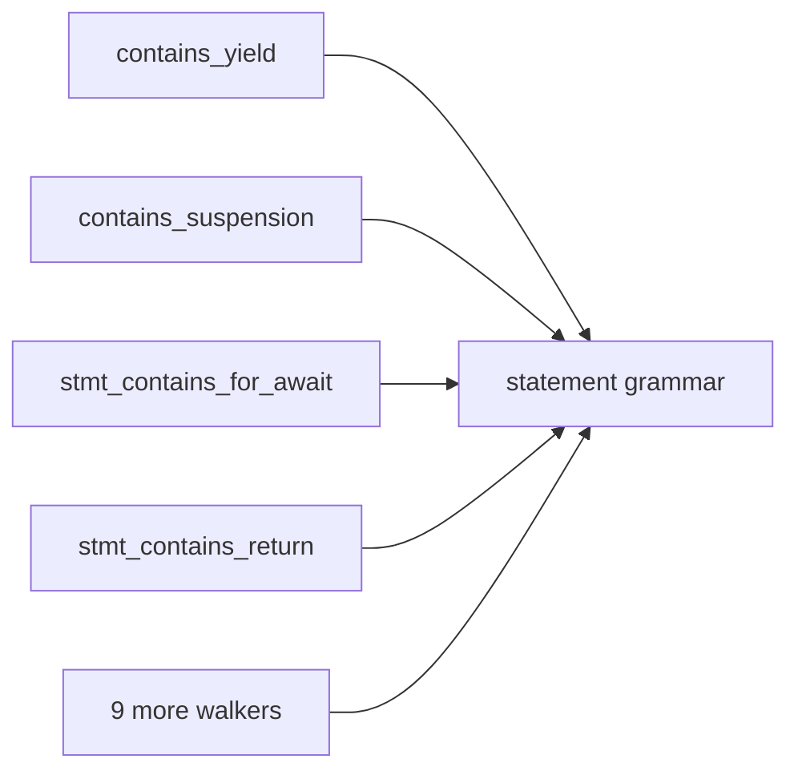

**After**

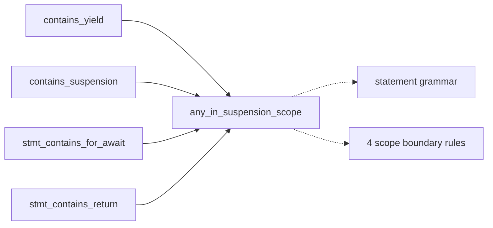

---

### `temporal-rounding-options-reader` — descriptor-driven Temporal option-bag reader · Worth exploring · score 24/25

- **Files**: ~6 estimated — `temporal/mod.rs` (seam home), `instant.rs`, `duration.rs`,
  `plain_time.rs`, `plain_date_time.rs`, `zoned_date_time.rs`
- **Score**: **24/25** (leverage 5, locality 5, blast radius 2, heat 5) — unchanged from
  the 2026-09-18 firing, where it was the runner-up candidate.

Carried over from the backlog and **re-verified against the current tree this firing**.
The friction is intact and the headline count is exact — `grep -n '"roundingMode"'` over
`temporal/*.rs` returns exactly 12 — but the re-check corrected the entry on four points,
all now folded into `.architecture/backlog.md`:

1. *"Each reads `largestUnit`/`roundingIncrement`/`roundingMode`/`smallestUnit`"* is
   **false**. `largestUnit` is read at 3 sites, `roundingIncrement` at 7; the 5 to-string
   readers read neither. It is a 7-way rounding family and a 5-way precision family
   overlapping on one key, not one 12-way clone.
2. There are **3** roundingMode error spellings, not 2 — the entry missed
   `"Invalid rounding mode: {rm}"` at `duration.rs:3132` and `:3279`.
3. The 8 expanded 9-arm matches have **4 collapsed or-pattern siblings**
   (`mod.rs:4216`, `plain_date_time.rs:1638`, `zoned_date_time.rs:3255`, `:4246`), so
   validators are 12, 1:1 with readers.
4. `zoned_date_time.rs:4189` and the `zoned_date_time.rs:3288-3340` range are stale
   anchors; the real reader starts at `:4135` and `:3234`.

Two findings the entry did not carry, both worth a reviewer's attention:

- **A half-built seam is being bypassed.** `mod.rs:1554 validate_rounding_increment_raw`
  exists but only 3 of 7 increment sites call it; 3 more hold byte-identical inline copies
  of its `if let Some(max)` half, including both format strings. Its `is_difference == true`
  branch is **dead** — all existing callers pass `false`.
- **`zoned_date_time.rs:3305-3319` is unreachable dead code**, including an unobservable
  truncated error message at `:3317`.

**Why it did not win.** It scored 24/25 against the pick's 25/25, and the re-check
*weakened* rather than strengthened it: the naive extraction is unsafe, because the
spec-mandated alphabetical read order is interleaved with type-specific keys
(`relativeTo` between `largestUnit` and `roundingIncrement`; `offset` between
`fractionalSecondDigits` and `roundingMode`) and some validation is deliberately deferred
past later reads. A fixed-shape reader reorders observable gets and breaks the five
`options-read-before-algorithmic-validation.js` tests. The seam must be
**descriptor-driven**, which is a larger design task than the pick. Also
`instant.rs:383` is *legitimately* different — `Instant.round` uses inclusive per-day
maxima, pinned by `allow-increments-that-divide-evenly-into-solar-days.js` — so "just call
the helper everywhere" would regress. The module has **zero** Rust unit tests, so the only
safety net is the test262 gate.

**Deletion test** — CONCENTRATES, on five orthogonal axes the seam must carry: allowed-unit
subset, default rounding mode, default/required `smallestUnit`, increment policy (a
3-valued enum replacing the `is_difference` boolean), and precision encoding.

**Before**

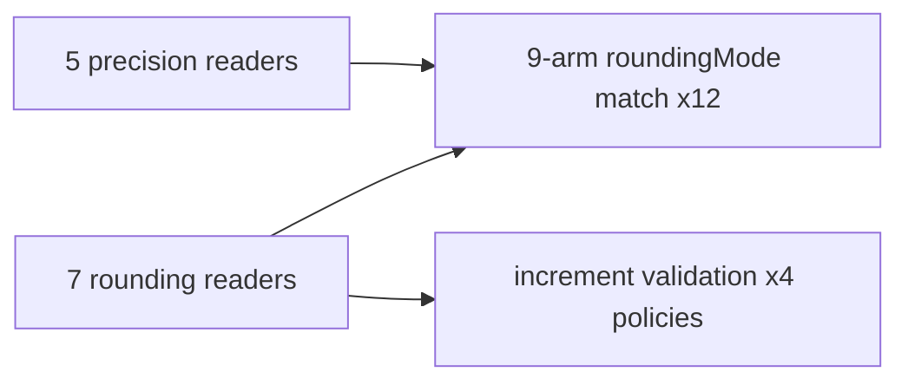

**After**

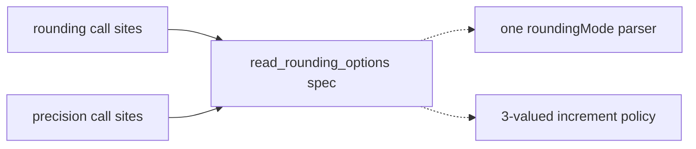

---

### `await-using-lowering-eligibility` — record the transform's decision instead of re-deriving it · Worth exploring · score 21/25

- **Files**: ~4 estimated — `generator_analysis.rs`, `generator_transform.rs`, `eval.rs`, `types.rs`
- **Score**: **21/25** (leverage 4, locality 4, blast radius 2, heat 5)

**Problem.** "Can this `await using` block's disposal be lowered into its own state?" is
answered by four functions in `generator_analysis.rs` (`:845 has_block_with_await_using`,
`:859 block_has_await_using`, `:918 scan_await_using`, `:978
has_suspendable_await_using_block`), with five consumers in `generator_transform.rs`
(`:488`, `:489`, `:624`, `:783`, `:848`) each picking a different one — plus a **fifth,
open-coded copy in the driver** at `eval.rs:8696-8699`, which re-derives the decision
*by raw pointer identity* (`last as *const Statement as usize`). The transform already
computed the answer and threw it away.

**Deletion test — CONCENTRATES, with a caveat.** The real deepening is recording the flag
on `GeneratorState`, which deletes the pointer-identity trick. Merging the four predicates
is closer to parameterisation than deepening — they ask genuinely different questions
(reach through `if` only, vs through loops/try/switch). Ranked on the flag alone; hence
leverage 4, not 5.

**Solution.** A `suspendable_dispose_tail: bool` on `GeneratorState`, set by the transform;
`eval.rs:8691-8702` collapses to a field read.

**Benefits.** *Locality*: the **Isolated Block** eligibility rule stops having a runtime
mirror. *Test surface*: `generator_analysis.rs:1117-1186` (3 tests, 33 table rows) already
pins the lattice, and 6 `test262-extra/await-using-*.js` files pin the runtime side.

**Before**

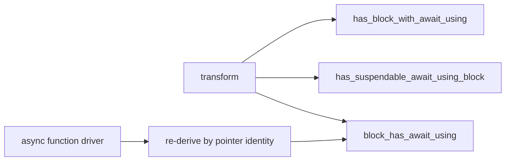

**After**

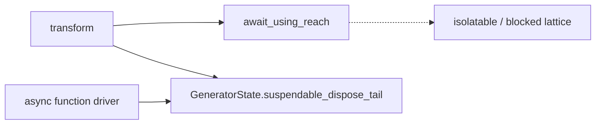

---

### `generator-for-of-stack-mirror` — a guard owning the for-of stack and its GC mirror · Speculative · score 19/25

- **Files**: ~4 estimated — `generator_runtime.rs`, `eval.rs`, `gc.rs`, `mod.rs`
- **Score**: **19/25** (leverage 3, locality 4, blast radius 2, heat 5)
  - *Leverage 3* — seven helpers (`:473`, `:6624`, `:6664`, `:6680`, `:6700`, `:6765`,
    `:6790`) already absorb most of the unwinding logic; what is left is close to "call
    `sync_generator_for_of_stack` after each mutation", which a guard automates rather
    than explains.

**Problem.** A suspended generator's live for-of iterator stack exists in three
representations — a driver-local `Vec<ForOfLoopState>` (`:718`, `:3982`, `eval.rs:8301`),
the `generator_for_of_stacks` side table (`mod.rs:260`, 24 references), and the
`generator_inline_iters` table (`mod.rs:259`) — synchronised by hand at **20**
`sync_generator_for_of_stack` call sites. `eval.rs` uses a *fourth* design, round-tripping
through saved async state rather than the side table.

**Deletion test — CONCENTRATES, but thinly.** It concentrates the flush invariant
("forgetting to flush at a suspension point leaks a GC root", pinned by `tests.rs:4141`)
and would force `eval.rs`'s fourth design into line, but most of the hard knowledge is
already extracted. Ranked below the others honestly rather than inflated.

**Solution.** A `ForOfStackGuard` owning the local `Vec` and flushing the mirror on `Drop`.

**Benefits.** *Locality*: the flush cannot be forgotten on a branch. *Test surface*:
partial — `tests.rs:4090`/`:4147` cover two host-exit paths; the ordinary suspend/resume
flush is unpinned and would need a new test first.

**Before**

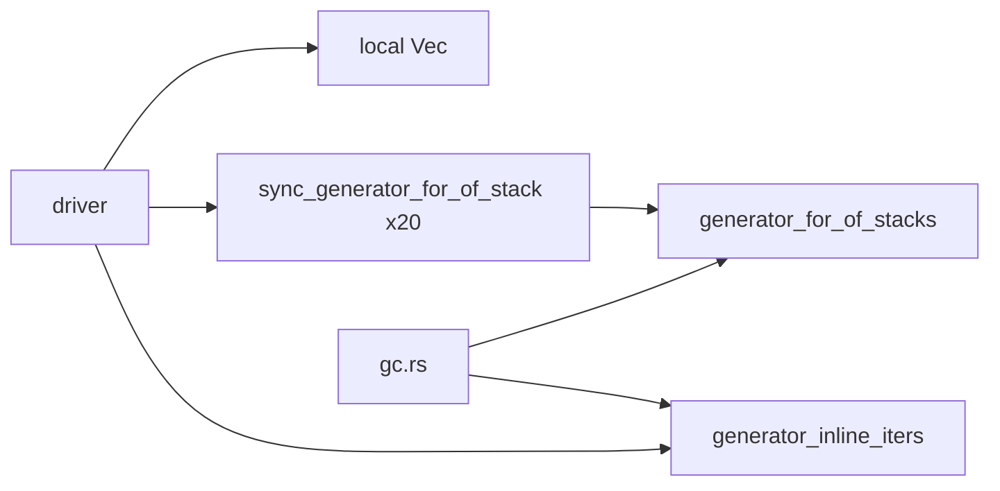

**After**

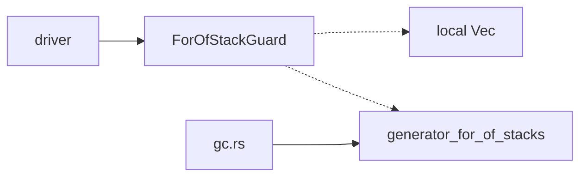

---

## Dropped

| Candidate | Dropped because |
|---|---|
| `switch-scope-dispose-exits` | **Leverage 1 — fails the deletion test.** The 7 `dispose_resources(&switch_env, …)` calls in `exec.rs:2488-2531` each already carry the completion being disposed; there is no shared state to latch, no ordering invariant, and no side table to clear. A `dispose_and_return!` helper makes 7 lines shorter without letting a reader skip any of them — complexity moves, it does not concentrate. The genuine fix is a scope guard on `switch_env`, which is the existing `gc-root-scope-guard-remainder`. |
| `async-generator-request-queue-prologue` | **Already in the backlog** as `generator-entry-guard`. The 16 `iterator_state().cloned()` + execution-state-match prologues (`generator_runtime.rs:6303`, `:6418`, `:6497`, …) are real duplication, but re-filing them under a new slug would break the dedup the backlog exists to provide. |
| All other backlog entries marked `dropped` | Their hard filters were re-checked this firing and all still apply; none moves back to `proposed`. See `.architecture/backlog.md` for the per-entry filter. |

## Too large to automate

None this firing. No surviving candidate scored blast radius 5.

## Pick

**`state-machine-terminator-dispatch`, 25/25.**

The runner-up **candidates** are a three-way tie at 24/25 — `generator-completion-teardown`,
`suspension-scope-expression-walker`, and the backlog's `temporal-rounding-options-reader`.
The top two are **within 1 point**, so the pick was close and any of the three is a
reasonable next firing; `generator-completion-teardown` is the natural one, since it lands
in the same file the pick warms.

What separated the winner on the axes:

- **Against `generator-completion-teardown`** (locality 4 vs 5): its teardown seam still
  needs a second promise-settling wrapper on top, which is the separately-tracked
  `settle-and-return-tail`, so verification concentrates into two places rather than one.
  The pick concentrates into exactly one function.
- **Against `suspension-scope-expression-walker`** (heat 4 vs 5): `generator_analysis.rs`
  moved twice in the last 60 commits where the pick's files moved 12 times between them,
  and 5 of the last 5 commits on `main` are in the pick's subsystem.
- **Against `temporal-rounding-options-reader`** (blast radius 2 vs 1): 6 files against 2,
  and this firing's re-verification actively weakened it — the alphabetical read order is
  interleaved with type-specific keys, so the seam must be descriptor-driven, and
  `instant.rs:383`'s divergence is legitimate and must survive. That is a larger design
  task with a thinner margin for an unattended run. The pick needed no such caveat.

Two things put the winner clear of all three. First, it is the only candidate whose
duplication has **demonstrably produced defects that are still live**: 8 reproducible
Exit-swallowing cases, each verified against a sibling driver that gets the identical
program right. Second, its test-first footing is the best available — `tests.rs:3848`
`host_exit_in_generator_conditional_goto_is_not_swallowed` is *already* a parameterised
table over `("function*", …)` and `("async function*", …)` with no `"async function"`
rows, so the red test is a table addition rather than new scaffolding.

One thing a reviewer should weigh: **this candidate is a deepening that also changes
behaviour** — and the backlog has a `dropped` entry, `proxy-blind-callable-check`, whose
stated filter is "this is a behaviour change, not a behaviour-preserving deepening". The
two are distinguishable, and the distinction is the operative rule rather than a special
case made for this pick. That entry is blocked by its own closing clause, *"once the
semantics are agreed"*: nothing in the tree says what its 11 proxy-blind sites *should*
do, so an unattended run would be choosing the spec reading itself. Here there is no such
gap — two of the three drivers already produce the correct answer on the identical
program, and `builtins/node_host.rs:84-93` states the intended semantics in prose, so the
target behaviour is **read off the tree, not decided by this run**. The filter that
matters is *"can current behaviour be pinned, and is the target unambiguous?"*, not *"is
any behaviour changed?"*.

Preserving the current behaviour is not actually the conservative option here. A seam
that kept all three dispositions intact would need a per-driver policy parameter — which
would encode the drift into the interface, the exact opposite of deepening. The choice is
between one correct rule and no seam at all.

Restating the consequence plainly: Routing the three drivers through one seam necessarily fixes the 8 defects —
that is the point of the seam, but it means this is not a pure behaviour-preserving
extraction. Every changed behaviour is pinned by a new test, and in every case the new
behaviour is what a sibling driver already produces for the same program.

## Design

Written at step 4 — see below.
