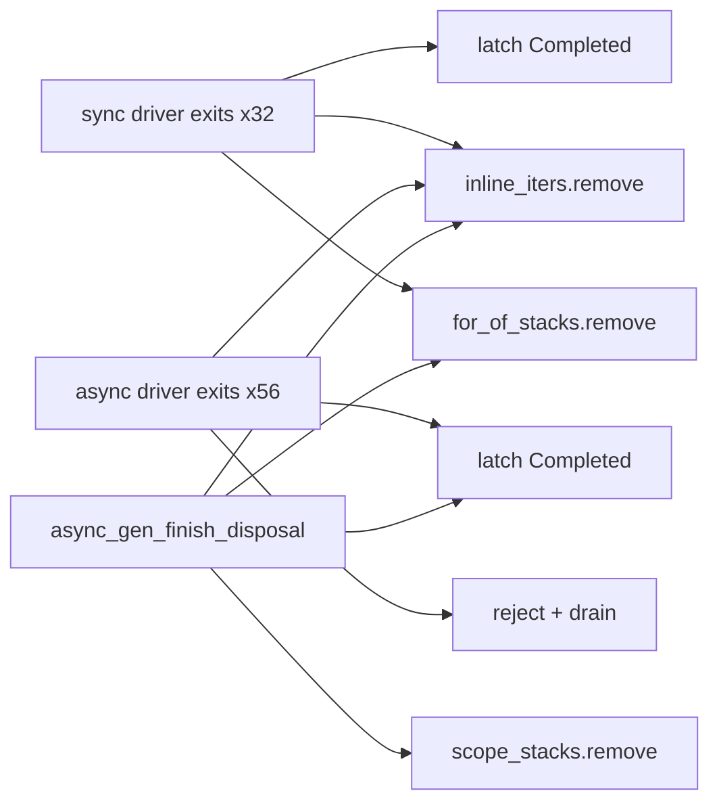
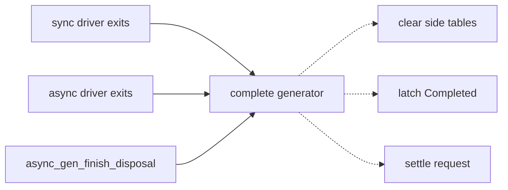
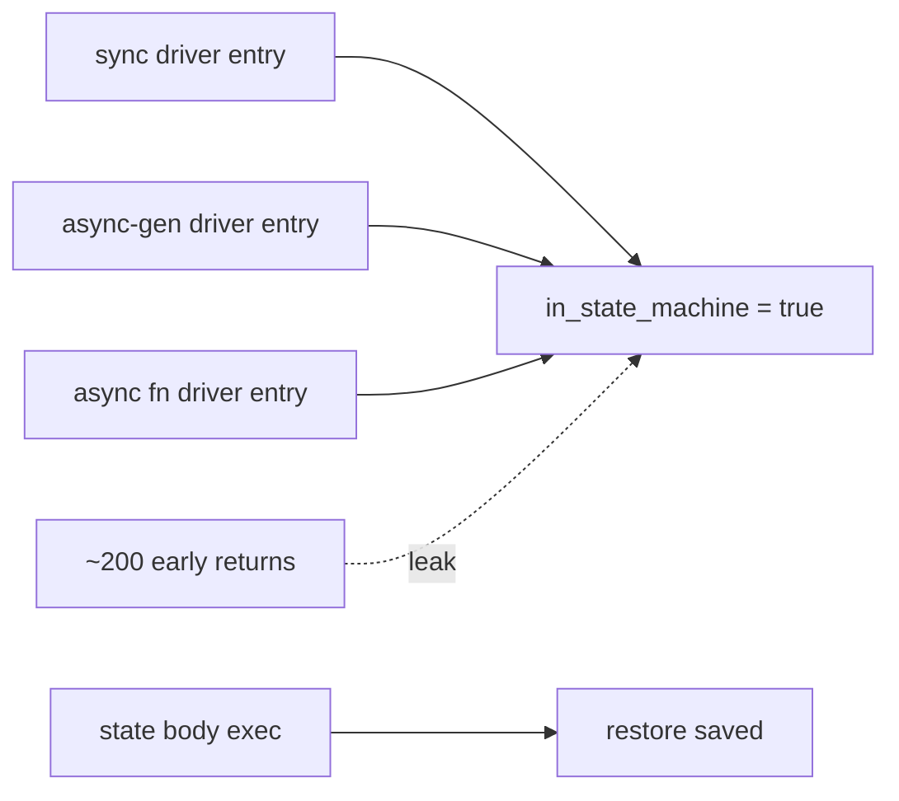
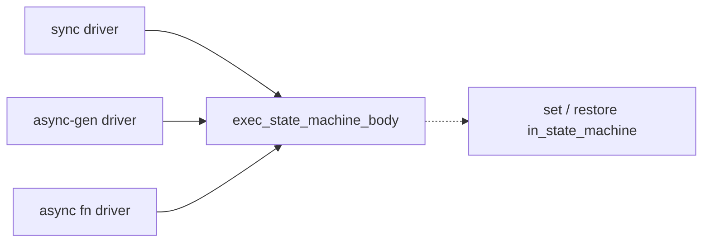

# Architecture review — jsse — 2026-09-22

**Scope**: Hot-spot inferred from `git log --since=2026-09-10 --name-only`. The
generator/async state machine still dominates: `eval.rs` (17 commits),
`generator_transform.rs` (13), `eval/generator_runtime.rs` (12), `tests.rs` (11),
`gc.rs` (8). Since the 2026-09-21 firing, six more generator commits landed on `main`
(#703, #706, #715, #717, #723, #730), all in `generator_runtime.rs`. The existing backlog
entries for this subsystem were re-verified against the current tree (`997eaee1`), and a
fresh friction scan covered `eval.rs`, `dispose.rs`, `gc.rs`, `promise.rs`, and `src/parser/`.

**Picked**: `generator-completion-teardown`. See `.architecture/backlog.md`.

**Branch**: adopted `sym/jsse/routine/refactor-audit/01M335G734`. It passed all four
conditions: it is not the default branch, it has 0 commits ahead of `origin/main`, it has
no upstream, and it is unpublished. It is not renamed.

**Degradations**: none. `gh` was authenticated and sub-agents were available. The release
binary was built at `997eaee1`, and every behaviour claim marked *reproduced* below was run
against it.

**Diagram legend**: solid edges are the interface a caller must learn. Dashed edges are
inside the implementation, hidden behind the seam.

---

## Reconciliation

- `state-machine-terminator-dispatch` moves from **in-flight to landed**. PR #694 merged
  2026-09-21T12:09:20Z.
- No other entry was `in-flight`, so no open architecture PR blocks this run.
- #730 deleted the dead async legacy path, and #723 routed `yield*` steps through a
  helper. Together they reduced the teardown counts below. The friction remains.

---

## Candidates

### `generator-completion-teardown`: one seam for "this generator is finished" · Strong · score 24/25

- **Files**: 2 estimated: `src/interpreter/eval/generator_runtime.rs` (seam and all call
  sites) and `src/interpreter/tests.rs` (pins). Blast-radius band 1: one module, no
  published interface.
- **Score**: **24/25** (leverage 5, locality 4, blast radius 1, heat 5)
  - *Leverage 5*: one interface replaces a hand-written transition at 88 latch sites
    (32 sync, 56 async). It also removes a whole class of test setup: "did this exit
    clear every side table and latch `Completed`?" is currently asked separately at each
    exit, and the two existing tests pin only 2 of them.
  - *Locality 4*: the ordering invariant moves to one function. It is 4 rather than 5
    because the promise-settling wrapper is still tracked separately
    (`settle-and-return-tail`).
  - *Blast radius 1*: one source file plus tests, no published interface, and no ADR
    touched.
  - *Heat 5*: `generator_runtime.rs` has 12 commits since 2026-09-15, including 6 since
    the last firing.

**Problem.** The completion transition (the generator is finished; tear it down) is
hand-written at **88 latch sites** on the current tree. There are 32
`IteratorState::completed_state_machine_generator(…)` assignments and 56
`…_async_generator(…)` assignments. The backlog's 2026-09-21 figures were 30 and 68. Since
then #723 removed 13, #717 added 4, and #694 removed 1. Around the latches are
**59** `generator_inline_iters.remove(&o.id)`, **13** `generator_for_of_stacks.remove`,
15 `dispose_resources`, 9 `dispose_or_park!`, and 35 single-line `call_function(&reject_fn, …)`.

The transition has a real ordering invariant: dispose, clear the side tables, latch
`Completed`, then settle. Today each site states that invariant separately, grouped into
these families:

| Family | Sites | Shape |
|---|---|---|
| A1 (async) | **27** | `inline_iters.remove` → latch → `reject_fn(e)` → `drain_microtasks()` → `return Normal(promise)`, byte-identical modulo the error name |
| S3 + A3 | **10** | `inline_iters.remove` → `for_of_stacks.remove` → latch → `return Exit(code)`, identical modulo the constructor |
| S1 (sync) | 6 | `route_exception!` → `dispose_resources` → latch → `inline_iters.remove` → `return disp`. `:1276` omits the route |
| S2 (sync) | 11 | route → latch → `return Throw(e)`. No remove |
| S4 (sync) | 6 | latch only |
| A2 (async) | 6 | as A1 but **no drain** |
| one-offs | ~22 | yield* helpers, `async_generator_await_return`, host-exit variants |

**Measured drift**:

1. **A half-built seam is being bypassed.** `async_gen_finish_disposal`
   (`generator_runtime.rs:5688`) already performs the whole transition:
   - clears all three side tables (`:5698-5700`)
   - latches
   - settles
   - re-drives the queue

   Only the *parked-disposal* path reaches it. The inline paths open-code the same
   transition with different choices. For example, the ConditionalGoto inline path at
   `:4818` drains, and its parked twin does not.
2. **The side-table clearing policy splits three ways.** A1 clears only
   `generator_inline_iters`. S3/A3 clear two tables. `async_gen_finish_disposal` clears
   three, including `generator_scope_stacks` from #703, which `gc.rs:455` roots until the
   generator itself is collected. The sync driver clears before latching at 6 sites and
   after latching at 8.
3. **The drain policy splits.** 33 of 37 direct reject-settle sites drain, and `:4422`,
   `:4694`, `:4744`, `:5395` do not. Of the backlog's earlier "7 no-drain sites", 2 were
   reaction closures that should never have been counted, and 1 was absorbed by #715.
4. **An `Exit` coming out of disposal leaves the generator `Executing`.** `:3639`,
   `:4410`, `:4733`, `:4805`, `:4945` return a bare `Completion::Exit(code)`, while their
   siblings at `:3680`, `:3955`, `:4682`, `:5384` go through `abort_async_generator!`.

**Deletion test.** The complexity **concentrates**. A `complete_*` seam would hide an
*ordering invariant*, not a call sequence:

- disposal must run before `Completed` is latched;
- every side table must be cleared before the object becomes unreachable, or its roots
  leak;
- an `Exit` out of disposal must propagate rather than being latched as a normal
  completion.

Deleting the seam would re-smear that invariant across 88 sites. That is exactly how the
three clearing policies arose.

**Solution.** Add one completion seam in `generator_runtime.rs`. It takes the generator
handle and the terminal outcome. It clears the side tables and latches `Completed` under
one policy, and settles the request for the async driver. `async_gen_finish_disposal`
becomes a caller of the seam rather than a parallel implementation. The canonical families
(A1, S3/A3, S1) route through it. The drifted sites (A2 no-drain, the bare-`Exit`
disposal returns, S1's un-routed `:1276`) keep their current behaviour unless the design
pass shows a difference is unobservable. They are reported, not silently unified.

**Benefits.**
- *Leverage*: a caller writes one call instead of a 4–6 statement epilogue.
- *Locality*: a new side table becomes a one-line change. #703 had to add
  `generator_scope_stacks`, and still left it uncleared at every inline site.
- *Test surface*: the post-conditions (Completed latched, side tables cleared, no temp
  roots) can be asserted against the seam directly, instead of only through two host-exit
  scripts (`tests.rs:4315`, `:4372`).

Before:



After:



### `suspension-scope-expression-walker`: one scope-aware walker for "does this contain a suspension?" · Strong · score 24/25

- **Files**: 2 estimated: `generator_analysis.rs`, `generator_transform.rs`.
- **Score**: 24/25 (leverage 5, locality 5, blast radius 1, heat 4). This is unchanged.
  Heat is 4 because the seam's home, `generator_analysis.rs`, has 4 commits since
  2026-09-08, against 12–17 for the hottest files.
- **Re-check (2026-09-22).**
  - Twins confirmed. `contains_yield` (`:666`) and `contains_suspension` (`:995`) differ
    only in formatting. `expr_contains_yield` (`:729`) and `expr_contains_suspension`
    (`:784`) differ exactly in whether `Expression::Await` is a leaf or a recursion. The
    class twins are one-liners over `class_scope_exprs`, so rule 2 is already factored
    out.
  - **The entry's drift claim (c) is half stale and not observable.** #699 changed
    `f.is_await` to `f.awaits_at_head()`. The ForOf arm still does not descend, but both
    paths end in the tree-walker's `exec_for_of_loop`.
  - New static findings, not reproduced:
    - **F1**: a nested `for await` in an async function is never lowered, because
      `contains_suspension :1028` ignores it.
    - **F2**: expressions inside patterns (declarator defaults, `ForInOfLeft::Pattern`,
      catch params) are invisible to every walker.
    - **F4**: `mod.rs` TLA detection misses switch case tests and class heritage.

  A shared walker would make F2 a one-place fix, which strengthens the leverage-5 case.
- **Problem, Solution, Deletion test**: as recorded in the backlog entry.
- **Why it did not win**: tied at 24/25 and lost the deterministic heat tie-break (4 vs 5).

### `temporal-rounding-options-reader`: descriptor-driven Temporal rounding-option reader · Worth exploring · score 24/25

- Unchanged since the 2026-09-21 re-check. No temporal commits since #668. It lost the
  blast-radius tie-break (2 vs 1) for the third firing running. See the backlog for the
  full card and the WARNING on naive extraction.

### `state-machine-flag-restore`: scope `in_state_machine` to the state body it describes · Strong · score 23/25 · NEW

- **Files**: 3 estimated:
  - `src/interpreter/eval.rs`: the set at `:8300-8301`, re-set at `:8916`, restores at
    `:8933` and `:9440`
  - `src/interpreter/eval/generator_runtime.rs`: sync set `:728-729`, `:838`, restore
    `:856`; async set `:3522-3523`, `:3821`, restores `:3871`, `:3892`, `:3921`
  - `src/interpreter/exec.rs`: the only reader, `:1100`
- **Score**: 23/25 (leverage 4, locality 5, blast radius 1, heat 5)
  - *Leverage 4*: 3 prologue sets and 7 hand restores collapse. The ~200 driver exits
    stop needing a rule.
  - *Locality 5*: the flag's lifetime becomes one function.
  - *Blast 1*: 3 files, no published interface.
  - *Heat 5*: the two hottest files.
- **Problem.** The flag disables proper tail calls (`exec.rs:1098-1102`). Each driver sets
  it on **entry** but restores it only after running a state body. Every early return in
  between leaks `true` into the rest of the program:
  - a resume that goes straight to a disposal await
  - an async-generator `return()`/`throw()` resume
- **Reproduced on the release binary at `997eaee1`.**
  - Leaking case: `"use strict"; function loop(n){ if (n===0) return "done"; return loop(n-1) }`
    `async function f(){ await using a = { async [Symbol.asyncDispose](){} }; }`
    `f().then(()=>setTimeout(()=>{ try { console.log(loop(1e6)) } catch(e) { console.log("caught", String(e)) } }))`
    prints `caught RangeError: Maximum call stack size exceeded`.
  - Control: the same program with `await 0` instead prints `done`.
  - The async-generator `it.return(3)` and `it.throw(3)` variants also leak.
  - A second, related defect: the flag is a global, not a per-function-body context, so
    it also disables PTC in **callees** of a state body. For example,
    `function* g(){ const x = loop(1e6); yield x; }` throws RangeError, while the same
    call in the terminator operand (`yield loop(1e6)`) runs after the restore and
    succeeds. `tco_suppress_depth` already has the right shape: it is reset at the
    function-call boundary (`eval.rs:5888`). `in_state_machine` is not.
- **Deletion test**: complexity concentrates. Moving the set/restore inside
  `exec_state_machine_body` deletes every hand restore.
- **Benefits**: a spec-conformance fix for PTC (§15.10) on every post-resume path, and the
  flag's invariant becomes testable (`!interp.in_state_machine` after any driver return).
- **Before / After**:





### `await-reaction-attachment`: one Await primitive over the existing `await_then` · Worth exploring · score 23/25 · NEW

- **Files**: 5 estimated: `eval.rs` (`async_fn_suspend_at_await :9736-9835`, `await_value`
  scheduling `:9881-9972`), `generator_runtime.rs` (`:4221-4348`, `:4519-4594`,
  `:5430-5504`), `builtins/array.rs:417-496`, `builtins/promise.rs:1133-1187`,
  `builtins/iterators.rs:4393-4440`.
- **Score**: 23/25 (leverage 5, locality 4, blast radius 2, heat 5).
- **Problem.** `dispose.rs:355 await_then` already implements Await correctly: it roots
  the value across `promise_resolve_value` and enqueues on both settled arms. It has 4
  users. Six other sites hand-roll the same
  `promise_resolve_value → match state { Fulfilled/Rejected → enqueue, Pending → push reactions }`
  shape, and PerformPromiseThen is copied inline twice.
- **Drift** (reported by the scan, reproduced here only where noted):
  - `generator_runtime.rs:5504` uses `promise_then`, which does a SpeciesConstructor
    lookup. An `await` must not.
  - `Array.fromAsync` rejects one tick early (`array.rs:441-444` settles synchronously
    where the Fulfilled arm enqueues). Program:
    `const log=[];const r=Promise.reject(1);r.catch(()=>{});Array.fromAsync({length:1,0:r}).catch(()=>log.push("rej"));Promise.resolve().then(()=>log.push("t1")).then(()=>log.push("t2"));setTimeout(()=>console.log(log.join()))`
    Node prints `t1,rej,t2`.
- **Deletion test**: complexity concentrates, removing about 400 lines. This is **several
  behaviour changes in one PR**, so it should be landed per site, each with its own pin.

### `parser-lookahead-restore`: a `peek` combinator that restores all lexer state · Strong · score 23/25 · NEW

- **Files**: 4 estimated: `src/parser/mod.rs` (`advance :232-255`, `push_back :257-263`,
  the seam home), `statements.rs`, `expressions.rs`, `modules.rs`.
- **Score**: 23/25 (leverage 5, locality 5, blast radius 2, heat 4). It is a direct
  sequel to #695's scoping combinators.
- **Problem.** `advance()` overwrites `current_token_start`/`current_token_end`, and
  `push_back` never restores them.
  - **6 sites** restore them by hand: `statements.rs:43`, `:78`, `:617`, `:736`, `:1567`
    (which writes the restore out 4×), and `mod.rs:1405`.
  - **15 sites** do not restore them: `statements.rs:124`, `:140`, `:548`, `:941`, `:995`,
    `:1537`; `modules.rs:44`, `:102`, `:329`; and `expressions.rs:1162`, `:1716`, `:1744`,
    `:1882`, `:1908`.
  - The `pushback` snapshot uses `.clone()` at 2 sites and `.take()` at 1.
- **Reproduced at `997eaee1`.** `eval("async x => x").toString()` returns `x => x`, and
  `eval("using => 0").toString()` returns `=> 0`. Node returns the full source text, and
  so does the spec (§20.2.3.5 Function.prototype.toString, whose source text is the
  matched production). `eval("0, async (x) => x")` is correct because it never goes
  through the peek.
- **Seam**: `fn peek<T>(&mut self, f: impl FnOnce(&mut Self) -> T) -> T`, snapshotting
  and restoring {current, prev_line_terminator, token start/end, prev_token_end,
  pushback, lexer state}.
- **Deletion test**: complexity concentrates. There are 21 sites of 4–25 lines each.

### `async-suspension-park-state`: park an async-function activation as one frame · Worth exploring · score 22/25 · NEW

- **Files**: 2 estimated: `eval.rs`, `gc.rs`.
- **Score**: 22/25 (leverage 4, locality 4, blast radius 1, heat 5).
- **Problem.** `async_fn_suspend_at_await` (`eval.rs:9717`) takes **16 parameters**. Its 6
  call sites (`:8408`, `:8663`, `:9033`, `:9072`, `:9100`, `:9422`) each repeat the same
  `.take()` × 4 + `&…` × 6 argument list. The `AsyncFunctionState {..}` literal is written
  out 3× (`:8142`, `:8277`, `:9747`). The interface is as wide as the implementation.
- **Seam**: keep the live activation as one `AsyncFunctionState` and add
  `park_at_await(id, frame, resume_state, binding, value)`.

### `module-path-context-guard`: one guard for `current_module_path` / `current_realm_id` save-restore · Speculative · score 19/25 · NEW

- **Files**: 4 estimated: `mod.rs` (`run_module` has 9 restore points at `:2522-2630`,
  plus `:3223-3324` and `:3444-3549` with 7 each), `eval/modules.rs`, `eval.rs`,
  `builtins/mod.rs`.
- **Score**: 19/25 (leverage 4, locality 4, blast radius 2, heat 3).
- **Problem.** About 40 hand-written restores. The reader side is split:
  - `import.meta` resolves lexically (`eval.rs:1027`).
  - `import()`, `import.defer`, `import.source`, and ShadowRealm `importValue` read the
    dynamic `current_module_path`.

  The claimed drift (an `import()` inside a function defined in `a/lib.js` but called from
  `b/main.js` resolves against `b/`) was **not reproduced**, because it needs fixture
  files.

### Re-verified existing entries (unchanged status)

| Entry | Score | 2026-09-22 finding |
|---|---|---|
| `await-using-lowering-eligibility` | 21/25 | The pointer-identity trick still exists (`eval.rs:8926`, `exec.rs:1063`) but now calls the imported `block_has_await_using`. Static analysis suggests it is **unreachable** since #701/#715: every block that directly declares `await using` is routed to `transform_scope_block`. A `debug_assert!` probe would settle it. There are 8 consumer sites, not 5 |
| `settle-and-return-tail` | 21/25 | Down from 54 to **35** canonical tails (33 reject, 2 resolve). `reject_with_type_error` (`:2570`) is already a partial extraction with 13 callers. Overlaps the pick's A1 family, which will absorb most of it |
| `generator-for-of-stack-mirror` | 19/25 | Up from 20 to **21** `sync_generator_for_of_stack` call sites (#715 added `:3852`). `eval.rs`'s fourth design is still at `:8158`, `:8209`, `:8293`, `:8307` |
| `generator-operand-throw-tail-drift` | 18/25 | All three findings intact at new anchors: sync `Return` without route `:1271-1284`; no-dispose operand sites `:963`, `:1597`, `:4065`, `:4995`; no-drain `:4422` |
| `promise-combinator-setup-prologue` | 20/25 | #696 swapped the accumulator for `RootedSlots` but left the prologue byte-identical. It appears at **6 sites, not 4**: `promise.rs:1238`, `1383`, `1569`, `1726`, `1950`, `2025` |

---

## Dropped

| Candidate | Dropped because |
|---|---|
| `switch-scope-dispose-exits` | Leverage 1, as recorded 2026-09-21 (unchanged) |
| `object-id-of`, `arg-or-undefined`, `define-method-adoption`, `define-accessor-adoption`, `proxy-trap-skeleton`, `typedarray-shared-equality` | Leverage 2, `/simplify`-class (unchanged) |
| `proxy-blind-callable-check` | Behaviour change with no agreed target semantics (unchanged) |

No new candidate was dropped this firing.

## Too large to automate

| Candidate | Why |
|---|---|
| `unify-generator-async-drivers` | Blast radius 5. This firing's pick is the second of the three recommended slices (`state-machine-terminator-dispatch` landed as #694). |

---

## Pick

**`generator-completion-teardown`, 24/25.** It is tied at 24/25 with
`suspension-scope-expression-walker` and `temporal-rounding-options-reader`. The
deterministic tie-break decided it:

1. Lower blast radius removes `temporal-rounding-options-reader` (2 vs 1).
2. Higher heat removes `suspension-scope-expression-walker` (4 vs 5).

**The pick was close.** Two candidates share the top score, and three new candidates sit
1 point below it at 23/25 (`state-machine-flag-restore`, `await-reaction-attachment`,
`parser-lookahead-restore`). The
**runner-up candidate** is `suspension-scope-expression-walker`, and it is the natural
next firing.

`state-machine-flag-restore` is the strongest *new* finding. It reproduces a spec bug
(PTC disabled after certain resumes) on the release binary. It is worth scheduling soon.
It lost on leverage (4), not on evidence.

## Design

Three interfaces were designed in parallel by sub-agents, each under a different
constraint. The dependency category is **in-process**: everything behind the seam is
in-memory `Interpreter` state (three `FxHashMap` side tables plus the generator object's
`ObjectKind`). No adapter is needed, and no design proposed one.

**Problem-space constraints given to all three.** The latch consumes the driver's owned
locals (`state_machine`, `func_env` are *moved* into
`IteratorState::completed_state_machine_*`), so today every latch must be followed by a
`return`. `obj_rc` is an `Rc<RefCell<JsObjectData>>` held by the driver, and several latch
sites live inside driver-local `macro_rules!` that capture those locals textually. Drain
versus no-drain is JS-observable (microtask ordering) and must be preserved per site;
side-table clearing breadth is GC-retention-only, and all three designs independently
verified by enumerating readers that no reader exists for a `Completed` generator.

### Design A: minimise the interface

Two private methods:

```rust
fn retire_generator(&mut self, gen_id: u64);
fn reject_async_generator_request(
    &mut self,
    gen_id: u64,
    request: (&JsValue, &JsValue, &JsValue), // (promise, resolve, reject)
    error: JsValue,
) -> Completion;
```

`retire_generator` reads the generator's identity (`state_machine`, `func_env`,
`is_strict`, and the sync/async variant tag) **back out of the live `IteratorState`**,
clears all three side tables, then latches. Because it takes only `gen_id`, the driver's
locals stop being moved and the call sites become one-liners. Scope: all 88 latch sites,
plus the 27 A1 sites through the second method. `async_gen_finish_disposal` becomes its
first non-driver caller, which is the evidence the seam is not driver-shaped.

*Strongest argument against (the design's own)*: a site that today cannot fail to latch
becomes a site that silently no-ops if the `IteratorState` is not what was assumed. That
is the silent-failure class this repo dislikes, mitigable with `debug_assert!` or a
`#[must_use] -> bool`.

### Design B: maximise flexibility

A `GeneratorFrame` value plus a `Teardown` policy record, so every drifting axis becomes a
named policy value:

```rust
struct GeneratorFrame { obj: ObjectHandle, flavour: Flavour, state_machine: Rc<GeneratorStateMachine>, func_env: EnvRef, is_strict: bool }
enum SideTables { Keep, Inline, InlineAndForOf, All }
enum Dispose { Skip, FuncEnv }   enum Drain { Skip, Microtasks }   enum Queue { Leave, Advance }
enum Settle { Bare(Completion), IterResultDone(JsValue), Reject(JsValue), ResolveDone(JsValue),
              AwaitReturn(JsValue), FromCompletion { completion: Completion, return_awaits: bool } }
struct Teardown { tables: SideTables, dispose: Dispose, settle: Settle, drain: Drain, queue: Queue }
fn finish_generator(&mut self, gen_id: u64, frame: Option<&GeneratorFrame>,
                    request: Option<(&JsValue,&JsValue,&JsValue)>, plan: Teardown) -> Completion;
```

Scope: 85 of 88 sites. It owns the ordering `dispose → release tables → latch → settle →
queue`. This design pass also produced a **new spec finding** while enumerating the
policies: jsse does not run `Symbol.dispose` when a throw comes from evaluating a **yield
operand** (`using x = …; yield (()=>{throw e})()` disposes on Node, not on jsse), because
`StateTerminator::Throw` (`:1331`) disposes before latching and the `Operand::Throw` arm of
`Yield` (`:969`) does not. Under this design that becomes `Dispose::Skip` — greppable
rather than a missing line.

*Strongest argument against (the design's own)*: an 85-site mechanical rewrite of the
engine's hairiest file for a seam whose flexibility axes have exactly one caller each
(`Queue::Advance`, `FromCompletion`, `frame: None`). Speculative generality, and a
4-variant enum can encode a wrong policy just as silently as a missing line.

### Design C: optimise for the most common caller

One plain method plus two per-driver macros over it, following #694's precedent
(`eval_operand` + one thin macro per driver):

```rust
pub(crate) enum GeneratorFlavor { Sync, Async }
pub(crate) fn latch_generator_completed(
    &mut self, obj_rc: &ObjectHandle, gen_id: u64, flavor: GeneratorFlavor,
    state_machine: Rc<GeneratorStateMachine>, func_env: EnvRef, is_strict: bool,
);
// driver-local:
macro_rules! complete_generator { … }      // fixes the flavour and the moved locals
macro_rules! reject_and_complete { … }     // A1's whole tail, including the return
```

The method keeps the identity in the driver's own locals (nothing is read back out, so no
silent no-op is possible) and clears all three side tables before latching. Scope: 48
sites — A1 ×27, the exit family ×15, S1 ×6. It explicitly leaves S2, S4, A2 (no-drain),
the queue-popping `async_gen_*` helper tails, and **:2245**, which reads
`generator_inline_iters` *after* the latch to run user `return()` closes — clearing there
would skip those closes.

*Strongest argument against (the design's own)*: the widening rests on a whole-file
enumeration of readers, and the macro hides a `return`.

### Adjudication

All three were adjudicated against the skill's fixed criteria, in order: **1 depth**
(behaviour per unit of interface a caller must learn), **2 locality** (where change, bugs
and verification concentrate afterwards), **3 seam placement** (does something actually
vary across the seam), **4 test surface** (can the behaviour be exercised through the
interface without reaching past it), **5 blast radius** (smaller diff wins between
otherwise-equal designs).
