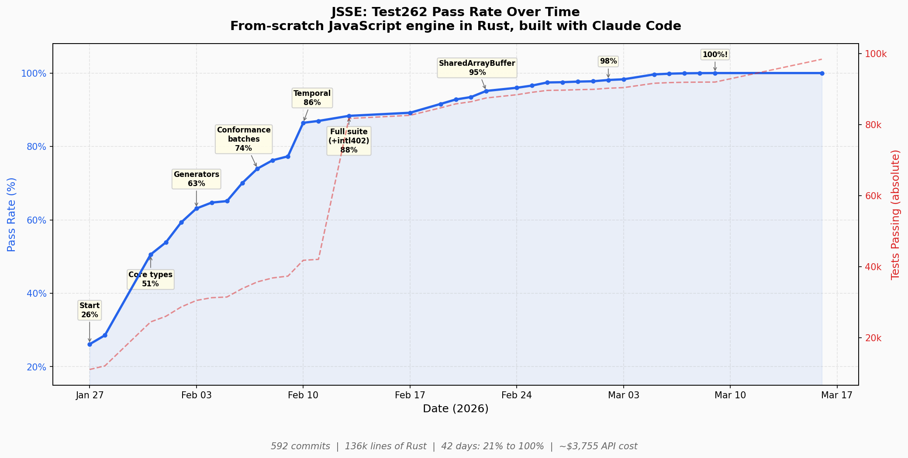

# JSSE Blog Post Data

## 1. Project Overview

| Metric | Value |
|--------|-------|
| **Language** | Rust (nightly) |
| **Start date** | January 27, 2026 |
| **100% non-staging test262** | March 9, 2026 (**42 days**) |
| **Total commits** | 592 |
| **Rust source files** | 58 |
| **Hand-written Rust** | ~136,000 lines |
| **Total Rust (incl. generated Unicode/emoji tables)** | ~170,000 lines |
| **Lines added (all time)** | 929,475 |
| **Lines removed (all time)** | 448,317 |
| **Direct crate dependencies** | 17 |
| **Total crates (Cargo.lock)** | 123 |
| **No JS parser/engine crates** | Everything from scratch |

### Commits per week

| Week | Dates | Commits |
|------|-------|---------|
| W04 | Jan 27 – Feb 2 | 139 |
| W05 | Feb 3 – Feb 9 | 74 |
| W06 | Feb 10 – Feb 16 | 46 |
| W07 | Feb 17 – Feb 23 | 117 |
| W08 | Feb 24 – Mar 2 | 73 |
| W09 | Mar 3 – Mar 9 | 72 |
| W10 | Mar 10 – Mar 16 | 69 |

### Busiest days (by commit count)

| Date | Commits |
|------|---------|
| Jan 27 (project kickoff) | 55 |
| Feb 22 | 50 |
| Jan 28 | 31 |
| Mar 14 | 27 |
| Feb 23 | 25 |

---

## 2. Claude Code Usage & API Cost (from `ccusage`)

### Overall (JSSE project only, filtered by project path)

| Metric | Value |
|--------|-------|
| **Total API cost** | **$3,754.98** |
| **Days with usage** | 31 (main) + worktrees/sub-projects |
| **Sessions** | 169 |
| **Output tokens** | 4,818,993 |
| **Input tokens** | 368,134 |
| **Cache read tokens** | 7,050,342,513 |
| **Cache creation tokens** | 95,570,148 |
| **Total tokens** | 7,151,099,788 |

### Per-model breakdown

| Model | Cost | Output Tokens |
|-------|------|---------------|
| Claude Opus 4.6 | $3,362.82 | 4,052,466 |
| Claude Sonnet 4.6 | $322.72 | 304,112 |
| Claude Haiku 4.5 | $69.44 | 462,415 |

### Cost by sub-project

| Sub-project | Cost |
|-------------|------|
| Main (`jsse`) | $2,917.66 |
| Intl402 worktree | $653.42 |
| Acorn tests | $46.01 |
| Worktrees (6 total) | $123.55 |
| Other (clippy, chief) | $14.33 |

### Notes

- The vast majority of cost (90%) was from Claude Opus 4.6, the primary model used for implementation.
- Claude Haiku 4.5 was used for background tasks (subagents, search).
- Cache read tokens are ~7.1B — aggressive prompt caching kept costs far below what raw token counts would suggest.
- Costs are filtered to JSSE project paths only (non-JSSE usage on this machine was $20.36).

---

## 3. Test262 Pass Rate Over Time

*(Vector version: [jsse_passrate.svg](jsse_passrate.svg))*

### Data points

| Date | Passing | Total | Rate |
|------|---------|-------|------|
| Jan 27 | 10,992 | 42,083 | 26.12% |
| Jan 28 | 12,011 | 42,070 | 28.55% |
| Jan 31 | 24,404 | 48,257 | 50.57% |
| Feb 1 | 25,988 | 48,257 | 53.87% |
| Feb 2 | 28,614 | 48,257 | 59.30% |
| Feb 3 | 30,450 | 48,257 | 63.10% |
| Feb 4 | 31,225 | 48,257 | 64.71% |
| Feb 5 | 31,419 | 48,257 | 65.11% |
| Feb 6 | 33,783 | 48,257 | 70.01% |
| Feb 7 | 35,691 | 48,257 | 73.96% |
| Feb 8 | 36,797 | 48,257 | 76.25% |
| Feb 9 | 37,307 | 48,257 | 77.31% |
| Feb 10 | 41,759 | 48,308 | 86.44% |
| Feb 11 | 42,029 | 48,338 | 86.95% |
| Feb 13 | 81,717 | 92,504 | 88.34% |
| Feb 17 | 82,610 | 92,632 | 89.18% |
| Feb 19 | 84,706 | 92,496 | 91.58% |
| Feb 20 | 85,836 | 92,496 | 92.80% |
| Feb 21 | 86,447 | 92,496 | 93.46% |
| Feb 22 | 87,502 | 91,986 | 95.13% |
| Feb 24 | 88,416 | 92,114 | 95.99% |
| Feb 25 | 89,099 | 92,242 | 96.59% |
| Feb 26 | 89,635 | 91,986 | 97.44% |
| Feb 27 | 89,696 | 91,986 | 97.51% |
| Feb 28 | 89,843 | 91,986 | 97.67% |
| Mar 1 | 89,927 | 91,986 | 97.76% |
| Mar 2 | 90,244 | 91,986 | 98.11% |
| Mar 3 | 90,420 | 91,986 | 98.30% |
| Mar 5 | 91,646 | 91,986 | 99.63% |
| Mar 6 | 91,830 | 91,986 | 99.83% |
| Mar 7 | 91,922 | 91,986 | 99.93% |
| Mar 8 | 91,968 | 91,986 | 99.98% |
| **Mar 9** | **91,986** | **91,986** | **100.00%** |

### Key milestones

| Date | Pass Rate | Milestone |
|------|-----------|-----------|
| Jan 27 | 21% | Project started — lexer, parser, basic interpreter |
| Jan 31 | 51% | Core types wired up, String.prototype fix (+23% in one day) |
| Feb 3 | 63% | Generators (state machine approach) |
| Feb 7 | 74% | 14 conformance batches in 2 days |
| Feb 10 | 86% | Temporal API phase 1 (4,021/4,480 tests) |
| Feb 11 | 87% | Temporal API 100% (4,482/4,482) |
| Feb 13 | 88% | Full suite expansion — added intl402, total went ~48k → ~92k |
| Feb 21 | 93% | Full Intl API (Collator, NumberFormat, DateTimeFormat, Segmenter, etc.) |
| Feb 22 | 95% | SharedArrayBuffer + Atomics |
| Mar 2 | 98% | Proper Tail Calls, cross-realm function calls |
| Mar 5 | 99.6% | Massive parser early-errors batch |
| Mar 9 | **100%** | Array.fromAsync was the final fix |

### Notable jumps

- **Jan 31**: +23% in one day (String.prototype wiring bug fix exposed ~11k tests)
- **Feb 10**: +9% in one day (Temporal API implementation)
- **Feb 13**: Test suite nearly doubled in size (intl402 added) yet pass rate went UP
- **Feb 22**: +2% in one day (SharedArrayBuffer + Atomics: 868 new passes)
- **Mar 5**: 98.3% → 99.6% in one day (274 parser early-error fixes)

---

## 4. Major Features Implemented

1. **Lexer** — full ECMAScript tokenizer with Unicode support
2. **Parser** — recursive descent, covers all ES2025 syntax
3. **Interpreter** — tree-walking, single-pass over AST
4. **All JS value types** — String (WTF-8), Number, BigInt, Symbol, etc.
5. **Prototype chains** — full property descriptor model
6. **Closures & scoping** — lexical, var hoisting, eval scoping
7. **Generators** — AST-to-state-machine transform
8. **Async/await** — with proper microtask queue
9. **Async generators** — full queue-based protocol
10. **ES Modules** — import/export, dynamic import(), top-level await
11. **Proxy & Reflect** — all traps, exotic object forwarding
12. **SharedArrayBuffer + Atomics** — 14 methods
13. **WeakRef + FinalizationRegistry**
14. **Mark-and-sweep GC** — with ephemeron support for WeakMap/WeakSet
15. **Temporal API** — 100% test262 compliance (4,482 tests)
16. **Full Intl API** — Collator, NumberFormat, DateTimeFormat, PluralRules, ListFormat, Segmenter, RelativeTimeFormat, DisplayNames, DurationFormat
17. **ShadowRealm**
18. **Explicit Resource Management** — `using`/`await using`, DisposableStack
19. **Proper Tail Calls** — runtime trampoline TCO for strict mode
20. **Decorators** — syntax support
21. **RegExp** — named groups, lookbehind, v-flag (unicodeSets), modifiers, `\p{}` property escapes (WTF-8 byte-level matching)
22. **Annex B** — legacy web compatibility features
23. **Import attributes & source phase imports**

---

## 5. Architecture Highlights

- **No bytecode** — pure tree-walking interpreter over AST
- **WTF-8 strings** — proper lone surrogate handling throughout
- **State machine generators** — AST transform, not stack-switching
- **Replay-based** — generators re-execute body, fast-forward past yields
- **58 source files**, largest: `eval.rs` (16.8k lines), `regexp.rs` (9.1k lines)
- **Generated tables**: `unicode_tables.rs` (28.8k lines), `emoji_strings.rs` (5.7k lines)
